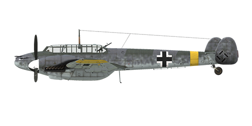
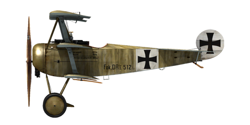
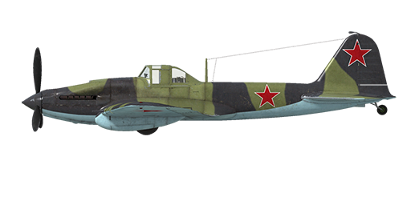
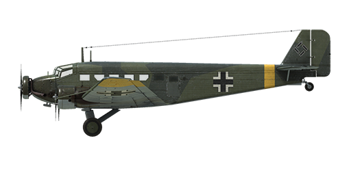
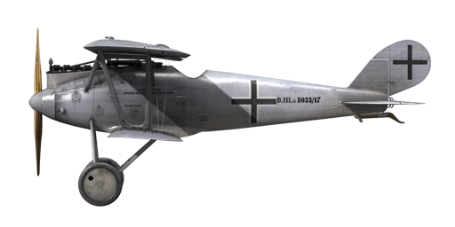
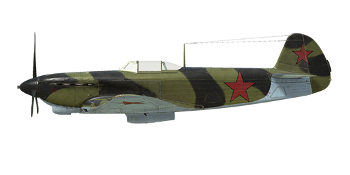

# IL-2: Sturmovik Great Battles: Vehicle Specifications

[View on GitHub Pages](https://aergistal.github.io/il2/)  

Version: 5.001 (07/09/2022)  

## Planes

### A-20B
[Specifications](planes/a20b.md)  
  

### Airco D.H.4
[Specifications](planes/aircodh4.md)  
  

### Albatros D.Va
[Specifications](planes/albatrosd5.md)  
  

### Ar 234 B-2
[Specifications](planes/ar234b2.md)  
  

### B-25D
[Specifications](planes/b25draf.md)  
  

### B-26B-55
[Specifications](planes/b26b55.md)  
  

### Bf 109 E-7
[Specifications](planes/bf109e7.md)  
  

### Bf 109 F-2
[Specifications](planes/bf109f2.md)  
  

### Bf 109 F-4
[Specifications](planes/bf109f4.md)  
  

### Bf 109 G-14
[Specifications](planes/bf109g14.md)  
  

### Bf 109 G-2
[Specifications](planes/bf109g2.md)  
  

### Bf 109 G-4
[Specifications](planes/bf109g4.md)  
  

### Bf 109 G-6
[Specifications](planes/bf109g6.md)  
  

### Bf 109 G-6 Late
[Specifications](planes/bf109g6late.md)  
  

### Bf 109 K-4
[Specifications](planes/bf109k4.md)  
  

### Bf 110 E-2
[Specifications](planes/bf110e2.md)  
  

### Bf 110 G-2
[Specifications](planes/bf110g2.md)  
  

### Breguet 14.B2
[Specifications](planes/breguet14.md)  
  

### Bristol F2B (F.II)
[Specifications](planes/bristolf2bf2.md)  
  

### Bristol F2B (F.III)
[Specifications](planes/bristolf2bf3.md)  
  

### C-47A
[Specifications](planes/c47a.md)  
  

### DFW C.V
[Specifications](planes/dfwc5.md)  
  

### Fokker D.VII
[Specifications](planes/fokkerd7.md)  
  

### Fokker D.VIIF
[Specifications](planes/fokkerd7f.md)  
  

### Fokker D.VIII
[Specifications](planes/fokkerd8.md)  
  

### Fokker Dr.I
[Specifications](planes/fokkerdr1.md)  
  

### Fw 190 A-3
[Specifications](planes/fw190a3.md)  
  

### Fw 190 A-5
[Specifications](planes/fw190a5.md)  
  

### Fw 190 A-6
[Specifications](planes/fw190a6.md)  
  

### Fw 190 A-8
[Specifications](planes/fw190a8.md)  
  

### Fw 190 D-9
[Specifications](planes/fw190d9.md)  
  

### Gotha G.V
[Specifications](planes/gothag5.md)  
  

### Halberstadt CL.II
[Specifications](planes/halberstadtcl2.md)  
  

### Halberstadt CL.II 200hp
[Specifications](planes/halberstadtcl2au.md)  
  

### Handley Page O/400
[Specifications](planes/handleypage400.md)  
  

### He 111 H-16
[Specifications](planes/he111h16.md)  
  

### He 111 H-6
[Specifications](planes/he111h6.md)  
  

### Hs 129 B-2
[Specifications](planes/hs129b2.md)  
  

### Hurricane Mk.II
[Specifications](planes/hurricanemkii.md)  
  

### I-16 type 24
[Specifications](planes/i16t24.md)  
  

### Il-2 mod.1941
[Specifications](planes/il2m41.md)  
  

### Il-2 mod.1942
[Specifications](planes/il2m42.md)  
  

### Il-2 mod.1943
[Specifications](planes/il2m43.md)  
  

### Ju 52/3m g4e
[Specifications](planes/ju523mg4e.md)  
  

### Ju 87 D-3
[Specifications](planes/ju87d3.md)  
  

### Ju 88 A-4
[Specifications](planes/ju88a4.md)  
  

### Ju 88 C-6
[Specifications](planes/ju88c6.md)  
  

### La-5FN ser.2
[Specifications](planes/la5fns2.md)  
  

### La-5 ser.8
[Specifications](planes/la5s8.md)  
  

### LaGG-3 ser.29
[Specifications](planes/lagg3s29.md)  
  

### MC.202 ser.VIII
[Specifications](planes/mc202s8.md)  
  

### Me 262 A
[Specifications](planes/me262a.md)  
  

### Me 410 A-1
[Specifications](planes/me410a1.md)  
  

### MiG-3 ser.24
[Specifications](planes/mig3s24.md)  
  

### Mosquito F.B. Mk.VI ser.2
[Specifications](planes/mosquitofbmkvis2.md)  
  

### Nieuport 28.C1
[Specifications](planes/nieuport28.md)  
  

### P-38J-25
[Specifications](planes/p38j25.md)  
  

### P-39L-1
[Specifications](planes/p39l1.md)  
  

### P-40E-1
[Specifications](planes/p40e1.md)  
  

### P-47D-22
[Specifications](planes/p47d22.md)  
  

### P-47D-28
[Specifications](planes/p47d28.md)  
  

### P-51B-5
[Specifications](planes/p51b5.md)  
  

### P-51D-15
[Specifications](planes/p51d15.md)  
  

### Pe-2 ser.35
[Specifications](planes/pe2s35.md)  
  

### Pe-2 ser.87
[Specifications](planes/pe2s87.md)  
  

### Pfalz D.XII
[Specifications](planes/pfalzd12.md)  
  

### Pfalz D.IIIa
[Specifications](planes/pfalzd3a.md)  
  

### S.E.5a
[Specifications](planes/se5a.md)  
  

### Sopwith Camel
[Specifications](planes/sopcamel.md)  
  

### Sopwith Dolphin
[Specifications](planes/sopdolphin.md)  
  

### Sopwith Triplane
[Specifications](planes/soptriplane.md)  
  

### SPAD 13.C1
[Specifications](planes/spad13.md)  
  

### SPAD 7.C1 150hp
[Specifications](planes/spad7early.md)  
  

### SPAD 7.C1 180hp
[Specifications](planes/spad7late.md)  
  

### Spitfire Mk.IXe
[Specifications](planes/spitfiremkixe.md)  
  

### Spitfire Mk.VB
[Specifications](planes/spitfiremkvb.md)  
  

### Spitfire Mk.XIV
[Specifications](planes/spitfiremkxiv.md)  
  

### Tempest Mk.V ser.2
[Specifications](planes/tempestmkvs2.md)  
  

### Typhoon Mk.Ib
[Specifications](planes/typhoonmkib.md)  
  

### U-2VS
[Specifications](planes/u2vs.md)  
  

### Yak-1b ser.127
[Specifications](planes/yak1s127.md)  
  

### Yak-1 ser.69
[Specifications](planes/yak1s69.md)  
  

### Yak-7B series 36
[Specifications](planes/yak7bs36.md)  
  

### Yak-9 ser.1
[Specifications](planes/yak9s1.md)  
  

### Yak-9T ser.1
[Specifications](planes/yak9ts1.md)  
  

## Vehicles

### GAZ-MM 72-K
[Specifications](vehicles/gaz-mm-72k.md)  
  

### KV-1s ChTZ (1943)
[Specifications](vehicles/kv1s.md)  
  

### M4A2
[Specifications](vehicles/m4a2.md)  
  

### Pz.Kpfw.III Ausf.L
[Specifications](vehicles/pziii-l.md)  
  

### Pz.Kpfw.III Ausf.M
[Specifications](vehicles/pziii-m.md)  
  

### Pz.Kpfw.IV Ausf.G
[Specifications](vehicles/pziv-g.md)  
  

### Pz.Kpfw.V Ausf.D
[Specifications](vehicles/pzv-d.md)  
  

### Pz.Kpfw.VI Ausf.H1
[Specifications](vehicles/pzvi-h1.md)  
  

### Sd.Kfz.10/5
[Specifications](vehicles/sdkfz10-5.md)  
  

### Sd.Kfz.184
[Specifications](vehicles/sdkfz184.md)  
  

### SU-122 UZTM (1943)
[Specifications](vehicles/su122.md)  
  

### SU-152 ChKZ (1943)
[Specifications](vehicles/su152.md)  
  

### T-34/76 STZ (1942)
[Specifications](vehicles/t34-76stz.md)  
  

### T-34/76 UTZ (1943)
[Specifications](vehicles/t34-76uvz-43.md)  
  
