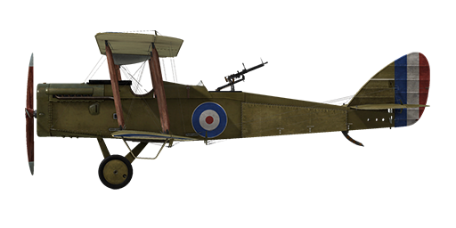

# Airco D.H.4

## Description

Designed by Geoffrey de Havilland to be a two-seat light bomber powered by a BHP engine. First prototype flew in August 1916, but as the BHP engine proved to be weak it required a major redesign and DH.4 was adapted to be equipped with a Rolls Royce Eagle engine. First order for 50 planes powered by Eagle III engine (250hp) was placed at the end of 1916.  
  
Basically an all-wooden construction tractor biplane, Airplane armament consisted of one forward-firing Vickers synchronized machine gun and one or two Lewis guns on the Scarff ring mount at the observer position. It could carry up to 460 pounds of bombs on external racks on wings or central position.  
  
Due to shortages of Rolls Royce engines the production airplanes were also fitted with BHP (230hp), RAF3A (200hp), the Siddeley Puma (230hp) and the 260hp Fiat, yet none of the alternative powered DH.4\'s could match the Rolls Royce powered machines. First DH.4 in frontline service were supplied to No.55 squadron on March 1917; it was the first RFC squadron fully equipped with this type. Till the end of 1917, a total of 6 squadrons were equipped with DH.4\'s. It also was used by RNAS squadrons for naval operations for recon and anti-submarine use.  
  
Reported to be pleasant to fly and easy to operate, the crews loved it because of its speed and maneuverability (the only "flaw" noted by its crews was the fuel tank placed between pilot and observer cockpits which caused communication problems between them). Due to its abilities, it was often used without fighter cover as its speed and good altitude performance allowed it to survive. Mostly used as a light day-bomber, it also could carry radio equipment for artillery observation duties and camera equipment for photo-reconnaissance missions.  
  
Produced by Airco, F.W. Berwick and Co, Glendower Aircraft Company, Palladium Autocars, Vulcan Motor and Engineering, and the Westland Aircraft Works in the UK, a total of 1,449 aircraft were built in the UK for the RFC and RNAS through the end of the war.  
  
  
Engine: V-type 12 cyl. Rolls Royce Eagle VII  
Power: 275 hp (320hp at 1800 RPM)  
  
Dimensions:  
Height: 3100 mm  
Length: 9200 mm  
Wing span: 12916 mm  
Wing surface: 40 sq.m  
  
Weight:  
Empty: 1088 kg  
Fuel capacity: 249 liters  
Oil capacity: 27.3 liters  
Takeoff without bombload: 1588 kg  
  
Speed (IAS), without bombload:  
sea level - 200 km/h  
1000 - 189 km/h  
2000 - 178 km/h  
3000 - 166 km/h  
4000 - 154 km/h  
5000 - 140 km/h  
  
Climb rate, full fuel load, no bombs:  
1000 m -  3 min. 23 sec.  
2000 m -  7 min. 7 sec.  
3000 m - 11 min. 47 sec.  
4000 m - 17 min. 52 sec.  
5000 m - 27 min.  
  
Service ceiling: 6800 m  
  
Endurance 3 h.  
  
Armament:  
Forward firing: 1 x Vickers Mk.I 7.69 mm, 500 rounds per barrel  
Tail upper position: 1 x Lewis 7.69 mm, 8 drums with 97 rounds each  
  
Bomb load variations:  
12 x 20lb (109 kg)  
8 x 20lb + 2 x 112lb (175 kg)  
4 x 112lb (203.4 kg)  
2 x 112lb (101.7 kg)  
2 x 230lb (208.8 kg)  
208.8 kg in total  
  
References  
1) Air Board Data Charts, 1917.  
2) Notes on the prediction and analysis of airplane performance, reports and memoranda no.474, may 1918, tables no. 10 and 11.  
3) Windsock Datafile Special - Airco DH.4 Vol.1, by J.M. Bruce.  
4) Rolls Royce engine charts, 1917.  
5) WWI Aeroplanes data, by J.M. Bruce.  
6) Various NACA reports.

## Modifications

**Aldis**  
Aldis Refractor-type Collimator Sight  
Additional mass: 2 kg

**Twin forward Vickers**  
Twin fixed forward firing Vickers guns.  
Ammo: 1000 of 7.69mm rounds (500 rounds for each gun)  
Projectile weight: 11 g  
Muzzle velocity: 745 m/s  
Rate of fire: 750 rpm  
Guns weight: 13 kg (w/o ammo drums)  
Mounts weight: 4 kg  
Ammo weight: 21 kg  
Total weight: 38 kg

**Cooper / H.E.R.L. / H.E.R.F.C. bombs**  
Up to 12 x 11 kg (24 lb) General Purpose Bombs  
Additional mass: 167 kg  
Ammunition mass: 131 kg  
Racks mass: 36 kg  
Estimated speed loss before drop: 7 km/h  
Estimated speed loss after drop: 3 km/h  
  
Up to 4 x 51 kg (112 lb) H.E.R.L. General Purpose Bombs  
Additional mass: 227 kg  
Ammunition mass: 204 kg  
Racks mass: 24 kg  
Estimated speed loss before drop: 8 km/h  
Estimated speed loss after drop: 4 km/h  
  
Up to 2 x 104 kg (230 lb) H.E.R.F.C. General Purpose Bombs  
Additional mass: 224 kg  
Ammunition mass: 208 kg  
Racks mass: 16 kg  
Estimated speed loss before drop: 5 km/h  
Estimated speed loss after drop: 3 km/h

**Fuel Gauge**  
Needle Scale fuel level Gauge (0-30 Gallons)  
Additional mass: 1 kg

**Twin Lewis MG turret**  
Scarff ring turret with twin Lewis MG  
Ammo: 776 of 7.69mm rounds (8 drums with 97 rounds in each)  
Projectile weight: 11 g  
Muzzle velocity: 745 m/s  
Rate of fire: 550 rpm  
Guns weight: 15 kg (w/o ammo drums)  
Mount weight: 12 kg  
Ammo weight: 32 kg  
Total weight: 59 kg  
Estimated speed loss: 2 km/h

**Twin Lewis Overwing**  
Two overwing mounted additional fixed Lewis machineguns.  
Ammo: 194 of 7.69mm rounds (2 drums with 97 rounds in each)  
Projectile weight: 11 g  
Muzzle velocity: 745 m/s  
Rate of fire: 550 rpm  
Guns weight: 15 kg (w/o ammo drums)  
Mounts weight: 6 kg  
Ammo weight: 10 kg  
Total weight: 31 kg  
Estimated speed loss: 5 km/h

**Cockpit light**  
Cockpit illumination lamp for night sorties  
Additional mass: 1 kg

**Radio**  
Radio transmitter  
Additional mass: 10 kg

**Camera**  
Camera for taking aerial photographs  
Additional mass: 10 kg
