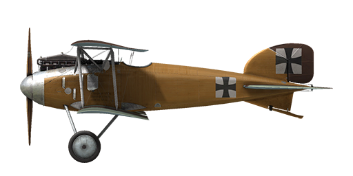

# Albatros D.II

## Description

First in the pantheon of the legendary Albatros fighter planes, the D.II became a symbol and icon of the fighter plane in the Great War. Under the guidance of engineer Robert Thelen, the plane incorporated new features in design and development. While retaining the clean aerodynamic shape of the D.I model’s fuselage, new central N-shaped struts were added to the wings. The upper wing was moved closer to the fuselage, and early models of the aircraft were fitted with Windhoff box-type radiators on both sides of the fuselage.  
The Albatros Werke, Ostdeutsche Albatros Werke, and Luft-Verkehrs-Gesellschaft mbH factories manufactured the aircraft. In all, 768 Albatros D.IIs were produced.  
In August 1916, the first detachment of Albatros D.I and D. II fighters arrived at the front. Starting with these two models of aircraft, two Spandau machine guns became standard equipment for all German fighters. In the hands of experienced pilots, who were already battle hardened and experienced in aerobatics, the D.II made for huge gains in air superiority. The rapid mass production of Albatros fighter planes allowed Germany to maintain air superiority all the way through April 1917. "Bloody April" has become synonymous with the great losses of British aircraft in 1917.  
The Albatros D. II was also employed against balloons and for providing cover for twin-seat bombers and scouts. Its pilots noted the good power of the twin machine guns, good forward and upward visibility, responsive handling, high speed and impressive rate of climb. The fighter participated in battles all along the Western Front.  
  
Engine 6—cyl. inline Mercedes D. III 160 HP  
  
Dimensions  
Height: 2640 mm  
Length: 7400 mm  
Wing span: 8500 mm  
Wing surface:  24.9 sq.m  
  
Weight  
Empty: 673 kg  
Takeoff: 898 kg  
Fuel capacity: 85 l  
Oil capacity: 10 l  
  
Maximum airspeed (IAS)  
sea level — 164 km/h  
1000 m — 156 km/h  
2000 m — 148 km/h  
3000 m — 139 km/h  
4000 m — 129 km/h  
  
Climb rate  
1000 m —  4 min.  2 sec.  
2000 m —  9 min. 14 sec.  
3000 m — 15 min. 51 sec.  
4000 m — 25 min. 22 sec.  
  
Service ceiling 5200 m  
  
Endurance at 1000 m  
nominal power (combat) — 1 h. 20 min.  
minimal consumption (cruise) — 2 h. 50 min.  
  
Forward firing armament: 2 x LMG 08/15 Spandau 7.92mm, 500 rounds per barrel  
  
References  
1) Albatros D.II, Windsock Datafile 11.  
2) Albatros D.I/D.II, Windsock Datafile 100.  
3) Albatros Fighters, Windsock Datafile Special.  
4) Albatros Aces of WWI by Norman Franks, Osprey №32.  
5) Albatros fighters in action by John F Connors.  
6) Albatros D.II, Flugzeugprofile №38.

## Modifications

**Cockpit light**  
Cockpit illumination lamp for night sorties  
Additional mass: 1 kg

**20mm Becker Cannon**  
20mm Becker Automatic Cannon  
Ammo: 60 of 20mm rounds (4 magazines with 15 rounds in each)  
Ammo type: HE/AP (High Explosive and Armour Piercing rounds)  
Rate of fire: 300 rpm  
Projectile weight: 120/130 g  
Muzzle velocity: 450/490 m/s  
Gun weight: 30 kg  
Mount weight: 10 kg  
Ammunition total weight: 25 kg  
Total weight: 65 kg  
Estimated speed loss: 6 km/h

**Thermometer**  
A.Schlegelmilch engine coolant temperature indicator (0-100 °C)  
Additional mass: 1 kg

**Gunsight**  
Additional sight with front sight and rear sight mountings  
Additional mass: 1 kg

**High Altimeter**  
D.R.P Altimeter (0-8000 m)

**Clock**  
Mechanical Clock  
Additional mass: 1 kg

**Anemometer**  
Wilhelm Morell Anemometer (45-250 km/h)  
Additional mass: 1 kg

**Aldis (Trophy)**  
Aldis Refractor-type Collimator Sight  
Additional mass: 2 kg
