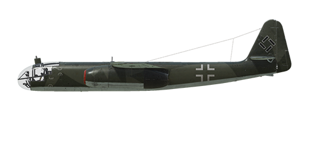

# Ar 234 B-2

## Description

Indicated stall speed in flight configuration: 177..248 km/h  
Indicated stall speed in takeoff/landing configuration: 159..223 km/h  
Dive true air speed limit: 850 km/h  
Maximum load factor: 6 G  
Stall angle of attack in flight configuration: 13.9°  
Stall angle of attack in landing configuration: 10.8°  
  
Maximum true air speed at sea level, engine mode - Nominal, 8400 RPM: 628 km/h  
Maximum true air speed at 6000 m, engine mode - Nominal, 8400 RPM: 658 km/h  
Maximum true air speed at 9000 m, engine mode - Nominal, 8400 RPM: 630 km/h  
  
Maximum true air speed at sea level, engine mode - Maximal, 8700 RPM: 703 km/h  
Maximum true air speed at 6000 m, engine mode - Maximal, 8700 RPM: 728 km/h  
Maximum true air speed at 9000 m, engine mode - Maximal, 8700 RPM: 702 km/h  
  
Service ceiling: 10500 m  
Climb rate at sea level: 14.3 m/s  
Climb rate at 6000 m: 6.3 m/s  
Climb rate at 9000 m: 3.0 m/s  
  
Maximum performance turn at sea level: 27 s, at 400 km/h IAS.  
Maximum performance turn at 6000 m: 52 s, at 380 km/h IAS.  
  
Flight endurance at 6000 m: 4 h 15 m, at 400 km/h IAS.  
  
Takeoff speed: 178..262 km/h  
Glideslope speed: 270 km/h  
Landing speed: 155..210 km/h  
Landing angle: 4.0°  
  
Note 1: the data provided is for international standard atmosphere (ISA).  
Note 2: flight performance ranges are given for possible aircraft mass ranges.  
Note 3: maximum speeds, climb rates and turn times are given for aircraft target mass.  
Note 4: climb rates and turn times are given for Maximal (8700 RPM) power.  
  
Engine: 2 x turbo jet  
Model: Jumo-004 B1  
Maximum power in Maximal mode (8700 RPM) at sea level: 810 kg(f)  
Maximum power in Maximal mode (8700 RPM) at 6000 m: 530 kg(f)  
Maximum power in Maximal mode (8700 RPM) at 9000 m: 385 kg(f)  
  
Engine modes:  
Nominal (unlimited time): 8400 RPM  
Maximal (15 minutes): 8700 RPM  
  
Nominal exhaust temperature: 600 °C  
Maximum exhaust temperature: 650 °C  
  
Exhaust pressure: 0.2-0.38 kg/cm²  
  
Fuel injection pressure: 40-80 kg/cm²  
  
Oil rated pressure in engine output: 2 kg/cm²  
Oil maximum pressure in engine output: 5 kg/cm²  
  
Empty weight: 5029 kg  
Minimum weight (no ammo, 10% fuel): 5329 kg  
Weight with full tanks (no ammo): 8210 kg  
Maximum takeoff weight: 10470 kg  
Target weight (1 x SC 500, 45% fuel): 6950 kg  
Fuel load: 3181 kg / 3790 l  
Useful load: 5441 kg  
  
Forward-firing armament:  
2 x 20mm gun "MG 151/20", 200 rounds, 700 rounds per minute, underbelly-mounted (modification)  
  
Bombs:  
Up to 2 x 249 kg general purpose bombs "SC 250"  
Up to 3 x 500 kg general purpose bombs "SC 500"  
1090 kg general purpose bomb "SC 1000"  
  
Length: 12.6 m  
Wingspan: 14.4 m  
Wing surface: 26.4 m²  
  
Combat debut: 24 December 1944  
  
Operation features:  
- The aircraft is equipped with two turbojet engines Jumo-004 B1. They are controlled automatically by the throttle which sets the turbine rotor RPM.  
- The engine is equipped with automatic fuel regulator that engaged only at more than 6000 RPM. Therefore, the fuel regulation at lower RPM wasn\'t effective and a careless throttle increase could cause excessive fuel intake, resulting in overheating and possible engine fire.  
- At high altitudes it is possible to lean the mixture too much by a sharp throttle decrease, causing a flameout and engine stop. The turbine shouldn\'t be set below 6000-8000 RPM depending on the altitude.  
- It is impossible to restart the engine at high altitudes (more than 4000 m).  
- The aircraft is equipped with horizontal stabilizer and rudder trim to reduce the load on controls.  
- The aircraft is susceptible to Mach tuck when diving at 0.8 M or higher speed.   
- Landing flaps and hovering ailerons have a hydraulic actuator. Thay can be extended in take-off position (flaps angle 25°) and landing position (flaps angle 45°).  
- Landing gear brakes are hydraulic as well and are engaged by pushing a corresponding pedal. The nose gear orients by itself.  
- There are two fuel tanks (1800 l and 1990 l) which have fuel level indicators and emergency fuel lamps (they light up when there are less than 250 l left).  
- The aircraft is equipped with three-channel autopilot system (main switch RAlt + A, each channel could be activated independently by RAlt + Y/P/R). Pilot has the ability to trim course (RAlt + Left/Right) and pitch (RAlt + Up/Down) stabilizing angles.  
- The aircraft has dive bombsight BZA 1 B by default (LShift + V). Pilot should set target height above sea level (RShift + Period/Semicolon) and wind speed (RAlt + Period/Semicolon) before initiating the dive. Head of dive bombsight periscope could change its orientation to provide rear-view to the pilot (RAlt + F). Reticle lights could be switched off (LAlt + M). Also bombsight Lotfe 7K for horizontal bombing could be installed as modification.  
- The aircraft has a significant takeoff run (especially with a maximum takeoff weight). To provide shorter takeoff run parachuted jet boosters could be installed as modification. Nominal operating time of jet boosters is 35 s (press R to activate). After successfull takeoff jet boosters should be jettisoned (LShift + D).  
- To provide shorter landing run drogue chute could be installed as modification. Maximum speed of drogue chute release (LAlt + D) is 215 km/h. After successfull landing and braking drogue chute should be jettisoned (LAlt + D).  
- To be able to fly reconnaissance missions aircraft could be equipped with photo equipment. Photobay doors must be opened before taking shots of reconnaissance area (control is the same as the bomb doors).  
  
Basic data and recommended positions of the aircraft controls:  
1. Starting the engine:  
	- recommended position of the mixture control lever: auto mixture control  
	- recommended position of the throttle lever: 15%  
  
2. Recommended mixture control lever positions for various flight modes: auto mixture control  
  
3. Recommended positions of the radiator/cowl flap control handle for various flight modes: no radiators/cowl flaps  
  
4. Approximate fuel consumption at altitude:  
	- Cruise engine mode: 17.2 l/min  
	- Combat engine mode: 28.3 l/min

## Modifications

**Drogue Chute**  
Installation of braking parachute for reducing the landing run distance  
Additional mass: 32 kg  
Estimated speed loss: 2 km/h

**SC 1000**  
1090 kg General Purpose Bomb SC 1000  
Additional mass: 1090 kg  
Ammunition mass: 1090 kg  
Estimated speed loss before drop: 31 km/h  
Estimated speed loss after drop: 0 km/h

**Bombsight**  
Installation of bombsight Lotfe 7K for horizontal bombing  
Additional mass: 33 kg  
Estimated speed loss: 3 km/h

**Mirrors**  
Retractable mirrors on cockpit sides to provide visual control of engines  
Additional mass: 1 kg  
Estimated speed loss (mirrors are extended): 5 km/h  
Estimated speed loss (mirrors are retracted): 0 km/h

**Starthilfe**  
Jettisonable Starthilfe (take-off assist) Walter HWK 109-500 units for shortening the take-off run  
Operating time: 35 s  
Additional thrust: 1000 kgf  
Additional mass: 560 kg  
Estimated speed loss before drop: 51 km/h  
Estimated speed loss after drop: 0 km/h

**2 x 20mm MG 151/20 gun pod**  
MG 151/20 20mm guns in underbelly gun pod with 200 rounds per each  
Additional mass: 245 kg  
Ammunition mass: 98 kg  
Guns mass: 147 kg  
Estimated speed loss: 22 km/h

**Navigational system**  
Additional mass: 0 kg  
Estimated speed loss: 0 km/h

**Photo equipment**  
Photo equipment for reconnaissance missions  
Additional mass: 204 kg  
Estimated speed loss (photo bay doors are opened): 9 km/h  
Estimated speed loss (photo bay doors are closed): 1 km/h
