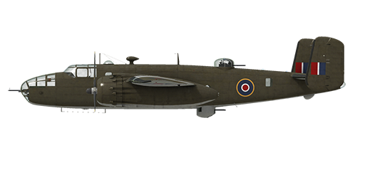

# B-25D

## Description

Indicated stall speed in flight configuration: 160..191 km/h (100..119 mph)  
Indicated stall speed in takeoff/landing configuration: 145..175 km/h (90..109 mph)  
  
Dive speed limit: 544 km/h (340 mph)  
Maximum load factor: 6.5 G  
Stall angle of attack in flight configuration:  18.3 °  
Stall angle of attack in landing configuration: 15.1 °  
  
Maximum true air speed at sea level, engine mode - Combat: 430 km/h (269 mph)  
Maximum true air speed at 1400 m, engine mode - Combat: 472 km/h (295 mph)  
Maximum true air speed at 3900 m, engine mode - Combat: 495 km/h (310 mph)  
  
Maximum true air speed at sea level, engine mode - Nominal: 419 km/h (262 mph)  
Maximum true air speed at 2000 m, engine mode - Nominal: 448 km/h (280 mph)  
Maximum true air speed at 4750 m, engine mode - Nominal: 461 km/h (288 mph)  
  
Service ceiling: 7450 m (24442 ft)  
Climb rate at sea level: 8.3 m/s (1575 ft/min)  
Climb rate at 3000 m: 6.3 m/s (1236 ft/min)  
Climb rate at 6000 m: 2.7 m/s (394 ft/min)  
  
Maximum performance turn at sea level: 28.8 s, at 270 km/h IAS.  
Maximum performance turn at 3000 m: 47.0 s, at 280 km/h IAS.  
  
Flight endurance at 3000 m: 4.6 h, at 330 km/h IAS. Engine mode - Cruise, 1st supercharger stage  
  
Takeoff speed: 165..180 km/h (105..115 mph)  
Glideslope speed: 200..215 km/h (125..135 mph)  
Landing speed: 176..192 km/h (110..120 mph)  
Landing angle: 4.5 °  
  
Note 1: the data provided is for international standard atmosphere (ISA).  
Note 2: flight performance ranges are given for possible aircraft mass ranges.  
Note 3: maximum speeds, climb rates and turn times are given for aircraft mass with 8 G.P.B. 500 bombs and 58%25 fuel.  
Note 4: climb rates and turn times are given for Nominal power.  
  
Engine:  
Model: Wright R-2600-13  
Maximum power in Cruise mode at 6700 ft: 1140 HP  
Maximum power in Cruise mode at 15000 ft: 1027 HP  
Maximum power in Nominal mode at 6700 ft: 1520 HP  
Maximum power in Nominal mode at 15000 ft: 1370 HP  
Maximum power in Combat mode at 4500 ft: 1725 HP  
Maximum power in Combat mode at 12000 ft: 1470 HP  
Maximum power in Takeoff mode at sea level: 1725 HP  
  
Engine modes:  
(boost value is listed for 1st and 2nd supercharger gears)  
Cruise (unlimited time): 2100 RPM, 31.5 / 32.5 inch Hg, mixture "Cruising Lean"   
Nominal (unlimited time): 2400 RPM, 38.0 / 39.0 inch Hg, mixture "Full Rich"   
Combat (5 min limit): 2600 RPM, 42.0 / 41.0 inch Hg, mixture "Full Rich"    
Takeoff (5 min limit): 2600 RPM, 44.0 inch Hg, mixture "Full Rich"    
  
Oil rated temperature in engine output: 80..95 °C  
Oil maximum temperature in engine output: 105 °C  
Cylinder head rated temperature: 140..235 °C  
Cylinder head maximum temperature: 260 °C  
  
Supercharger gear shift altitude: 3350 m (11000 ft)  
  
Empty weight: 8379 kg  
Minimum weight (no ammo, 10%25 fuel): 8829 kg  
Standard weight: 11544 kg  
Maximum takeoff weight: 15422 kg  
Fuel load: 2618 kg / 3688 l / 974 gal  
Useful load: 7043 kg  
  
Forward-firing armament:  
12.7mm machine gun ANM2 .50, 400 rounds, 850 rounds per minute, nose-mounted  
  
Defensive armament:  
Nose: 12.7mm machine gun ANM2 .50, 400 rounds, 850 rounds per minute  
Top: 2 x 12.7mm machine gun ANM2 .50, 400 rounds, 850 rounds per minute  
Belly: 2 x 12.7mm machine gun ANM2 .50, 400 rounds, 850 rounds per minute  
  
Bombs:  
Up to 8 x 500 lb general purpose bomb "500 lb."  
Up to 4 x 1000 lb general purpose bomb "1000 lb. M.C."  
  
Length: 16.1 m  
Wingspan: 20.5 m  
Wing surface: 57.0 m²  
  
Combat debut: spring 1942  
  
Operation features:  
- The engine has no manifold pressure automatic governor. For this reason, manifold pressure not only depends on throttle position, but also from RPM and altitude. This requires additional checking of manifold pressure to not cause engine damage.  
- The engine is equipped with an automatic fuel mixture control which maintains optimal mixture if mixture lever is set to Full Rich (100%25) position. To use automatic mixture leaning to reduce fuel consumption during flight it is necessary to set mixture lever to Cruising Lean (50%25) position. To stop the engine mixture lever should be set to the Cut Off (0%25) position.  
- Engine RPM has an automatic governor and it is maintained at the required RPM corresponding to the governor control lever position. The governor automatically controls the propeller pitch to maintain the required RPM.  
- Oil radiators shutters and engine cowl outlet shutters are manually operated.  
- The aircraft has trimmers for all flight-controls: pitch, roll and yaw.  
- Landing flaps have a hydraulic actuator and they can be extended to any angle up to 45°.  
- The aircraft has independent left and right hydraulic wheel brake controls. To apply either brake push the upper part of the rudder pedal.  
- The aircraft is equipped with upper formation lights.  
- The engine has a two-stage mechanical supercharger which must be manually switched at 3350 m (11000 ft) altitude.  
- The nose gear orients by itself, doesn't have brakes and can't be controlled.  
- There are white and red signal lamps in the tail: the white one is lit while bomb doors are open and the red one lights up for 5 seconds when bombs are released.  
- The aircraft is equipped with a bomb salvo controller. It allows to drop selected bombs in a salvo or drop all bombs in salvo. There is also a controller for a drop delay between each bomb in the salvo.
