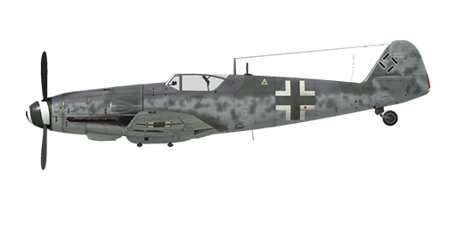

# Bf 109 G-6AS

## Description

Indicated stall speed in flight configuration: 163..180 km/h  
Indicated stall speed in takeoff/landing configuration: 151..163 km/h  
Dive speed limit: 850 km/h  
Maximum load factor: 10.5 G  
Stall angle of attack in flight configuration: 19.7 °  
Stall angle of attack in landing configuration: 17.2 °  
  
DB-605AS engine:  
  
Maximum true air speed at sea level, engine mode - Emergency: 523 km/h  
Maximum true air speed at 3500 m, engine mode - Emergency: 600 km/h  
Maximum true air speed at 9500 m, engine mode - Emergency: 670 km/h  
Maximum true air speed at sea level, engine mode - Combat: 505 km/h  
Maximum true air speed at 2900 m, engine mode - Combat: 565 km/h  
Maximum true air speed at 9000 m, engine mode - Combat: 650 km/h  
  
DB-605ASM engine:  
  
Maximum true air speed at sea level, engine mode - Emergency: 570 km/h  
Maximum true air speed at 2000 m, engine mode - Emergency: 610 km/h  
Maximum true air speed at 8000 m, engine mode - Emergency: 690 km/h  
Maximum true air speed at sea level, engine mode - Combat: 505 km/h  
Maximum true air speed at 2900 m, engine mode - Combat: 565 km/h  
Maximum true air speed at 9000 m, engine mode - Combat: 650 km/h  
  
Service ceiling: 12100 m  
Climb rate at sea level: 17.3 m/s  
Climb rate at 3000 m: 16.2 m/s  
Climb rate at 6000 m: 12.1 m/s  
  
Maximum performance turn at sea level: 23.0 s, at 270 km/h IAS.  
Maximum performance turn at 3000 m: 28.5 s, at 270 km/h IAS.  
  
Flight endurance at 3000 m: 2.3 h, at 350 km/h IAS.  
  
Takeoff speed: 155..180 km/h  
Glideslope speed: 195..205 km/h  
Landing speed: 150..155 km/h  
Landing angle: 13.7 °  
  
Note 1: the data provided is for international standard atmosphere (ISA).  
Note 2: flight performance ranges are given for possible aircraft mass ranges.  
Note 3: maximum speeds, climb rates and turn times are given for standard aircraft mass.  
Note 4: climb rates and turn times are given for Combat power.  
  
Engine:  
Model: DB-605AS  
Maximum power in Emergency mode at sea level: 1435 HP  
Maximum power in Emergency mode at 8000 m: 1200 HP  
Maximum power in Combat mode at sea level: 1275 HP  
Maximum power in Combat mode at 7800 m: 1150 HP  
  
Engine modes:  
Nominal (unlimited time): 2300 RPM, 1.15 ata  
Combat power (up to 30 minutes): 2600 RPM, 1.3 ata  
Emergency power (up to 1 minute): 2800 RPM, 1.42 ata  
  
Engine:  
Model: DB-605ASM  
Maximum power in Emergency mode at sea level: 1800 HP  
Maximum power in Emergency mode at 6400 m: 1500 HP  
Maximum power in Combat mode at sea level: 1250 HP  
Maximum power in Combat mode at 7800 m: 1150 HP  
  
Engine modes:  
Nominal (unlimited time): 2300 RPM, 1.15 ata  
Combat power (up to 30 minutes): 2600 RPM, 1.3 ata  
Emergency power (up to 3 minute): 2800 RPM, 1.7 ata  
Emergency power (up to 10 minute with MW-50): 2800 RPM, 1.7 ata (modification)  
  
Water rated temperature in engine output: 100..102 °C  
Water maximum temperature in engine output: 115 °C  
Oil rated temperature in engine intake: 75..80 °C  
Oil maximum temperature in engine intake: 85 °C  
  
Supercharger gear shift altitude: fluid coupling   
  
Empty weight: 2540 kg  
Minimum weight (no ammo, 10% fuel): 2855 kg  
Standard weight: 3222 kg  
Maximum takeoff weight: 3585 kg  
Fuel load: 304 kg / 400 l  
Useful load: 1045 kg  
  
Forward-firing armament:  
20mm gun "MG 151/20", 200 rounds, 700 rounds per minute, nose-mounted  
2 x 13mm machine gun "MG 131", 300 rounds, 900 rounds per minute, synchronized  
2 x 20mm gun "MG 151/20", 135 rounds, 700 rounds per minute, wing-mounted (modification)  
30mm gun "MK 108", 65 rounds, 650 rounds per minute, nose-mounted (modification)  
  
Bombs:  
249 kg general purpose bomb "SC 250"  
  
Rockets:  
Two WGr.21 rockets in jettisonable launchers  
  
Length: 8.94 m  
Wingspan: 9.92 m  
Wing surface: 16.2 m²  
  
Combat debut: spring 1944  
  
Operation features:  
- The aircraft has a wide automatization of the engine systems, in fact, to control speed it is only necessary to use the throttle lever. There is no need to manually set engine revolutions and mixture or supercharger gear in normal flight.  
- MW-50 water-methanol mixture injection system that prevents the engine detonation in the emergency power mode (modification). It engages automatically when the throttle is set to maximum, there is enough mixture for 25-30 minutes. However, the engine can work up to 10 minutes at this mode, wait for another 10 minutes at the combat mode before engaging the emergency mode again. Attention: running the engine with the water-methanol mixture at altitudes higher than 8 km is forbidden! A pilot can check the system using the injection pressure indicator on the left: its normal pressure is 0.6...0.7 atm, stop using it if the pressure is lower than 0.4 atm and switch the engine to combat mode.  
- In addition to full-automatic mode there is a special manual control mode for the radiator shutters, which can be used in specific situations.  
- To reduce swinging during taxiing due to prop-wash the prop pitch control should be switched to manual mode and pitch should be reduced to minimum.  
- The aircraft has no flight-control trimmers. Airplane is equipped with bendable trim tabs that can be set pre-flight by ground personnel.  
- The aircraft has a manually controlled horizontal stabilizer. It should be set to +1° before takeoff and to -4°...-5° before landing. Also, it may be used to trim the flight stick during the flight. In a deep dive the stabilizer should be set so that the pilot must push the flight stick forward to maintain the dive angle.  
- The aircraft has automatic wing slats. They deploy when the high angle of attack increases which makes pre-stall softer.  
- The aircraft has a manual mechanical system for retracting the landing flaps, for this reason it is necessary to extend landing flaps well before final approach. Markers on the left-wing flap indicate how far the flaps are extended. The flaps can be extended to any angle up to 40°.  
- The aircraft has a manual tailwheel lock. Wheel should be locked when taxiing straight for a long distance and before takeoff and landing.  
- The aircraft has independent left and right hydraulic wheel brake controls. To apply either brake push the upper part of the rudder pedal.  
- The aircraft has a fuel gauge which shows total fuel remaining. Also, it has an emergency fuel warning light (80 liters).  
- The design of the cockpit canopy does not allow it to be opened during flight. The canopy should be closed before takeoff to prevent damage. The canopy has an emergency release system for bailouts.  
- The gunsight has a sliding sun-filter.  
  
Basic data and recommended positions of the aircraft controls:  
1. Starting the engine:  
	- recommended position of the mixture control lever: auto mixture control  
	- recommended position of the oil/water radiator control handle: auto radiators control  
	- recommended position of the prop pitch control handle: auto prop pitch control  
	- recommended position of the throttle lever: 10%  
	- before taxiing, you must unlock the tailwheel  
  
2. Recommended mixture control lever positions for various flight modes: auto mixture control  
  
3. Recommended positions of the radiators control handle for various flight modes: auto radiators control  
  
4. Approximate fuel consumption at 2000 m altitude:  
	- Cruise engine mode: 5.3 l/min  
	- Combat engine mode: 8.2 l/min

## Modifications

**MW-50 Mixture**  
MW-50 water-methanol mixture injection increases engine endurance at emergency power modes  
Additional mass (mixture): 63 kg

**1 x SC 250 bomb**  
249 kg General Purpose Bomb SC 250  
Additional mass: 279 kg  
Ammunition mass: 249 kg  
Racks mass: 30 kg  
Estimated speed loss before drop: 33 km/h  
Estimated speed loss after drop: 11 km/h

**30mm MK 108 gun**  
MK 108 30mm nose-gun with 65 rounds  
Additional mass: 4 kg  
Ammunition mass: 38 kg  
Gun mass: 58 kg  
Estimated speed loss: 0 km/h

**MW-50 System**  
MW-50 water-methanol mixture injection system   
Additional mass: 84 kg  
Water-methanol mixture mass: 63 kg  
Estimated speed increase at sea level: 45 km/h

**21 cm BR**  
Two WGr.21 rockets in jettisonable launchers  
Additional mass: 258 kg  
Ammunition mass: 224 kg  
Racks mass: 34 kg  
Estimated speed loss before launch: 51 km/h  
Estimated speed loss after launch: 11 km/h  
Estimated speed loss after drop: 2 km/h

**DB-605ASM engine**  
DB-605ASM engine with C3 fuel and MW-50 System tank (empty)  
Additional mass: 21 kg  
Estimated speed increase at sea level: 43 km/h

**2 x 20mm MG 151/20 gun pods**  
MG 151/20 20mm guns in wing-mounted gun pods with 135 rounds per each  
Additional mass: 212 kg  
Ammunition mass: 55 kg  
Guns mass: 157 kg  
Estimated speed loss: 13 km/h
