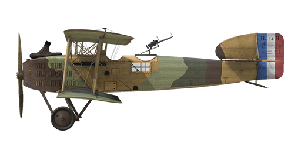

# Breguet 14.B2

## Description

The Breguet 14 was a two-seater biplane designed by the French company known as Breguet Aviation. The prototype made its first flight in April 1917. To ensure exceptional durability, the airframe structure was composed of duralumin and steel sections. Several companies manufactured this plane, including Michelin, Bellanger, Renault, Farman, Schmitt, and Darracq. During the war, production aircraft were fitted with a variety of engine types. Renault engines were the first to be installed and were subsequently followed by Fiat models and, in later months, Liberty engines. These reliable and powerful engines made the Breguet 14 the fastest two-seat bomber of WWI.  
  
The first series of planes entered service with the French Army Corps in May 1917, where it eventually replaced the Sopwith 1½ Strutter. The Breguet 14 was faster, had a higher climb speed, could carry a higher bomb load and possessed a more durable structure. In April 1918, 225 aircraft of this type were in service with 1 American and 50 French squadrons.  
  
The French Army employed it in a variety of ways, including bombing, aerial supply, artillery spotting, aerial mapping of the front lines, recon, and dropping of propaganda leaflets. Its main bombing targets were railway junctions, German frontline fortifications, and targets in the immediate battle area. Pilots noted its speed and ability to take punishment from enemy fire. The Breguet 14 participated in battles on the Western, Eastern and Italian fronts.  
  
  
Engine: V-type 12 cyl. Renault 12 Fcx  
Power: 310 hp (1600 RPM)  
  
Dimensions:  
Height: 3300 mm  
Length: 8870 mm  
Wing span: 13284 mm  
Wing surface: 52 sq.m  
  
Weight:  
Empty: 1076 kg  
Fuel capacity: 260 liters  
Oil capacity: 35 liters  
Takeoff without bombload: 1538 kg  
  
Speed (IAS), without bombload:  
sea level - 181 km/h  
1000 - 170 km/h  
2000 - 158 km/h  
3000 - 146 km/h  
4000 - 133 km/h  
5000 - 115 km/h  
  
Climb rate, full fuel load, no bombs:  
1000 m -  3 min. 21 sec.  
2000 m -  7 min. 8 sec.  
3000 m - 11 min. 58 sec.  
4000 m - 18 min. 33 sec.  
5000 m - 28 min. 38 sec.  
  
Service ceiling: 5550 m with 256 kg bombs.  
  
Endurance 2.5 h with bombload.  
  
Armament:  
Forward firing: 1 x Vickers Mk.I 7.69 mm, 500 rounds per barrel  
Tail upper position: 2 x Lewis 7.69 mm, 8 drums with 97 rounds each  
  
Bomb load variations:  
32 x 8kg (256kg)  
8 x 20kg (160kg)  
8 x 40kg (320kg)  
  
References  
1) S.T.Ae. Service des Essais. AVION Breguet 717.  
2) Windsock Datafile Special Breguet 14, by Alan D. Toelle.  
3) Profile Publications The Breguet 14, Number 157.

## Modifications

**Cockpit light**  
Cockpit illumination lamp for night sorties  
Additional mass: 1 kg

**Radio**  
Radio transmitter  
Additional mass: 10 kg

**Le-Chretien**  
Le-Chretien Refractor-type Collimator Sight  
Additional mass: 1 kg

**Sideslip Indicator**  
Sideslip indicator (ball-type)  
Additional mass: 1 kg

**Camera**  
Camera for taking aerial photographs  
Additional mass: 10 kg

**Lewis Overwing**  
Additional Lewis machinegun with changeable position.  
Ammo: 485 of 7.69 mm rounds (5 drums with 97 rounds in each)  
Forward position: 5°  
Upward position: 20°  
Projectile weight: 11 g  
Muzzle velocity: 745 m/s  
Rate of fire: 550 rpm  
Guns weight: 7.5 kg (w/o ammo drum)  
Mounts weight:2 kg  
Ammo weight: 20 kg  
Total weight: 29.5 kg  
Estimated speed loss: 3 km/h

**Aldis**  
Aldis Refractor-type Collimator Sight  
Additional mass: 2 kg

**8kg, 20 kg, 40 kg bombs**  
Up to 8 x 40 kg General Purpose Bombs  
Additional mass: 320 kg  
Ammunition mass: 320 kg  
Racks mass: 0 kg  
Estimated speed loss before drop: 8 km/h  
Estimated speed loss after drop: 0 km/h  
  
Up to 16 x 20 kg General Purpose Bombs  
Additional mass: 320 kg  
Ammunition mass: 320 kg  
Racks mass: 0 kg  
Estimated speed loss before drop: 6 km/h  
Estimated speed loss after drop: 0 km/h  
  
Up to 32 x 8 kg General Purpose Bombs  
Additional mass: 256 kg  
Ammunition mass:256 kg  
Racks mass: 0 kg  
Estimated speed loss before drop: 6.3 km/h  
Estimated speed loss after drop: 0 km/h
