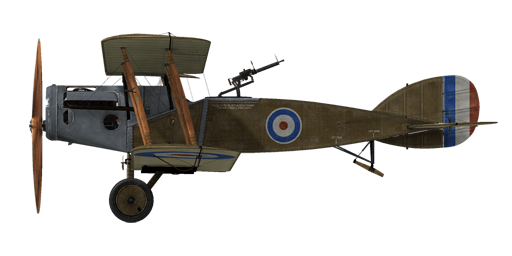

# Bristol F2B (F.II)

## Description

Design of the Bristol started in March of 1916 as an intended replacement for the B.E. two seater Series. It was designed as a reconnaissance aircraft, but additionally the new type was also going to have to be capable of carrying out scout patrols.  
It was supplied with dual controls, wireless radio, camera equipment and armed with a fixed Vickers gun firing through the cowling and a rear turret with one or two Lewis guns.  
  
The first prototype Bristol F.2A flew in September of 1916, equipped with a Rolls Royce Mk.1 engine.  
After successful trials, the aircraft went into production. The first combat unit equipped with Bristols to arrive in France was No.48 Squadron, which arrived at the front on March 8, 1917.  
  
The first offensive patrol was flown on April 5, 1917, but proved to be a disastrous debut for the Bristol. The patrol consisted of six F.2As and was led by Captain I.V. Leefe-Robinson, V.C. When over Douai, they were attacked by five Albatros D.IIIs led by Manfred von Richthofen, who shot down two of the Bristols for his thirty-fifth and thirty-sixth victories. Two other Bristols, one of them flown by Leefe-Robinson himself, were also accounted for by Richthofen\'s pilots.  
  
This failure happened mostly due to old tactics used by the first Bristol pilots - as they used it to fly in close formation and only with defensive tactics. But later, as pilots gained combat experience, the Bristol proved to be a superior combat machine when used as a fighter plane.  
  
Later on, some changes were made to the Bristol airframe, and it was also supplied with new Falcon II and Falcon III engines, whereupon it was re-designated as the Bristol F.2B and became one of the best, if not the best, two seat fighter of the Great War.  
Due to a shortage of the Rolls Royce Falcon engine, a wide variety of engines were installed, such as 300hp Hispano, Raf 4a, Sunbeam Arab and Liberty engines.  
  
Fast, with a good climb rate, rugged, very fast in dives and flown by aggressive and experienced pilots, Bristols soon became feared by enemy opponents. Usually, German pilots chose to evade Bristols if the Germans did not have superior numbers.  
The most successful Bristol ace who flew F.2Bs as a pilot, Andrew Edward McKeever from No.11 squadron, scored an impressive 31 kills flying Bristols. However, his record was overshadowed by that of the highest scoring observer ace of the war, Charles George Gass, who scored 39 (!!!) kills while flying as a Bristol gunner!  
  
While excelling as a fighter, the Bristol was also capable of being a good ground attack aircraft. It could carry up to 450 lbs of bombs on external racks. Some of the Bristols were also equipped with a Negative Lens bombsight.  
Being a very successful aircraft, Bristol Fighters were used by RAF squadrons through the 1920s.  
A total of 3,101 Bristol Fighters were produced up until the end of 1918.  
  
Engine: V-type 12 cyl. Rolls Royce Falcon II  
Power: 255 hp (2000 RPM)  
  
Dimensions:  
Height: 2970 mm  
Length: 7874 mm  
Wing span: 11986 mm  
Wing surface: 37.7 sq.m  
  
Weight:  
Empty: 885 kg  
Crew: 160 kg  
Fuel capacity: 170.5 liters (127 kg)  
Oil capacity: 15.2 liters (14 kg)  
Takeoff without bombload: 1262 kg  
Takeoff with 4 x 112 lb (203 kg) bombs: 1465 kg  
Takeoff with 12 x 24 lb (131 kg) bombs: 1393 kg  
  
Speed (IAS), without bombload:  
sea level - 192 km/h  
1000 - 180 km/h  
2000 - 168 km/h  
3000 - 155 km/h  
4000 - 142 km/h  
5000 - 128 km/h  
6000 - 106 km/h  
  
Climb rate, full fuel load, no bombs:  
1000 m -  3 min. 18 sec.  
2000 m -  7 min. 20 sec.  
3000 m - 12 min. 42 sec.  
4000 m - 20 min. 41 sec.  
5000 m - 35 min. 54 sec.  
  
Service ceiling: 5200 m  
Theoretical ceiling: 6100 m  
  
Endurance at 1000 m:  
nominal power (combat) — 1 h. 50 min.  
minimal consumption — 4 h. 50 min.  
  
Armament:  
Forward firing: 1 x Vickers Mk.I 7.69 mm, 973 rounds per barrel  
Tail upper position: 2 x Lewis 7.69 mm, 8 drums with 97 rounds each  
1749 7.69 mm rounds in total  
  
Bomb load variations:  
12 x 24 lb (131 kg)  
8 x 24 lb + 2 x 112lb (187 kg)  
4 x 112 lb (203 kg)  
2 x 112 lb (102 kg)  
203 kg in total  
  
References  
1) Air Board Data Charts, 1917.  
2) Windsock Datafile Special Vol.1/Vol.2, by J.M. Bruce.  
3) Profile Publications The Bristol Fighter, Number 21.  
4) Bristol Fighter Pilot notes, 1917.  
5) Rolls Royce engine charts, 1917.  
6) WWI Aeroplanes data, by J.M. Bruce.  
7) Bristol F2 Fighter Aces, Osprey, AOF no.79.  
8) Various NACA reports.  
9) Various RFC trial reports on Bristol Fighter, 1917-1918.

## Modifications

**Camera**  
Camera for taking aerial photographs  
Additional mass: 10 kg

**Twin Lewis Overwing**  
Two overwing mounted additional Lewis machineguns with changeable position.  
Ammo: 582 of 7.69mm rounds (6 drums with 97 rounds in each)  
Forward position: 0°  
Upward position: 62°  
Projectile weight: 11 g  
Muzzle velocity: 745 m/s  
Rate of fire: 550 rpm  
Guns weight: 15 kg (w/o ammo drums)  
Mounts weight: 8 kg  
Ammo weight: 24 kg  
Total weight: 47 kg  
Estimated speed loss: 4-14 km/h

**Radio**  
Radio transmitter  
Additional mass: 10 kg

**Cooper / H.E.R.L. bombs**  
Up to 12 x 11 kg (24 lb) General Purpose Bombs  
Additional mass: 167 kg  
Ammunition mass: 131 kg  
Racks mass: 36 kg  
Estimated speed loss before drop: 7 km/h  
Estimated speed loss after drop: 3 km/h  
  
Up to 4 x 51 kg (112 lb) H.E.R.L. General Purpose Bombs  
Additional mass: 252 kg  
Ammunition mass: 204 kg  
Racks mass: 48 kg  
Estimated speed loss before drop: 8 km/h  
Estimated speed loss after drop: 4 km/h

**Aldis**  
Aldis Refractor-type Collimator Sight  
Additional mass: 2 kg

**Fuel Gauge**  
Needle Scale fuel level Gauge (0-30 Gallons)  
Additional mass: 1 kg

**Twin Lewis MG turret**  
Scarff ring turret with twin Lewis MG  
Ammo: 776 of 7.69mm rounds (8 drums with 97 rounds in each)  
Projectile weight: 11 g  
Muzzle velocity: 745 m/s  
Rate of fire: 550 rpm  
Guns weight: 15 kg (w/o ammo drums)  
Mount weight: 12 kg  
Ammo weight: 32 kg  
Total weight: 59 kg  
Estimated speed loss: 2 km/h

**Cockpit light**  
Cockpit illumination lamp for night sorties  
Additional mass: 1 kg
