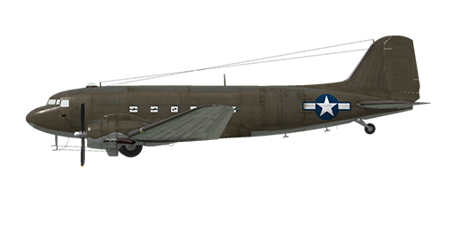

# C-47A

## Description

Indicated stall speed in flight configuration: 73...88 mph (118...142 km/h)  
Indicated stall speed in takeoff/landing configuration: 67...77 mph (107...124 km/h)  
Dive speed limit: 255 mph (410 km/h)  
Maximum load factor: 5.0 G  
Stall angle of attack in flight configuration: 13 °  
Stall angle of attack in landing configuration: 12.5 °  
  
Maximum true air speed at sea level, engine mode - take-off: 365 km/h (227 mph)  
Maximum true air speed at 2000 m (6562 feet), engine mode - take-off: 394 km/h (245 mph)  
  
Maximum true air speed at sea level, engine mode - economical maximum: 288 km/h (179 mph)  
Maximum true air speed at 5000 m (16404 feet), engine mode - economical maximum: 348 km/h (216 mph)  
  
Service ceiling: 8000 m (26247 feet)  
Climb rate at sea level: 6,7 m/s (1319 fpm)  
Climb rate at 3000 m: 6,2 m/s (1220 fpm)  
Climb rate at 6000 m: 2,9 m/s (571 fpm)  
  
Maximum performance turn at sea level: 22.0 s, at 175 mph (282 km/h) IAS.  
Maximum performance turn at 3000 m (9843 feet): 31.0 s, at 165 mph (262 km/h) IAS.  
  
Flight endurance at 3000 m (9843 feet): 3.5, at 300 km/h (187 mph) IAS.  
  
Takeoff speed: 75...85 mph (121..137 km/h)  
Glideslope speed: 95..105 mph (153..169 km/h)  
Landing speed: 70..80 mph (112..128 km/h)  
Landing angle: 11.5 °  
  
Note 1: the data provided is for international standard atmosphere (ISA).  
Note 2: flight performance ranges are given for possible aircraft mass ranges.  
Note 3: maximum speeds, climb rates and turn times are given for standard aircraft mass.  
Note 4: climb rates are given for maximum continuous power, turn times are given for Take-off power.  
  
Engine:  
Model: R-1830-92  
Maximum power in take-off mode at sea level: 1170 HP  
Maximum power in maximum continuous mode at sea level: 1030 HP  
Maximum power in economical maximum mode at sea level: 590 HP  
  
Maximum power in take-off mode at 4800 feet (1463 m): 1200 HP  
Maximum power in maximum continuous mode at 7000 feet (2134 m): 1050 HP  
Maximum power in economical maximum mode at 15000 feet (4572 m): 700 HP  
  
Engine modes:  
Take-off (up to 5 minutes): 2700 RPM, 46.0 inch Hg, "Auto-rich"  
Maximum continuous (unlimited time): 2550 RPM, 41 inch Hg, "Auto-lean"  
Economical maximum (unlimited time): 2325 RPM, 28.0 inch Hg, "Auto-lean"  
  
Oil rated temperature in engine output: 60..75 °C  
Oil maximum temperature in engine output: 100 °C  
Cylinder head rated temperature: 150..232 °C  
Cylinder head maximum temperature: 260 °C  
  
Empty weight: 8029 kg (17700 lb)  
Minimum weight (no ammo, 10%25 fuel): 8828 kg (19462 lb)  
Standard weight: 6503 kg (14337 lb)  
Maximum takeoff weight: 13337 kg (29403 lb)  
Fuel load: 2188 kg (4824 lb) / 3043 l (804 gal)  
Useful load: 5308 kg (11702 lb)  
  
Length: 64.8 feet (19.75 m)  
Wingspan: 28,96 m (95 feet)  
Wing surface: 91,7 m² (987 feet²)  
  
Combat debut: spring 1942  
  
Operation features:  
- The engine has no manifold pressure automatic governor. For this reason, manifold pressure not only depends on throttle position, but also from RPM and altitude. This requires additional checking of manifold pressure to not cause engine damage.  
- The engine is equipped with an automatic fuel mixture control which maintains optimal mixture if mixture lever is set to Auto Rich (66%25) position. To use automatic mixture leaning to reduce fuel consumption during flight it is necessary to set mixture lever to Auto Lean (33%25) position. In the case of malfunction of the automatic mixture control the mixture lever should be set to Emergency (100%25) position. To stop the engine mixture lever should be set to the Idle Cut Off (0%25) position.  
- Engine RPM has an automatic governor and it is maintained at the required RPM corresponding to the governor control lever position. The governor automatically controls the propeller pitch to maintain the required RPM.  
- Oil radiators and engine cowl outlet shutters are manually operated.  
- The aircraft has trimmers for all flight-controls: pitch, roll and yaw.  
- Landing flaps have a hydraulic actuator and they can be extended to any angle up to 50°.  
- The aircraft has independent left and right hydraulic wheel brake controls. To apply either brake push the upper part of the rudder pedal.  
- The aircraft is equipped with a parking brake system.  
- The aircraft is equipped with formation, navigation and landing lights.  
- The engine has a one-stage mechanical supercharger.  
- The aircraft has a fuel gauge which shows remaining fuel in fuel tanks depending on switch position. In game the fuel indicator switch changes by pressing (RShift+I).  
- The aircraft has a manual control for the tailwheel lock. The unlocked tailwheel has no turn limit. The tailwheel should be locked when taxiing straight for a long distance and before takeoff and landing.  
- The aircraft is equipped with three-channel autopilot system (main switch RAlt + A). Pilot has the ability to trim course (RAlt + Left/Right), pitch (RAlt + Up/Down) and roll (RShift + Left/Right) stabilizing angles.  
- Cargo unload doors can be opened on the ground only.  
- The left passenger door must be removed before flight for dropping paratroopers or cargo containers. Use the bomb drop button ("B" by default) to drop them.

## Modifications

**Runway localizer**  
Runway localizer system for instrument approach  
Additional mass: 15 kg  
Estimated speed loss: 1 km/h

**16 paratroopers**  
16 paratroopers with ammunition  
Additional mass: 1600 kg  
Estimated speed loss before drop: 2 km/h  
Estimated speed loss after drop: 0 km/h

**14 x A-5 containers**  
14 x 250lb (110 kg) drop transport container with parachute A-5  
Additional mass: 1540 kg  
Containers mass: 1540 kg  
Racks mass: 0 kg  
Estimated speed loss before drop: 5 mph (8 km/h)  
Estimated speed loss after drop: 4 mph (6 km/h)

**6 x A-5 containers**  
6 x 250lb (110 kg) drop transport container with parachute A-5  
Additional mass: 765 kg  
Containers mass: 660 kg  
Racks mass: 105 kg  
Estimated speed loss before drop: 11 mph (18 km/h)  
Estimated speed loss after drop: 9 mph (14 km/h)

**2315 kg of cargo**  
2315 kg of military cargo payload  
Additional mass: 2315 kg  
Estimated speed loss: 2 mph (4 km/h)
