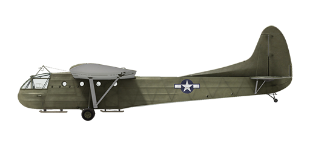

# CG-4A

## Description

Indicated stall speed in flight configuration: 65..86 km/h  
Dive speed limit: 241 km/h  
Maximum load factor: 3.5 G  
Stall angle of attack in flight configuration: 16 °  
  
Takeoff speed: 86..113 km/h  
Glideslope speed: 98..128 km/h  
Landing speed: 81..106 km/h  
Landing angle: 8 °  
  
Optimal descent speed on glideslope: 2 m/s  
  
Note 1: the data provided is for international standard atmosphere (ISA).  
Note 2: flight performance ranges are given for possible aircraft mass ranges.  
  
Empty weight: 1769 kg  
Minimum weight: 2383 kg  
Standard weight: 3402 kg  
Maximum takeoff weight: 4082 kg  
Useful load: 2313 kg  
  
Length: 14.73 m  
Wingspan: 25.2 m  
Wing surface: 79.25 m²  
  
Combat debut: July 1943  
  
Operation features:  
- The glider is equipped with a towing mechanism with a detachable cable. The cable could be released upon command from the glider pilot, or from the pilot of the towing aircraft (by default, LShift+D).  
- The airframe has interceptor spoilers with a manual mechanical drive, which, when released (by default, RAlt+B), reduce the lift of the wing and increase the drag, thereby shortening the glide path.  
- The front part of the glider is a crew cabin, which on the ground can be tilted upward for loading and unloading cargo or troops.  
- The aircraft has independent left and right pneumatic wheel brake controls. To apply either brake push the upper part of the rudder pedal.  
- The airplane tailwheel rotates freely and does not have a lock.  
- To provide shorter landing run drogue chute could be installed as modification. Maximum speed of drogue chute release (LAlt + D) is 225 km/h. After successfull landing and braking drogue chute should be jettisoned (LAlt + D).

## Modifications

**Braking Parachute**  
Installation of braking parachute for reducing the landing run distance  
Additional mass: 32 kg  
Estimated speed loss: 2 km/h

**13 airborne troopers**  
13 airborne troopers with ammunition  
Additional mass: 1415 kg

**Willys MB**  
Willys MB 1⁄4 ton 4x4 utility truck  
Additional mass: 1630 kg

**Cargo, 1000 kg**  
1000 kg of military cargo  
Additional mass: 1000 kg
