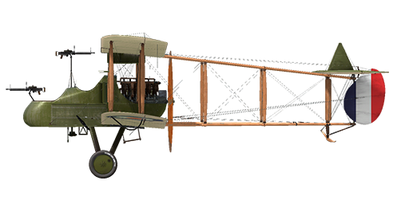

# F.E.2b

## Description

The F.E.2 was a biplane with a pusher propeller and a sprung landing gear with a front support wheel to minimize the risk of overturning during a bad landing. The entire trailing edge of the upper center section was hinged along the rear spar and could be lowered to act as a flap-type air brake. The forward cockpit was occupied by the observer gunner, with the pilot sitting behind him at a higher level. The engine was almost completely cowled and drove a two-blade pusher propeller.  
  
Interestingly, in February 1915, this type of plane was tested with a brake parachute. This was probably the first time in history that a braking parachute was used on an airplane. A newly designed air brake that had been used on the first F.E.2a was also tested, but the air brake was eventually abandoned.  
  
During testing, the performance of the 100 hp Green engine was found to be unsatisfactory, mainly due to its poor power-to-weight ratio, and the machine was modified to be fitted with a new in-line six-cylinder water-cooled Beardmore engine rated at 120 hp. The center section of the upper wing was made in one piece and the air brake was removed. The aircraft with the new engine made its first flight in March 1915, but the first deliveries to the Royal Flying Corps did not begin until May. The first F.E.2b to go to France was flown to the No. 6 Squadron airfield at Abeele by Captain L.A. Strange on May 20, 1915. By September 25th the squadron had four F.E.2b\'s in its strength.  
  
Production of the F.E.2b was undertaken by a number of contractors, but it took some time before the machines were available in sufficient numbers; by the end of 1915, a total of thirty-two had been delivered. The first R.F.C. unit to go to France fully equipped with F.Es was No. 20, which arrived on January 23, 1916. No. 25 Squadron followed on 20 February, No. 23 on 16 March, and No. 22 on April 1st.  
  
The F.E.2b was mainly used for the needs of the army: for reconnaissance and for the escort of other aircraft, and it proved to be very worthy in the battles against enemy aircraft. Often grouped with D.H.2 fighters, the F.E.2b fought back against the Fokker monoplanes that dominated the skies at the time. The success of its use in combat was due to the wide sector of fire of the machine guns in the nose of the plane. The plane was also occasionally used to attack ground targets on the front line and in actions on the enemy\'s rear communications. In the second half of the war, the F.E.2b was widely used as a night bomber; for this purpose, the aircraft were painted black and equipped with night take-off and landing equipment.  
  
The performance of the F.E.2b with the 120 hp Beardmore engine was not outstanding and from time to time attempts were made to improve its flight characteristics. At the end of March 1916, a new version of the Beardmore engine with an increased power of 160 hp appeared, and as it was essentially an improved version of the previous model, it could be fitted without the need for major design changes. Between 1915 and 1918, 1,939 F.E.2b aircraft were produced.  
  
Engine: 6-cyl. inline Beardmore 160 hp  
  
Dimensions  
Height: 3850 mm  
Length: 9830 mm  
Wing span: 14320 mm  
Wing surface: 45.9 sq.m  
  
Weight  
Empty weight: 936 kg  
Takeoff weight: 1380 kg  
  
Maximum airspeed (IAS), without bombload:  
seal level - 147 km/h  
1980 - 132 km/h  
3048 - 122 km/h  
  
Climb rate:  
 914 m - 7 min. 27 sec.  
3048 m - 39 min. 44 sec.  
  
Service ceiling: 3352 m  
  
Endurance: 3 h.  
  
Armament  
Forward gunner: 1 x Lewis 7,69mm for forward, port and starboard positions firing, plus 1 x Lewis 7,69mm on telescopic mounting between the cockpits, 12 drums with 97 rounds.  
  
Bomb load variations:  
12 x 20lb (109kg)  
1 x 230lb + 8 x 20lb (177kg)  
3 x 112lb (152,5kg)  
  
177kg in total  
  
References  
1) Windsock Datafile 18 RAF FE 2b, by J.M. Bruce.  
2) Windsock Datafile 147 RAF FE 2b at War, by Paul R Hare.  
2) WWI Aeroplanes by J.M. Bruce.

## Modifications

**Camera**  
Camera for taking aerial photographs  
Additional mass: 10 kg

**Clock**  
Mechanical Clock  
Additional mass: 1 kg

**Twin Lewis MG turret**  
Scarff ring turret with twin Lewis MG  
Ammo: 776 of 7.69mm rounds (8 drums with 97 rounds in each)  
Projectile weight: 11 g  
Muzzle velocity: 745 m/s  
Rate of fire: 550 rpm  
Guns weight: 15 kg (w/o ammo drums)  
Mount weight: 12 kg  
Ammo weight: 32 kg  
Total weight: 59 kg  
Estimated speed loss: 2 km/h

**Radio**  
Radio transmitter  
Additional mass: 10 kg

**Fuel Gauge**  
Needle Scale fuel level Gauge  
Additional mass: 1 kg

**Cooper / H.E.R.L. / H.E.R.F.C. bombs**  
Up to 12 x 11 kg (24 lb) General Purpose Bombs  
Additional mass: 167 kg  
Ammunition mass: 131 kg  
Racks mass: 36 kg  
Estimated speed loss before drop: 7 km/h  
Estimated speed loss after drop: 3 km/h  
  
Up to 3 x 51 kg (112 lb) H.E.R.L. General Purpose Bombs  
Additional mass: 177 kg  
Ammunition mass: 153 kg  
Racks mass: 24 kg  
Estimated speed loss before drop: 8 km/h  
Estimated speed loss after drop: 4 km/h  
  
Up to 1 x 104 kg (230 lb) H.E.R.F.C. General Purpose Bombs  
Additional mass: 120 kg  
Ammunition mass: 104 kg  
Racks mass: 16 kg  
Estimated speed loss before drop: 5 km/h  
Estimated speed loss after drop: 3 km/h

**Cockpit light**  
Cockpit illumination lamp for night sorties  
Additional mass: 1 kg
