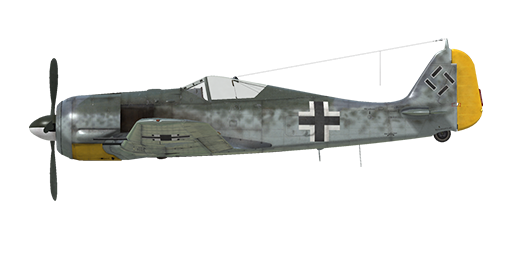

# Fw 190 A-6

## Description

Indicated stall speed in flight configuration: 170..197 km/h  
Indicated stall speed in takeoff/landing configuration: 156..178 km/h  
Dive speed limit: 850 km/h  
Maximum load factor: 11 G  
Stall angle of attack in flight configuration: 19.5°  
Stall angle of attack in landing configuration: 18.1°  
  
Maximum true air speed at sea level, engine mode - Emergency: 563 km/h  
Maximum true air speed at 3000 m, engine mode - Emergency: 585 km/h  
Maximum true air speed at 6400 m, engine mode - Emergency: 661 km/h  
  
Maximum true air speed at sea level, engine mode - Combat: 535 km/h  
Maximum true air speed at 3000 m, engine mode - Combat: 560 km/h  
Maximum true air speed at 6000 m, engine mode - Combat: 622 km/h  
  
Service ceiling: 10400 m  
Climb rate at sea level: 15.0 m/s  
Climb rate at 3000 m: 11.3 m/s  
Climb rate at 6000 m: 8.9 m/s  
  
Maximum performance turn at sea level: 23.5 s, at 280 km/h IAS.  
Maximum performance turn at 3000 m: 35.5 s, at 280 km/h IAS.  
  
Flight endurance at 3000 m: 3.0 h, at 350 km/h IAS.  
  
Takeoff speed: 170..210 km/h  
Glideslope speed: 205..215 km/h  
Landing speed: 160..170 km/h  
Landing angle: 12.5°  
  
Note 1: the data provided is for international standard atmosphere (ISA).  
Note 2: flight performance ranges are given for possible aircraft mass ranges.  
Note 3: maximum speeds, climb rates and turn times are given for standard aircraft mass.  
Note 4: climb rates are given for Combat power, turn times are given for Emergency power.  
  
Engine:  
Model: BMW-801D  
Maximum power in Emergency mode at sea level: 1700 HP  
Maximum power in Emergency mode at 5700 m: 1440 HP  
Maximum power in Combat mode at 700 m: 1520 HP  
Maximum power in Combat mode at 5300 m: 1320 HP  
  
Engine modes:  
Nominal (unlimited time): 2300 RPM, 1.2 ata  
Combat power (up to 30 minutes): 2400 RPM, 1.32 ata  
Emergency power (up to 3 minutes): 2700 RPM, 1.42 ata  
  
Oil rated temperature in engine intake: 60..70 °C  
Oil maximum temperature in engine intake: 85 °C  
Oil rated temperature in engine output: 105 °C  
Oil maximum temperature in engine output: 120 °C  
Cylinder head rated temperature: 180 °C  
Cylinder head maximum temperature: 220 °C  
Supercharger gear shift altitude: automatic  
  
Empty weight: 3371 kg  
Minimum weight (no ammo, 10%25 fuel): 3553 kg  
Standard weight: 4140 kg  
Maximum takeoff weight: 4766 kg  
Fuel load: 409 kg / 524 l  
Useful load: 1395 kg  
  
Forward-firing armament:  
2 x 7.92mm machine gun "MG 17", 900 rounds, 1200 rounds per minute, synchronized  
2 x 20mm gun "MG 151/20", 250 rounds, 700 rounds per minute, synchronized  
2 x 20mm gun "MG 151/20", 140 rounds, 700 rounds per minute, wing-mounted  
  
Bombs:  
Up to 8 x 66 kg general purpose bombs "SD 70"  
Up to 3 x249 kg general purpose bomb "SC 250"  
500 kg general purpose bomb "SC 500"  
  
Rockets:  
Two WGr.21 rockets in jettisonable launchers  
  
Length: 8.85 m  
Wingspan: 10.51 m  
Wing surface: 18.3 m²  
  
Combat debut: Summer 1943  
  
Operation features:  
- The aircraft has a wide automatization of the engine systems, in fact, to control speed it is only necessary to use the throttle lever. There is no need to manually set engine revolutions and mixture or supercharger gear in normal flight. The engine supercharger has an automatic switch system which depends on altitude and engine revolutions.  
- G-3 and G-3/R-5 modification includes C3 additional fuel injection system. When engaged, it increases pressure to 1.65 ATA (10 minutes time limit). This system can be turned on by engine boost command only at 100%25 throttle, with automatic propeller pitch control enabled and at altitudes lower than 1 km.  
- Outlet cowl shutters are operated manually.  
- To reduce swinging during taxiing due to prop-wash the propeller pitch control should be switched to manual mode and pitch should be reduced to minimum.  
- When the angle of attack increases to critical levels the wing may stall suddenly and unexpectedly. There is almost no pre-stall buffet before the stalling. To avoid this the pilot must pay additional attention when performing extreme maneuvering.  
- The aircraft has no flight-control trimmers. Airplane is equipped with bendable trim tabs that can be set pre-flight by ground personnel.  
- The aircraft has a manually controlled horizontal stabilizer which is electrically-actuated. It should be set to +1.5° before takeoff and landing. Also, it may be used to trim the flight stick during the flight. In a deep dive the stabilizer should be set so that the pilot must push the flight stick forward to maintain the dive angle.  
- The aircraft has electrically-actuated landing flaps with three fixed positions: retracted, takeoff (13°) and landing (58°). Flaps control buttons and indicator lights are located on left panel near the throttle. The flap angle may also be checked by indicators on the left and right wing outside the cockpit.  
- The aircraft has a tail wheel lock system which locks the tail wheel if the flight-stick is pulled backward. The tailwheel should be locked when taxiing straight for a long distance, before takeoff and after touchdown upon landing.  
- The aircraft has independent left and right hydraulic wheel brake controls. To apply either brake push the upper part of the rudder pedal.  
- The aircraft has a fuel gauge which shows the amount of remaining fuel in the front or rear fuel tank depending on switch position. In game the fuel indicator switch changes by itself during horizontal flight by every 10 seconds. Also, the airplane has an emergency fuel warning light (100 liters).  
- It is impossible to open or close the canopy at high speed due to strong airflow. The canopy has an emergency release system for bailouts.  
- The control system for the bomb rack only allows for dropping bombs one by one. With "G-3" and "G-3/R-5" modifications it is possible to select left, right or both underwing bomb racks, but the centerline bomb rack is always selected and each push of the bomb release control will drop one of its bombs.  
- The gunsight has a sliding sun-filter.

## Modifications

**Bomb load**  
Underwing (G-3) and underbelly racks with bombs  
  
ETC 501 Centerline Bomb Rack  
4 x 66 kg Fragmentation Bombs SD 70:  
Additional mass: 324 kg  
Ammunition mass: 264 kg  
Racks mass: 60 kg  
Estimated speed loss before drop: 90 km/h  
Estimated speed loss after drop: 46 km/h  
  
249 kg General Purpose Bomb SC 250:  
Additional mass: 279 kg  
Ammunition mass: 249 kg  
Racks mass: 30 kg  
Estimated speed loss before drop: 43 km/h  
Estimated speed loss after drop: 17 km/h  
  
500 kg General Purpose Bomb SC 500:  
Additional mass: 530 kg  
Ammunition mass: 500 kg  
Racks mass: 30 kg  
Estimated speed loss before drop: 47 km/h  
Estimated speed loss after drop: 17 km/h

**21 cm BR**  
Two WGr.21 rockets in jettisonable launchers  
Additional mass: 222 kg  
Ammunition mass: 188 kg  
Racks mass: 34 kg  
Estimated speed loss before launch: 66 km/h  
Estimated speed loss after launch: 17 km/h  
Estimated speed loss after drop: 6 km/h

**Installation of MG 17**  
Installation of 2 nose-mounted 7.92mm machine guns MG-17 (only together with "Sturmjager" or "G-3/R-5" modifications).  
  
Additional ammunition mass: 52 kg  
Additional guns mass: 20 kg

**Removal of MG 151/20**  
Removal of 2 wing-mounted 20mm MG-151/20 guns (not compatible with "G-3" or "G-3/R-5" modifications).  
  
Removed ammunition mass: 62 kg  
Removed guns mass: 87 kg

**Fw 190 A-6 Sturmjäger**  
Additional protection: side armour plates and armoured glass on the windshield and canopy sides. Machineguns are removed.  
Additional mass: 34 kg  
Estimated speed loss: 5 km/h

**Fw 190 G-3/R-5**  
Fw 190 G-3/R-5 strike modification includes 70 kg underwing bomb racks, underbelly ETC 501 rack, 1.65 ATA modified engine (C3 system) and removes the outer MG151/20 wing-mounted guns and MG-17 machineguns (machineguns can be installed back by special modification).  
  
Removed mass: 151 kg  
Estimated speed loss: 29 km/h

**Fw 190 G-3**  
Fw 190 G-3 strike modification includes 250 kg underwing bomb racks, underbelly ETC 501 rack, 1.65 ATA modified engine (C3 system) and removes the outer MG151/20 wing-mounted guns and MG-17 machineguns.  
  
Removed mass: 151 kg  
Estimated speed loss: 27 km/h
