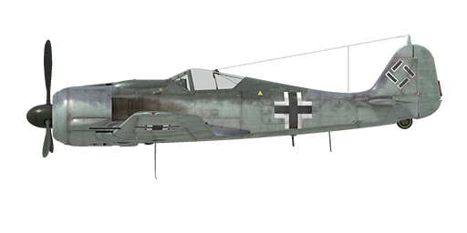

# Fw 190 A-8

## Description

Indicated stall speed in flight configuration: 177..208 km/h  
Indicated stall speed in takeoff/landing configuration: 164..188 km/h  
Dive speed limit: 850 km/h  
Maximum load factor: 11 G  
Stall angle of attack in flight configuration: 19.5°  
Stall angle of attack in landing configuration: 18.1°  
  
Maximum true air speed at sea level, engine mode - Emergency: 558 km/h  
Maximum true air speed at 3000 m, engine mode - Emergency: 580 km/h  
Maximum true air speed at 6200 m, engine mode - Emergency: 641 km/h  
  
Maximum true air speed at sea level, engine mode - Combat: 532 km/h  
Maximum true air speed at 3000 m, engine mode - Combat: 558 km/h  
Maximum true air speed at 5800 m, engine mode - Combat: 612 km/h  
  
Service ceiling: 10300 m  
Climb rate at sea level: 13.8 m/s  
Climb rate at 3000 m: 10.1 m/s  
Climb rate at 6000 m: 7.8 m/s  
  
Maximum performance turn at sea level: 24.2 s, at 280 km/h IAS.  
Maximum performance turn at 3000 m: 33.0 s, at 280 km/h IAS.  
  
Flight endurance at 3000 m: 3.8 h, at 350 km/h IAS.  
  
Takeoff speed: 180..220 km/h  
Glideslope speed: 215..225 km/h  
Landing speed: 160..180 km/h  
Landing angle: 12.5°  
  
Note 1: the data provided is for international standard atmosphere (ISA).  
Note 2: flight performance ranges are given for possible aircraft mass ranges.  
Note 3: maximum speeds, climb rates and turn times are given for standard aircraft mass.  
Note 4: climb rates are given for Combat power, turn times are given for Emergency power.  
  
Engine:  
Model: BMW-801D  
Maximum power in Emergency mode at sea level: 1700 HP  
Maximum power in Emergency mode at 5700 m: 1440 HP  
Maximum power in Combat mode at 700 m: 1520 HP  
Maximum power in Combat mode at 5300 m: 1320 HP  
  
Engine modes:  
Nominal (unlimited time): 2300 RPM, 1.2 ata  
Combat power (up to 30 minutes): 2400 RPM, 1.32 ata  
Emergency power (up to 3 minutes): 2700 RPM, 1.42 ata  
  
Oil rated temperature in engine intake: 60..70 °C  
Oil maximum temperature in engine intake: 85 °C  
Oil rated temperature in engine output: 105 °C  
Oil maximum temperature in engine output: 120 °C  
Cylinder head rated temperature: 180 °C  
Cylinder head maximum temperature: 220 °C  
Supercharger gear shift altitude: automatic  
  
Empty weight: 3504 kg  
Minimum weight (no ammo, 10%25 fuel): 3697 kg  
Standard weight: 4391 kg  
Maximum takeoff weight: 5239 kg  
Fuel load: 498 kg / 639 l  
Useful load: 1735 kg  
  
Forward-firing armament:  
2 x 20mm gun "MG 151/20", 250 rounds, 700 rounds per minute, synchronized  
2 x 20mm gun "MG 151/20", 140 rounds, 700 rounds per minute, wing-mounted  
2 x 13mm machine gun "MG 131", 475 rounds, 900 rounds per minute, synchronized  
2 x 30mm gun "MK 108", 55 rounds, 650 rounds per minute, wing-mounted (modification)  
  
Bombs:  
Up to 8 x 66 kg fragmentation bombs "SD 70"  
Up to 3 x 249 kg general purpose bomb "SC 250"  
500 kg general purpose bomb "SC 500"  
1090 kg general purpose bomb "SC 1000"  
  
Rockets:  
Two WGr.21 rockets in jettisonable launchers  
Up to 12 Panzerblitz 1 rockets (R-HL, M8)  
  
Length: 8.85 m  
Wingspan: 10.51 m  
Wing surface: 18.3 m²  
  
Combat debut: Spring 1944  
  
Operation features:  
- The aircraft has a wide automatization of the engine systems, in fact, to control speed it is only necessary to use the throttle lever. There is no need to manually set engine revolutions and mixture or supercharger gear in normal flight. The engine supercharger has an automatic switch system which depends on altitude and engine revolutions.  
- There is an additional emergency engine mode system installed. When it is engaged, the first supercharger gear pressure increases to 1.58 ATA and the second gear pressure to 1.65 ATA, the time limit is 10 minutes. This system is turned on by the engine boost command and works only when the throttle is set to 100%25, automatic propeller pitch system is engaged and the altitude is lower than critical altitude for a given supercharger gear.  
- Outlet cowl shutters are operated manually.  
- To reduce swinging during taxiing due to prop-wash the propeller pitch control should be switched to manual mode and pitch should be reduced to minimum.  
- When the angle of attack increases to critical levels the wing may stall suddenly and unexpectedly. There is almost no pre-stall buffet before the stalling. To avoid this the pilot must pay additional attention when performing extreme maneuvering.  
- The aircraft has no flight-control trimmers. Airplane is equipped with bendable trim tabs that can be set pre-flight by ground personnel.  
- The aircraft has a manually controlled horizontal stabilizer which is electrically-actuated. It should be set to +1.5° before takeoff and landing. Also, it may be used to trim the flight stick during the flight. In a deep dive the stabilizer should be set so that the pilot must push the flight stick forward to maintain the dive angle.  
- The aircraft has electrically-actuated landing flaps with three fixed positions: retracted, takeoff (13°) and landing (58°). Flaps control buttons are located on left panel near the throttle. The flap angle may be checked by indicators on the left and right wing outside the cockpit.  
- The aircraft has a tail wheel lock system which locks the tail wheel if the flight-stick is pulled backward. The tailwheel should be locked when taxiing straight for a long distance, before takeoff and after touchdown upon landing.  
- The aircraft has independent left and right hydraulic wheel brake controls. To apply either brake push the upper part of the rudder pedal.  
- The aircraft has a fuel gauge which shows the amount of remaining fuel in the front or rear fuel tank depending on switch position. In game the fuel indicator switch changes by itself during horizontal flight by every 10 seconds. Also, the airplane has an emergency fuel warning light (100 liters).  
- It is impossible to open or close the canopy at high speed due to strong airflow. The canopy has an emergency release system for bailouts.  
- The standard bomb release controller (without modification) allows dropping the bombs only one by one. The strike modification (F-8) bomb release controller allows to choose the bomb release order for underbelly and underwing bombs and the delay between each bomb in the salvo.  
- The gunsight has a sliding sun-filter.

## Modifications

**21 cm BR**  
Two WGr.21 rockets in jettisonable launchers  
Additional mass: 258 kg  
Ammunition mass: 224 kg  
Racks mass: 34 kg  
Estimated speed loss before launch: 67 km/h  
Estimated speed loss after launch: 16 km/h  
Estimated speed loss after drop: 4 km/h

**Sturmjäger**  
Additional protection: side armour plates and armoured glass on the windshield sides.  
Additional mass: 85 kg  
Estimated speed loss: 5 km/h

**30mm MK 108 guns**  
Two MK 108 30mm wing-mounted guns with 55 rounds per gun.  
Additional mass: 63 kg  
Ammunition mass: 64 kg  
Guns mass: 116 kg  
Estimated speed loss: 0 km/h

**Fw 190 F-8 / G-8**  
Fw 190 F-8 "Schlachtflugzeug" strike modification includes additional fuselage bottom and engine armour, 70 kg underwing bomb or rocket holders and removes the outer MG151/20 wing-mounted guns.  
Fw 190 G-8 "Jabo-Rei" bomber modification is enabled when "Removal of MG 131" is also selected. This modification also allows to attach 250 kg underwing bombs.  
  
Additional mass: 68 kg  
Estimated speed loss: 17 km/h

**Removal of MG 131**  
Removal of 2 nose-mounted 13mm machine guns (only together with "Sturmjäger" or "F-8/G-8" modifications).  
In combination with "F-8/G-8" modification it allows to carry one SC 1000 or two SC 250 bombs.  
  
Removed ammunition mass: 81 kg  
Removed guns mass: 40 kg

**ETC 501 Centerline Bomb Rack**  
4 x 66 kg Fragmentation Bombs SD 70:  
Additional mass: 324 kg  
Ammunition mass: 264 kg  
Racks mass: 60 kg  
Estimated speed loss before drop: 93 km/h  
Estimated speed loss after drop: 46 km/h  
  
249 kg General Purpose Bomb SC 250:  
Additional mass: 279 kg  
Ammunition mass: 249 kg  
Racks mass: 30 kg  
Estimated speed loss before drop: 43 km/h  
Estimated speed loss after drop: 16 km/h  
  
500 kg General Purpose Bomb SC 500:  
Additional mass: 530 kg  
Ammunition mass: 500 kg  
Racks mass: 30 kg  
Estimated speed loss before drop: 48 km/h  
Estimated speed loss after drop: 16 km/h  
  
1090 kg General Purpose Bomb SC 1000:  
Additional mass: 1120 kg  
Ammunition mass: 1090 kg  
Racks mass: 30 kg  
Estimated speed loss before drop: 85 km/h  
Estimated speed loss after drop: 28 km/h
