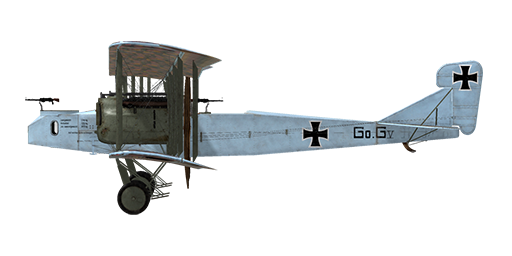

# Gotha G.V

## Description

The Gotha G.V was a subsequent development of the Gotha G.IV. Combat experience showed that the close proximity of the fuel tanks to the engines could lead to disastrous results. As a result, the fuel tanks were moved to the fuselage. A shortage of quality materials led to an increased weight of the airframe. The lower part of the fuselage retained the gun tunnel for firing rearward and downward. To improve stability while taxiing on the ground, the undercarriage legs were shortened, which required the engine nacelles to be repositioned above the lower wing. This latter modification is the most important external feature distinguishing the V series from previous models. Orders were placed in October 1916 for the production of 100 aircraft. In August 1917, first Gotha G.V left the factory. The plane was manufactured by Gothaer Waggonfabrik A.G. In all, 205 planes of the V series were built.  
The G.V was used to bomb strategically important ground targets and cities such as London. By war’s end, the plane was being employed as a night bomber.  
With a maximum bomb load, the plane was stable in flight, but on returning to base, it exhibited minimum stability and an unpleasant heaviness of the tail fin. To overcome these flaws, the tail gunner would sit close to the pilot; later on, the wings were simply moved rearwards by 20 cm. Upon landing, the plane had a tendency to yaw until it made full contact with ground. In February 1918, additional gears were fitted that were meant to make landings safer and to avoid nosing over. The aircraft took part in battles over the Western Front.  
  
  
Engine: 2 x inline 6 cyl. Mercedes D. IVa  
Power: 260 hp  
  
Dimensions:  
Height: 4300 mm  
Length: 12400 mm  
Wing span: 23700 mm  
Wing surface: 89.5 sq.m  
  
Weight:  
Empty: 2739.8 kg   
Crew: 240 kg  
Fuel capacity: 841 liters (626.8 kg)  
Oil capacity: 43 liters (79.8 kg)  
Takeoff: 3745.4 kg  
Takeoff with 7 x 50 kg (350 kg) bombs: 4095 kg  
  
Speed (IAS), without bombload:  
sea level - 137.6 km/h  
1000 - 132.7 km/h  
2000 - 126.7 km/h  
3000 - 121.7 km/h  
4000 - 113.9 km/h  
5000 - 102.6 km/h  
  
Climb rate, full fuel load, no bombs:  
1000 m: 6 min.  
2000 m: 12 min. 38 sec.  
3000 m: 20 min. 46 sec.  
4000 m: 32 min. 07 sec.  
5000 m: 53 min. 37 sec.  
  
Climb speed, full fuel load, 7 x 50kg (350 kg) bombs:  
1000 m - 7 min. 35 sec.  
2000 m - 16 min. 20 sec.  
3000 m - 27 min. 51 sec.  
4000 m - 47 min. 35 sec.  
  
Service ceiling: 4650 m (6850 m without bomb load)  
  
Endurance: 5 hours (7 hours without bomb load)  
  
Armament:  
Nose position: 1 х Parabellum LMG 14/17 7,92 mm, 4 drums with 250 rounds each  
Tail upper position: 1 х Parabellum LMG 14/17 7,92 mm, 4 drums with 250 rounds each  
  
Bomb load variations:  
5 x 50 kg (350 kg)  
7 x 100 kg (700 kg)  
4 x 100 kg (400 kg)  
1 x 300 kg + 4 x 100 kg (700 kg)  
1 x 300 kg (300 kg)  
  
700 kg in total  
  
References:  
1) Gotha by P.M. Grosz  
2) German Aircraft of World War I. Grey and Thetford Putnam Books. ISBN  0-933852-71-1  
3) The Gotha G1-G5. Profile Publications Number 115  
4) The Gotha. Flight magazine 1917.

## Modifications

**Cockpit light**  
Cockpit illumination lamp for night sorties  
Additional mass: 1 kg

**Fuel Gauge and Clock**  
Needle Scale fuel level Gauge (0-800 l) and Mechanical Clock  
Additional mass: 0.5 kg

**P.u.W. Bombs**  
Up to 12 x 12.5 kg P.u.W. General Purpose Bombs  
Additional mass: 434 kg  
Ammunition mass: 350 kg  
Racks mass: 84 kg  
Estimated speed loss before drop: 2 km/h  
Estimated speed loss after drop: 1 km/h  
  
Up to 3 x 50 kg P.u.W. General Purpose Bombs  
Additional mass: 784 kg  
Ammunition mass: 700 kg  
Racks mass: 84 kg  
Estimated speed loss before drop: 2.5 km/h  
Estimated speed loss after drop: 1 km/h  
  
Up to 3 x 50 kg P.u.W. General Purpose Bombs  
Additional mass: 760 kg  
Ammunition mass: 700 kg  
Racks mass: 60 kg  
Estimated speed loss before drop: 2 km/h  
Estimated speed loss after drop: 1 km/h  
  
Up to 3 x 50 kg P.u.W. General Purpose Bombs  
Additional mass: 312 kg  
Ammunition mass: 300 kg  
Racks mass: 12 kg  
Estimated speed loss before drop: 1.5 km/h  
Estimated speed loss after drop: 1 km/h

**20mm Becker Front Turret**  
Front Turret with Becker Automatic Cannon  
Ammo: 60 of 20mm rounds (4 magazines with 15 rounds in each)  
Ammo type: HE/AP (High Explosive and Armour Piercing rounds)  
Rate of fire: 300 rpm  
Projectile weight: 120/130 g  
Muzzle velocity: 450/490 m/s  
Gun weight: 30 kg  
Mount weight: 10 kg  
Ammunition total weight: 25 kg  
Total weight: 65 kg  
Estimated speed loss: 2 km/h

**Rear 20mm Becker Turret**  
Rear Turret with Becker Automatic Cannon  
Ammo: 60 of 20mm rounds (4 magazines with 15 rounds in each)  
Ammo type: HE/AP (High Explosive and Armour Piercing rounds)  
Rate of fire: 300 rpm  
Projectile weight: 120/130 g  
Muzzle velocity: 450/490 m/s  
Gun weight: 30 kg  
Mount weight: 10 kg  
Ammunition total weight: 25 kg  
Total weight: 65 kg  
Estimated speed loss: 2 km/h

**Twin Parabellum MG Front Turret**  
Front ring turret with twin Parabellum machine guns.  
Ammo: 2000 of 7.92mm rounds (8 drums with 250 rounds in each)  
Projectile weight: 10 g  
Muzzle velocity: 825 m/s  
Rate of fire: 700 rpm  
Guns weight: 19 kg (w/o ammo drums)  
Mount weight: 5 kg  
Ammo weight: 40 kg  
Total weight: 64 kg  
Estimated speed loss: 1 km/h

**Twin Parabellum MG Rear Turret**  
Rear ring turret with twin Parabellum machine guns.  
Ammo: 2000 of 7.92mm rounds (8 drums with 250 rounds in each)  
Projectile weight: 10 g  
Muzzle velocity: 825 m/s  
Rate of fire: 700 rpm  
Guns weight: 19 kg (w/o ammo drums)  
Mount weight: 5 kg  
Ammo weight: 40 kg  
Total weight: 64 kg  
Estimated speed loss: 1 km/h
