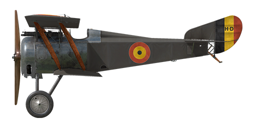

# Hanriot HD.1

## Description

The Hanriot HD.1 was developed by Pierre Dupont in the summer of 1916 for the Hanriot company as a classical biplane made mostly of wood with two-spar wings (the rudder frame and the nose part were metal). The upper wing had a small V-angle while the lower one was straight. There were 3 fuel tanks in the fuselage: two behind the engine and one more behind the pilot's back.  
  
At first, the HD.1 was meant to take over from the older Nieuport 11 and 17 planes, but the new Spad 7s were already in use on the front lines and got positive feedback from pilots for their in-line engines. Meanwhile, Nieuport squadrons still used Le Rhone engines. As a result, the French Air Force (Aviation Militaire) decided not to switch to HDs as it wasn't cost-effective, and the acquisition was canceled.  
  
However, the Entente allies found this plane attractive - it was more firm, maneuverable, and slightly better than the Nieuport in general. The Italian Air Force (Aviazione Militaire) was the first to order this plane. Societa Nieuport-Macchi started manufacturing HDs in November 1916, and in the summer of 1917, the first Hanriots were delivered to the front lines. By the end of the war, the Italians had 831 Hanriots. The Belgian Air Force, Aeronautique Militaire Belge, ranked second in buying these new planes, and the French Hanriot manufacturer constructed 125 aircraft. Belgian squadrons began flying HD1s on August 22, 1917, and they used them effectively, especially the Belgian aces like Coppens, de Meulemeester, and Olieslagers.  
  
Engine: 9 cyl. rotary Le Rhone 9Jby 130 hp  
  
Dimensions  
Height: 2940 mm  
Length: 5850 mm  
Wing span: 8700 mm  
Wing surface: 18.2 sq.m  
  
Weight  
Empty weight: 406.9 kg  
Takeoff weight: 612.1 kg  
  
Climb rate  
1000 m:  2 min. 39 sec.  
2000 m:  5 min. 45 sec.  
3000 m:  9 min. 22 sec.  
4000 m: 14 min. 19 sec.  
5000 m: 20 min. 52 sec.  
6000 m: 31 min. 39 sec.  
  
Maximum airspeed (IAS)  
sea level — 188 km/h  
1000 m — 179 km/h  
2000 m — 169 km/h  
3000 m — 159 km/h  
4000 m — 149 km/h  
5000 m — 138 km/h  
6000 m — 126 km/h  
  
Service ceiling 6620 m  
  
Endurance — 2 h.  
  
Armament  
Forward firing: 1 x Vickers Mk.I 7.69 mm, 500 rounds per barrel.  
  
References  
1) Windsock Datafile 12 - Hanriot HD.1, by J.M. Bruce.

## Modifications

**Balloon gun**  
Vickers "Balloon" gun  
Ammo: 250 of 11.43mm rounds  
Projectile weight: 17,5 g  
Muzzle velocity: 610 m/s  
Guns weight: 13 kg  
Ammo weight: 20 kg  
Rate of fire: 600 rpm  
Total additional weight of weapon modification: 33 kg

**Lewis Overwing**  
Overwing mounted additional Lewis machinegun with changeable position.  
Ammo: 388 of 7.69mm rounds (4 drums with 97 rounds in each)  
Projectile weight: 11 g  
Muzzle velocity: 745 m/s  
Rate of fire: 550 rpm  
Guns weight: 8 kg (w/o ammo drums)  
Mounts weight: 3 kg  
Ammo weight: 16 kg  
Total weight: 27 kg  
Estimated speed loss: 5 km/h

**Le-Chretien**  
Le-Chretien Refractor-type Collimator Sight  
Additional mass: 1 kg

**Compass**  
L.Maxant Compass  
Additional mass: 1 kg

**Cockpit light**  
Cockpit illumination lamp for night sorties  
Additional mass: 1 kg
