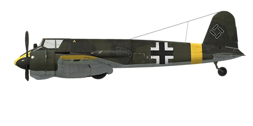

# Hs 129 B-2

## Description

Indicated stall speed in flight configuration: 143..159 km/h  
Indicated stall speed in takeoff/landing configuration: 136..150 km/h  
Dive speed limit: 670 km/h  
Maximum load factor: 9 G  
Stall angle of attack in flight configuration: 20.0 °  
Stall angle of attack in landing configuration: 18.0 °  
  
Maximum true air speed at sea level, engine mode - Combat: 349 km/h  
Maximum true air speed at 3000 m, engine mode - Combat: 396 km/h  
  
Service ceiling: 7000 m  
Climb rate at sea level: 8.4 m/s  
Climb rate at 3000 m: 8.1 m/s  
Climb rate at 6000 m: 2.6 m/s  
  
Maximum performance turn at sea level: 30.0 s, at 255 km/h IAS.  
Maximum performance turn at 3000 m: 46.0 s, at 270 km/h IAS.  
  
Flight endurance at 3000 m: 2.1 h, at 300 km/h IAS.  
  
Takeoff speed: 145..155 km/h  
Glideslope speed: 180..200 km/h  
Landing speed: 135..145 km/h  
Landing angle: 10.6 °  
  
Note 1: the data provided is for international standard atmosphere (ISA).  
Note 2: flight performance ranges are given for possible aircraft mass ranges.  
Note 3: maximum speeds, climb rates and turn times are given for standard aircraft mass.  
Note 4: climb rates and turn times are given for Combat power.  
  
Engine:  
Model: Gnome-Rhone 14 M  
Maximum power in Take-off mode at sea level: 700 HP  
Maximum power in Combat mode at sea level: 580 HP  
Maximum power in Combat mode at 4000 m: 650 HP  
  
Engine modes:  
Nominal (unlimited time): 2350 RPM, 1.1 ata  
Combat power (up to 30 minutes): 2750 RPM, 1.25 ata  
Take-off power (up to 1 minute): 3030 RPM, 1.5 ata  
  
Oil rated temperature in engine intake: 60..75 °C  
Oil maximum temperature in engine intake: 125 °C  
  
Supercharger gear shift altitude: single gear  
  
Empty weight: 3992 kg  
Minimum weight (no ammo, 10%25 fuel): 4200 kg  
Standart weight: 4756 kg  
Maximum takeoff weight: 5170 kg  
Fuel load: 451 kg / 610 l  
Useful load: 1178 kg  
  
Forward-firing armament:  
2 x 7.92mm machine gun "MG 17", 1000 rounds, 1200 rounds per minute, nose-mounted  
2 x 15mm gun "MG 151/15", 250 rounds, 700 rounds per minute, nose-mounted  
2 x 20mm gun "MG 151/20", 250 rounds, 700 rounds per minute, nose-mounted (modification)  
4 x 7.92mm machine gun "MG 17", 1000 rounds, 1200 rounds per minute, underbelly (modification)  
30mm gun "MK 101", 30 rounds, 250 rounds per minute, underbelly (modification)  
30mm gun "MK 103", 80 rounds, 400 rounds per minute, underbelly (modification)  
  
Bombs:  
Up to 6 x 55 kg general purpose bombs "SC 50"  
249 kg general purpose bombs "SC 250"  
  
Length: 9.7 m  
Wingspan: 14.2 m  
Wing surface: 28.9 m²  
  
Combat debut: May 1942  
  
Operation features:  
- Controlling the propellers RPM is possible only in the manual mode by changing the propeller pitch. The automatic mode keeps the RPM at 2750.  
- The engine control lever allows setting the pressure up to the combat mode (1.25 ATA).  
- To switch the engines to the take-off mode, move the boost lever to 1.5 ATA position and set the propellers to 3030 RPM.  
- Engine mixture control is automatic. Leaning the mixture manually reduces the fuel consumption during flight.  
- The oil radiator shutters are controlled automatically and do not have a manual mode.  
- The propellers have a feathering system which should be activated in case of engine damage to reduce drag of the propeller in auto-rotation.  
- The aircraft has only pitch and yaw flight-control trimmers.  
- The aircraft has independent left and right hydraulic wheel brake controls. To apply either brake push the upper part of the rudder pedal.  
- Landing flaps have a hydraulic actuator and they can be extended to any angle up to 40° or to the fixed take-off position.  
- The tail wheel rotates freely and does not have a lock. For this reason, it is necessary to confidently and accurately operate the rudder pedals during the takeoff and landing.  
- The aircraft fuel gauges are positioned directly on the engine nacelles and show only the amount of fuel remaining in the wing tanks (the fuel remaining in the central fuel tank is not indicated).  
- The aircraft isn't equipped with an oxygen supply system, so flying above 4000 meters is forbidden.  
- The aircraft is equipped with an electric bomb release controller that allows dropping the bombs only one by one.  
- The gunsight has a sliding sun-filter.

## Modifications

**4 x 7.92mm MG 17 gun pod**  
Four MG 17 7.92mm machineguns in fuselage mounted gun pod with 1000 rounds per each  
Additional mass: 194.8 kg  
Ammunition mass: 106 kg  
Guns mass: 88.8 kg  
Estimated speed loss: 4 km/h

**Peilrahmen PR 16**  
Fixed loop radio compass for navigation with radio beacons  
Additional mass: 10 kg  
Estimated speed loss: 0 km/h

**2 x 20mm MG 151/20 gun**  
2 x MG 151/20 20mm nose-gun with 250 rounds per each  
Additional mass: 14.4 kg  
Ammunition mass: 105 kg  
Gun mass: 42 kg  
Estimated speed loss: 0 km/h

**30mm MK 101**  
30mm MK 101 autocannon gun pod with 30 rounds  
Additional mass: 179 kg  
Ammunition mass: 24 kg  
Guns mass: 155 kg  
Estimated speed loss: 6 km/h

**30mm MK 103**  
30mm MK 103 autocannon gun pod with 80 rounds  
Additional mass: 234.2 kg  
Ammunition mass: 74.7 kg  
Guns mass: 159.5 kg  
Estimated speed loss: 6km/h

**Mirror**  
Rear view mirror  
Additional mass: 1 kg  
Estimated speed loss: 1 km/h
