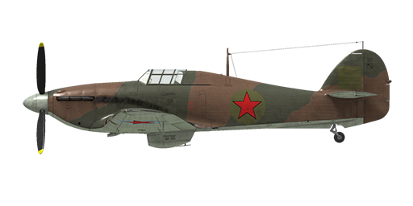

# Hurricane Mk.II

## Description

Indicated stall speed in flight configuration: 132...155 km/h  
Indicated stall speed in landing configuration: 123...144 km/h  
  
Dive speed limit: 630 km/h  
Maximum load factor: 11.0 G  
Stall angle of attack in flight configuration: 17.6 °  
Stall angle of attack in landing configuration: 15.4 °  
  
Maximum true air speed at sea level, 3000 RPM, boost +14: 466 km/h (modification)  
Maximum true air speed at sea level, 3000 RPM, boost +12: 455 km/h  
Maximum true air speed at sea level, 3000 RPM, boost +9: 435 km/h  
Maximum true air speed at 4200 m, 3000 RPM, boost +9: 514 km/h  
Maximum true air speed at 6550 m, 3000 RPM, boost +9: 543 km/h  
  
Service ceiling: 11300 m  
Climb rate at sea level: 14.0 m/s  
Climb rate at 3000 m: 13.5 m/s  
Climb rate at 6000 m: 10.2 m/s  
  
Maximum performance turn at sea level: 16.8 s, at 230 km/h IAS.  
Maximum performance turn at 3000 m: 20.3 s, at 230 km/h IAS.  
  
Flight endurance at 3000 m: 3.3 h, at 260 km/h IAS.  
  
Takeoff speed: 150...180 km/h  
Glideslope speed: 150...185 km/h  
Landing speed: 115..135 km/h  
Landing angle: 10.0 °  
  
Note 1: the data provided is for international standard atmosphere (ISA).  
Note 2: flight performance ranges are given for possible aircraft mass ranges.  
Note 3: maximum speeds, climb rates and turn times are given for standard aircraft mass.  
Note 4: climb rates are given for 2850 RPM and boost +9, turn times are given for 3000 RPM and boost +12.  
  
Engine:  
Model: Merlin XX  
Maximum power in Take-off mode (3000 RPM, boost +12, low gear) at sea level: 1280 HP  
Maximum power in Climb mode (2850 RPM, boost +9, low gear) at 10000 feet: 1240 HP  
Maximum power in Climb mode (2850 RPM, boost +9, high gear) at 17500 feet: 1175 HP  
Maximum power in Combat mode (3000 RPM, boost +12, low gear) at 8500 feet: 1400 HP  
Maximum power in Combat mode (3000 RPM, boost +14, high gear) at 14750 feet: 1405 HP  
  
Engine modes:  
Max Cruising power (unlimited time): 2650 RPM, boost +7  
Climb power (up to 1 hour): 2850 RPM, boost +9  
Combat power (up to 5 minutes): 3000 RPM, boost +12/+14 (low gear/hi gear)  
Combat power (up to 5 minutes): 3000 RPM, boost +14/+16 (low gear/hi gear) (modification)  
  
Water rated temperature in engine output: 60..125 °C  
Water maximum temperature in engine output: 135 °C  
Oil rated temperature in engine intake: 15..90 °C  
Oil maximum temperature in engine intake: 105 °C  
  
Supercharger gear shift altitude: 13000 feet  
  
Empty weight: 2567 kg  
Minimum weight (no ammo, 10%25 fuel): 2859 kg  
Standard weight: 3225 kg  
Maximum takeoff weight: 3894 kg  
Fuel load: 317 kg / 441.5 l / 97.1 gallons  
Maximum useful load: 1327 kg  
  
Forward-firing armament:  
8 x 7.7mm machine gun "Browning .303", 324-338 rounds per gun, 2676 rounds total, 1150 rounds per minute, wing-mounted  
8 x 7.7mm machine gun "Browning .303", 370-490 rounds per gun, 3270 rounds total, 1150 rounds per minute, wing-mounted (modification)  
12 x 7.7mm machine gun "Browning .303", 324-338 rounds per gun, 3988 rounds total, 1150 rounds per minute, wing-mounted (modification)  
12 x 7.7mm machine gun "Browning .303", 328-490 rounds per gun, 4582 rounds total, 1150 rounds per minute, wing-mounted (modification)  
4 x 20mm gun "Hispano Mk.II", 90 rounds per gun, 650 rounds per minute, wing-mounted (modification)  
2 x 7.7mm machine gun "Browning .303", 650 rounds per gun, 1150 rounds per minute, wing-mounted (modification)  
2 x 40mm gun "Vickers Class S", 15 rounds per gun, 125 rounds per minute, wing-mounted (modification)  
2 x 12.7mm machine gun "UB", 100 rounds per gun, 1000 rounds per minute, wing-mounted (modification)  
2 x 20mm gun "ShVAK", 120 rounds per gun, 800 rounds per minute, wing-mounted (modification)  
  
Bombs:  
2 x 250 lb general purpose bomb "250 lb. G.P."  
2 x 500 lb general purpose bomb "500 lb. G.P."  
2 x 104 kg general purpose bomb "FAB-100M" (modification)  
  
Rockets:  
6 x 7 kg rockets "ROS-82", HE payload mass 2.52 kg (modification)  
  
Length: 9.82 m  
Wingspan: 12.19 m  
Wing surface: 23.92 m²  
  
Combat debut: Autumn 1940  
  
Operation features:  
- The engine is equipped with the two-stage mechanical supercharger which should be manually switched at 13000ft altitude.  
- The engine is equipped with an automatic fuel mixture control which maintains optimal mixture.  
- Engine RPM has an automatic governor that controls the propeller pitch to maintain the required RPM.  
- Water and oil temperatures are controlled manually by adjusting the radiator shutter.  
- The aircraft has a fuel gauge which shows remaining fuel in fuel tanks depending on switch position. In game the fuel indicator switch changes by pressing (RShift+I).  
- The aircraft is equipped with elevator and rudder trimmers.  
- Landing flaps have hydraulic actuators and can be extended to any angle up to 80°. The speed with the extended flaps is limited to 120 mph.  
- The aircraft tail wheel rotates freely and does not have a lock.  
- The aircraft has differential pneumatic wheel brakes with shared control lever. This means that if the brake lever is held and the rudder pedal the opposite wheel brake is gradually released causing the plane to swing to one side or the other.  
- The aircraft is equipped with a siren that warns a pilot if the throttle is set to low position with landing gear retracted.  
- It is impossible to open the canopy at high speeds because of the ram air, but there is an emergency jettison handle for bailing out.  
- The aircraft is equipped with upper and bottom formation lights which can be turned on simultaneously or independently.  
- The gunsight is adjustable: both the target distance and target base can be set.  
- The gunsight has a sliding sun-filter.  
- When bombs are installed there is a salvo controller, it has two release modes: single drop or drop two in a salvo.  
- When rockets are installed there is a salvo controller, it has three launch modes: single fire, fire two in a salvo or fire four in a salvo.

## Modifications

**Merlin XX engine with +14 lb boost**  
Merlin XX engine with +14 lb boost  
Estimated speed increase at sea level: 11 km/h

**2 x 40mm Vickers gun pods + Armor**  
Two wing-mounted "Browning .303" 7.7mm machine guns with 650 rounds per each and two Vickers Class S 40mm gun pods with 15 rounds per each instead of default "Browning .303" wing-mounted machineguns + additional armour plates  
Additional mass: 390 kg  
Ammunition mass: 84 kg  
Guns mass: 323 kg  
Armour mass: 148 kg  
Estimated speed loss: 16 km/h

**2 x 40mm Vickers Class S gun pods**  
Two wing-mounted "Browning .303" 7.7mm machine guns with 650 rounds per each and two Vickers Class S 40mm gun pods with 15 rounds per each instead of default "Browning .303" wing-mounted machineguns  
Additional mass: 242 kg  
Ammunition mass: 84 kg  
Guns mass: 323 kg  
Estimated speed loss: 14 km/h

**Air Cleaner**  
Air cleaner for dusty conditions  
Additional mass: 13 kg  
Estimated speed loss: 5 km/h

**Four additional "Browning .303" MGs**  
Four additional wing-mounted "Browning .303" 7.7mm machine guns with 328 rounds per gun.  
Additional mass: 100 kg  
Ammunition mass: 39 kg  
Guns mass: 55 kg  
Estimated speed loss: 3 km/h

**4 x 20mm "Hispano Mk.II" gun**  
Four "Hispano Mk.II" 20mm wing-mounted guns with 90 rounds per each instead of default "Browning .303" wing-mounted machineguns  
Additional mass: 195 kg  
Ammunition mass: 102 kg  
Guns mass: 228 kg  
Estimated speed loss: 12 km/h

**2 x 12.7 mm BS and 2 x 20mm ShVAK**  
Two BS 12.7 mm wing-mounted machine guns with 100 rounds per each and two ShVAK 20mm wing-mounted guns with 120 rounds per each instead of default "Browning .303" wing-mounted machineguns  
Additional mass: 59 kg  
Ammunition mass: 87 kg  
Guns mass: 124 kg  
Estimated speed loss: 4 km/h

**Mirror**  
Rear view mirror  
Additional mass: 1 kg  
Estimated speed loss: 2 km/h
