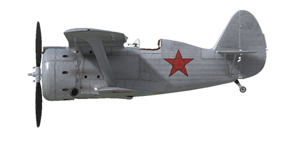

# I-153

## Description

Indicated stall speed in flight configuration: 114..124 km/h  
Dive speed limit: 550 km/h  
Maximum load factor: 12 G  
Stall angle of attack in flight configuration: 19.9 °  
  
Maximum true air speed at sea level, engine mode - Boosted: 409 km/h  
Maximum true air speed at 1530 m, engine mode - Nominal: 411 km/h  
Maximum true air speed at 4850 m, engine mode - Nominal: 440 km/h  
  
Service ceiling: 11000 m  
Climb rate at sea level: 16.1 m/s  
Climb rate at 4000 m: 13.1 m/s  
Climb rate at 6000 m: 9.7 m/s  
  
Maximum performance turn at sea level: 11.9 s, at 200 km/h IAS.  
Maximum performance turn at 3000 m: 15.3 s, at 200 km/h IAS.  
  
Flight endurance at 3000 m: 1.0 h, at 300 km/h IAS.  
  
Takeoff speed: 110..120 km/h  
Glideslope speed: 145..160 km/h  
Landing speed: 105..115 km/h  
Landing angle: 16.3 °  
  
Note 1: the data provided is for international standard atmosphere (ISA).  
Note 2: flight performance ranges are given for possible aircraft mass ranges.  
Note 3: maximum speeds, climb rates and turn times are given for standard aircraft mass.  
Note 4: climb rates and turn times are given for Nominal mode.  
  
Engine:  
Model: M-62  
Maximum power in Boosted mode at sea level: 1000 HP  
Maximum power in Nominal mode at sea level: 830 HP  
Maximum power in Nominal mode at 1530 m: 850 HP  
Maximum power in Nominal mode at 4200 m: 800 HP  
  
Engine modes:  
Nominal (unlimited time): 2100 RPM, 900 mm Hg  
Boosted power (up to 5 minutes): 2200 RPM, 1050 mm Hg  
  
Oil rated temperature in engine output: 60..90 °C  
Oil maximum temperature in engine output: 125 °C  
Cylinder head rated temperature: 125..200 °C  
Cylinder head maximum temperature: 205 °C  
  
Supercharger gear shift altitude: 2500 m  
  
Engine:  
Model: M-63  
Maximum power in Boosted mode at sea level: 1100 HP  
Maximum power in Nominal mode at sea level: 930 HP  
Maximum power in Nominal mode at 1800 m: 1000 HP  
Maximum power in Nominal mode at 4500 m: 900 HP  
  
Engine modes:  
Nominal (unlimited time): 2200 RPM, 915 mm Hg  
Boosted power (up to 5 minutes): 2300 RPM, 1065 mm Hg  
  
Oil rated temperature in engine output: 55..90 °C  
Oil maximum temperature in engine output: 125 °C  
Cylinder head rated temperature: 120..200 °C  
Cylinder head maximum temperature: 205 °C  
  
Supercharger gear shift altitude: 3000 m  
  
Empty weight: 1514 kg  
Minimum weight (no ammo, 10% fuel): 1630 kg  
Standard weight: 1863 kg  
Maximum takeoff weight: 2195 kg  
Fuel load: 237 kg / 316 l  
Useful load: 681 kg  
  
Forward-firing armament:  
2 x 7.62mm machine gun "ShKAS", 1450 rounds, 1800 rounds per minute, synchronized upper  
2 x 7.62mm machine gun "ShKAS", 1020 rounds, 1800 rounds per minute, synchronized lower  
12.7mm machine gun "UB", 165 rounds per gun, 1000 rounds per minute, synchronized (modification)  
  
Bombs:  
4 x 50 kg general purpose bombs "FAB-50sv"  
2 x 104 kg general purpose bombs "FAB-100M"  
  
Rockets:  
Up to 8 x 7 kg rockets "ROS-82", HE payload mass 2.52 kg  
  
Length: 6.175 m  
Wingspan of upper wing: 10 m  
Wingspan of lower wing: 7.5 m  
Wing surface: 22.14 m²  
  
Combat debut: July 1939  
  
Operation features:  
- The engines have a boost mode. To set boost mode it is necessary to push the boost lever fully forward and increase the engine M-62 to 2200 RPM and the engine M-63 to 2230 RPM.  
- The engines have a two-stage mechanical supercharger which should be manually shifted at 2500m altitude for M-62 engine and at 3000m altitude for M-63 engine.  
- Engine mixture control is automatic when the mixture lever is set to maximum. It is possible to manually lean the mixture by moving the mixture control to less than maximum. This also reduces fuel consumption during flight.  
- Engine RPM has an automatic governor and it is maintained at the required RPM corresponding to the governor control lever position. The governor automatically controls the propeller pitch to maintain the required RPM.  
- Oil radiator shutter and air cooling intake shutters control is manual.  
- The aircraft has no flight-control trimmers. Airplane is equipped with bendable trim tabs that can be set pre-flight by ground personnel.  
- The aircraft has a tailwheel control mechanism which is linked to rudder pedals. Because of this, it is necessary to avoid of large rudder pedal inputs when moving at high speed on the ground.  
- The aircraft has differential pneumatic wheel brakes with shared control lever. This means that if the brake lever is held and the rudder pedal the opposite wheel brake is gradually released causing the plane to swing to one side or the other. To brake the wheels, move the pedals to the neutral position and press the brake lever located on the flight stick. If the pedals are not in neutral position, only one wheel will be braked. If the right pedal is in the forward position, the right wheel will be braked and vice versa, if the left pedal is in the forward position, the left wheel will be braked.  
- The aircraft has a hydrostatic fuel gauge which shows total fuel remaining only when manual sucker lever is pushed in. In game this happens by pressing (RShift+I by default).  
- Cockpit has side-doors which should be closed before takeoff to prevent damage.  
- The aircraft is equipped with a bomb salvo controller, it has three release modes: single drop, drop two in a salvo or drop four in a salvo.  
- The aircraft is equipped with a rockets salvo controller, it has three launch modes: single fire, fire two in a salvo or fire four in a salvo.  
- The gunsight has a sliding sun-filter. There is also a back-up folding mechanical sight which can be used if main sight is damaged.  
- There is no radio station in the default aircraft configuration. As a modification, the installation of the RSI-3 radio station is provided.  
- Full fuel tank capacity is 316 liters (237 kg of petrol). Normal fuel load is 200 liters (150 kg).  
  
Basic data and recommended positions of the aircraft controls:  
1. Starting the engine:  
	- recommended position of the mixture control lever: auto mixture control  
	- recommended position of the cowl flap control handle: 0%  
	- recommended position of the radiator control handle: 0%  
	- recommended position of the prop pitch control handle: light 90%  
	- recommended position of the throttle lever: 15%  
  
2. Recommended mixture control lever positions for various flight modes: auto mixture control  
  
3.1 Recommended positions of cowl flaps for various flight modes:  
	- takeoff: open 50%  
	- climb: open 100%  
	- cruise flight: open 30% (in winter conditions - close to 15% if necessary)  
	- combat: open 70%  
  
3.2 Recommended positions of the oil radiator control handle for various flight modes:  
	- takeoff: open 50%  
	- climb: open 100%  
	- cruise flight: open 60%  
	- combat: open 100%  
  
4. Approximate fuel consumption at 2000 m altitude:  
	- Nominal engine mode: 5.6 l/min  
	- Boosted engine mode: 6.0 l/min

## Modifications

**8 x ROS-82 rockets**  
8 x 82mm High Explosive unguided rockets ROS-82  
Additional mass: 80 kg  
Ammunition mass: 56 kg  
Racks mass: 24 kg  
Estimated speed loss before launch: 15 km/h  
Estimated speed loss after launch: 8 km/h

**4 x FAB-50sv**  
4 x 50 kg General Purpose Bombs FAB-50sv  
  
FAB-50sv:  
Additional mass: 240 kg  
Ammunition mass: 200 kg  
Racks mass: 40 kg  
Estimated speed loss before drop: 16 km/h  
Estimated speed loss after drop: 7 km/h

**2 x FAB-50sv / FAB-100M bombs**  
2 x 50 kg General Purpose Bombs FAB-50sv / 2 x 104 kg General Purpose Bombs FAB-100M  
  
FAB-50sv:  
Additional mass: 120 kg  
Ammunition mass: 104 kg  
Racks mass: 20 kg  
Estimated speed loss before drop: 13 km/h  
Estimated speed loss after drop: 7 km/h  
  
FAB-100M:  
Additional mass: 228 kg  
Ammunition mass: 208 kg  
Racks mass: 20 kg  
Estimated speed loss before drop: 18 km/h  
Estimated speed loss after drop: 7 km/h

**BS 12.7 mm (165 rounds)**  
BS 12.7mm nose-mounted machinegun with 165 rounds instead of default two upper ShKAS nose-mounted machineguns  
Ammunition mass: 31 kg  
Guns mass: 24.2 kg  
Estimated speed loss: 0 km/h

**M-63 Engine**  
Increased RPM and boost, the oil radiator enlarged to 9 inches and placed under the hood. The frontal cooling openings size increased.  
Estimated speed gain: 10 km/h.  
Estimated climb rate gain: 1.5 m/s.

**Radio transmitter**  
Radio transmitter RSI-3  
Additional mass: 12.6 kg  
Estimated speed loss: 0 km/h
