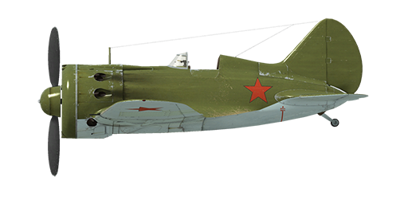

# I-16 type 24

## Description

Indicated stall speed in flight configuration: 143..164 km/h  
Indicated stall speed in takeoff/landing configuration: 142..163 km/h  
Dive speed limit: 620 km/h  
Maximum load factor: 12 G  
Stall angle of attack in flight configuration: 17.6 °  
Stall angle of attack in landing configuration: 15 °  
  
Maximum true air speed at sea level, engine mode - Boosted: 448 km/h  
Maximum true air speed at 1800 m, engine mode - Nominal: 460 km/h  
Maximum true air speed at 4500 m, engine mode - Nominal: 490 km/h  
  
Service ceiling: 10500 m  
Climb rate at sea level: 16.7 m/s  
Climb rate at 3000 m: 13.8 m/s  
Climb rate at 6000 m: 8.8 m/s  
  
Maximum performance turn at sea level: 19.0 s, at 230 km/h IAS.  
Maximum performance turn at 3000 m: 25.3 s, at 230 km/h IAS.  
  
Flight endurance at 3000 m: 0.9 h, at 350 km/h IAS.  
  
Takeoff speed: 145..175 km/h  
Glideslope speed: 185..195 km/h  
Landing speed: 135..145 km/h  
Landing angle: 15.3 °  
  
Note 1: the data provided is for international standard atmosphere (ISA).  
Note 2: flight performance ranges are given for possible aircraft mass ranges.  
Note 3: maximum speeds, climb rates and turn times are given for standard aircraft mass.  
Note 4: climb rates and turn times are given for Boosted power.  
  
Engine:  
Model: M-63  
Maximum power in Boosted mode at sea level: 1100 HP  
Maximum power in Nominal mode at sea level: 930 HP  
Maximum power in Nominal mode at 1800 m: 1000 HP  
Maximum power in Nominal mode at 4500 m: 900 HP  
  
Engine modes:  
Nominal (unlimited time): 2200 RPM, 915 mm Hg  
Boosted power (up to 5 minutes): 2300 RPM, 1065 mm Hg  
  
Oil rated temperature in engine output: 55..90 °C  
Oil maximum temperature in engine output: 125 °C  
Cylinder head rated temperature: 120..200 °C  
Cylinder head maximum temperature: 205 °C  
  
Supercharger gear shift altitude: 3000 m  
  
Empty weight: 1501 kg  
Minimum weight (no ammo, 10%25 fuel): 1633 kg  
Standard weight: 1878 kg  
Maximum takeoff weight: 2146 kg  
Fuel load: 191 kg / 260 l  
Useful load: 645 kg  
  
Forward-firing armament:  
2 x 7.62mm machine gun "ShKAS", 500 rounds, 1800 rounds per minute, synchronized  
2 x 7.62mm machine gun "ShKAS", 900 rounds, 1800 rounds per minute, wing-mounted  
2 x 20mm gun "SsVAK", 90 rounds, 800 rounds per minute, wing-mounted (modification)  
  
Bombs:  
2 x 50 kg general purpose bombs "FAB-50sv"  
2 x 104 kg general purpose bombs "FAB-100M"  
  
Rockets:  
Up to 6 x 7 kg rockets "ROS-82", HE payload mass 2.52 kg  
  
Length: 6.04 m  
Wingspan: 9 m  
Wing surface: 14.54 m²  
  
Combat debut: June 1941  
  
Operation features:  
- Engine has a boost mode. To set boost mode it is necessary to push the boost lever fully forward and increase the engine to 2300 RPM.  
- Engine has a two-stage mechanical supercharger which should be manually shifted at 3000m altitude.  
- Engine mixture control is automatic when the mixture lever is set to maximum. It is possible to manually lean the mixture by moving the mixture control to less than maximum. This also reduces fuel consumption during flight.  
- Engine RPM has an automatic governor and it is maintained at the required RPM corresponding to the governor control lever position. The governor automatically controls the propeller pitch to maintain the required RPM.  
- Oil radiator shutter and air cooling intake shutters control is manual.  
- Airplane has no flight-control trimmers. Airplane is equipped with bendable trim tabs that can be set pre-flight by ground personnel.  
- Airplane has a manual system for landing flaps and gear, for this reason it is necessary to extend landing flaps and gear before final approach. Landing flaps can be extended to any angle up to 53°.  
- Airplane has a tail wheel control mechanism which is linked to rudder pedals. Because of this, it is necessary to avoid of large rudder pedal inputs when moving at high speed on the ground.  
- Airplane has independent left and right mechanical wheel brakes. To brake it is necessary to push upper part of the rudder pedal.  
- Airplane has a hydrostatic fuel gauge which shows total fuel remaining only when manual sucker lever is pushed in. In game this happens by itself during horizontal flight by every 10 seconds.  
- Cockpit has side-doors which should be closed before takeoff to prevent damage.  
- When bombs are installed there is a salvo controller, it has two release modes: single drop or drop two in a salvo.  
- When rockets are installed there is a salvo controller, it has three launch modes: single fire, fire two in a salvo or fire four in a salvo.  
- The gunsight has a sliding sun-filter. There is also a back-up folding mechanical sight which can be used if main sight is damaged.

## Modifications

**2 x FAB-50sv / FAB-100M bombs**  
2 x 50 kg General Purpose Bombs FAB-50sv / 2 x 104 kg General Purpose Bombs FAB-100M  
  
FAB-50sv:  
Additional mass: 120 kg  
Ammunition mass: 104 kg  
Racks mass: 20 kg  
Estimated speed loss before drop: 13 km/h  
Estimated speed loss after drop: 7 km/h  
  
FAB-100M:  
Additional mass: 228 kg  
Ammunition mass: 208 kg  
Racks mass: 20 kg  
Estimated speed loss before drop: 18 km/h  
Estimated speed loss after drop: 7 km/h

**2 x 20mm ShVAK (180 rounds)**  
ShVAK 20mm wing-mounted guns with 90 rounds per each instead of default ShKAS wing-mounted machineguns  
Additional mass: 40 kg  
Ammunition mass: 22 kg  
Guns mass: 98 kg  
Estimated speed loss: 3 km/h

**6 x ROS-82 rockets**  
6 x 82mm High Explosive unguided rockets ROS-82  
Additional mass: 60 kg  
Ammunition mass: 42 kg  
Racks mass: 18 kg  
Estimated speed loss before launch: 15 km/h  
Estimated speed loss after launch: 10 km/h

**4 x ROS-82 rockets**  
4 x 82mm High Explosive unguided rockets ROS-82  
Additional mass: 40 kg  
Ammunition mass: 28 kg  
Racks mass: 12 kg  
Estimated speed loss before launch: 10 km/h  
Estimated speed loss after launch: 7 km/h

**One-piece Windscreen**  
One-piece frontal canopy section for better visibility  
Additional mass: 0 kg  
Estimated speed loss: 0 km/h
