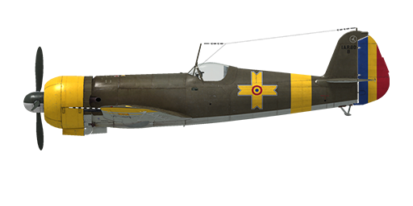

# I.A.R. 80-B

## Description

Indicated stall speed in flight configuration: 154..162 km/h  
Indicated stall speed in takeoff/landing configuration: 143..151 km/h  
Dive speed limit: 750 km/h  
Maximum load factor: 12 G  
Stall angle of attack in flight configuration: 16,0°  
Stall angle of attack in landing configuration: 13,8°  
  
Maximum true air speed at sea level, engine mode - nominal: 427 km/h  
Maximum true air speed at sea level, engine mode - emergency: 447 km/h  
Maximum true air speed at 4700, engine mode - nominal m: 505 km/h  
Maximum true air speed at 3800 m, engine mode - emergency: 511 km/h  
  
Service ceiling: 10500 m  
Climb rate at sea level: 13,9 m/s  
Climb rate at 3000 m: 13,1 m/s  
Climb rate at 6000 m: 9,4 m/s  
  
Maximum performance turn at sea level: 17,8 s, at 300 km/h IAS.  
  
Flight endurance at 3000 m: 1.9 h, at 350 km/h IAS.  
  
Takeoff speed: 150...180 km/h  
Glideslope speed: 200...220 km/h  
Landing speed: 170...180 km/h  
Landing angle: 14.2 °  
  
Note 1: the data provided is for international standard atmosphere (ISA).  
Note 2: flight performance ranges are given for possible aircraft mass ranges.  
Note 3: maximum speeds, climb rates and turn times are given for standard aircraft mass.  
Note 4: climb rates are given for mominal power, turn times are given for emergency power.  
  
Engine:  
Model: I.A.R. 14 K. IV. C-32  
Maximum power in Emergency mode at sea level: 1050 HP  
Maximum power in Emergency mode at 2700 m: 1100 HP  
Maximum power in Nominal mode at sea level: 930 HP  
Maximum power in Nominal mode at 3200 m: 1000 HP  
  
Engine modes:  
Nominal (unlimited time): 2300 RPM, 850 mm Hg  
Emergency (up to 3 minutes): 2300 RPM, 935 mm Hg  
  
Oil rated temperature in engine output: 40..110 °C  
Oil maximum temperature in engine output: 120 °C  
  
Empty weight: 20930 kg  
Minimum weight (no ammo, 10% fuel): 2522 kg  
Standard weight: 2745 kg  
Maximum takeoff weight: 3030 kg  
Fuel load: 324 kg / 450 l  
Useful load: 1050 kg  
  
Forward-firing armament:  
4 x 7.92mm machine gun "FN Browning 7.92 mod 1938", 1600 rounds, 1500 rounds per minute, wing-mounted  
2 x 13.2mm machine gun "FN Browning 13.2", 350 rounds, 1080 rounds per minute, wing-mounted	  
  
or (modification):  
4 x 7.92mm machine gun "FN Browning 7.92 mod 1938", 1600 rounds, 1500 rounds per minute, wing-mounted  
2 x 20mm gun "MG FF", 120 rounds, 530 rounds per minute, wing-mounted  
  
or (modification):  
2 x 7.92mm machine gun "FN Browning 7.92 mod 1938", 1400 rounds, 1500 rounds per minute, wing-mounted  
2 x 20mm gun "MG 151/20", 350 rounds, 700 rounds per minute, wing-mounted  
  
Bombs (modification):  
Up to 2 x 55 kg fragmentation bombs "SC 50"  
249 kg general purpose bomb "SC 250"  
  
Length: 8.97 m  
Wingspan: 11.0 m  
Wing surface: 16.5 m²  
  
Combat debut: Autumn 1942  
  
Operation features:  
- The aircraft has no constant propeller governor. The propeller speed is controlled by manually changing the propeller pitch using a switch on the instrument board (default propeller pitch commands in the sim are [RShift + +/-]).  
- Due to the absence of a constant propeller speed governor, it is necessary to carefully monitor the propeller RPM, especially in a dive - due to the spinning up of the propeller during acceleration, it is possible to exceed the maximum RPM and cause an engine failure.  
- The aircraft has no cylinder head temperature gauge - only an oil temperature gauge.  
- The oil radiator of the I.A.R. 80-B has no regulation (there is a second adjustable oil radiator on I.A.R. 80-C, I.A.R. 81-C modification).  
- The aircraft is equipped with elevator trimmer.  
- Mixture control is automated, the automatic regulator maintains the set mixture composition and automatically enriches the mixture at low and full throttle. The optimum mixture is set by the centre position of the control lever.  
- The flaps are hydraulic and can be set to any angle up to 75°. In the dive bomber version, the fully released flaps are used as air brake. There is no flap position indicator.  
- The aircraft has differential pneumatic wheel brakes with shared control lever. This means that if the brake lever is held and the rudder pedal the opposite wheel brake is gradually released causing the plane to swing to one side or the other.  
- The aircraft has a hydrostatic fuel gauge which shows total fuel remaining only when manual sucker lever is pushed in. In the sim, hold [RShift+I by default].  
- To drop bombs, you must switch on the bomb releasel system first [N key]. After dropping bombs, the system should be manually deactivated.  
- When the bomb release system is switched on, the flaps are automatically fully released as an air brake and retract automatically either when the bomb release button is pressed or when the system is switched off.  
- The bomb release system can either drop only the central bomb or all three bombs at once.  
- The gunsight is adjustable: both the target distance and target base can be set.  
- In the dive bomber version, the tilt of the gunsight is adjustable [RAlt + F by default].  
- The gunsight has a sliding sun-filter [LAlt + F by default].  
  
Basic data and recommended positions of the aircraft controls:  
1. Starting the engine:  
	- recommended position of the mixture control lever: 50% auto mixture control  
	- recommended position of the cowl flap control handle: close  
	- recommended position of the prop pitch control handle: heavy  
	- recommended position of the throttle lever: 0%  
  
2. Recommended mixture control lever positions for various flight modes: 50% (auto mixture control)  
  
3. Recommended positions of the cowl flap control handle for various flight modes:  
	- takeoff: open 100%  
	- climb: open 100%  
	- cruise flight: open 20% (in winter conditions - close if necessary)  
	- combat: open 50%  
  
4. Approximate fuel consumption at 2000 m altitude:  
	- Cruise engine mode: 6.9 l/min  
	- Combat engine mode: 7.7 l/min

## Modifications

**I.A.R.81-C series 301-450**  
Armament changed to two 7.92mm MGs and two 20mm MG151/20 guns,  
centerline (249 kg SC 250) and underwing bombs (two 55 kg SC 50),  
tail struts, sturdier flaps.  
Additional mass: 426.7 kg  
Ammunition mass: 387.5 kg  
Racks mass: 20.0 kg  
Estimated speed loss before drop: 41 km/h  
Estimated speed loss after drop: 19 km/h

**I.A.R.80-C series 251-290**  
Armament changed to four 7.92mm MGs and two 20mm MG FF/M guns,  
tail struts, new air filter, second oil radiator,  
sturdier fuselage and flaps.  
Additional mass: 24.2 kg  
Estimated speed loss: 12 km/h
