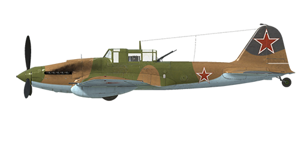

# Il-2 mod.1943

## Description

Indicated stall speed in flight configuration: 144..159 km/h  
Indicated stall speed in takeoff/landing configuration: 135..152 km/h  
Dive speed limit: 570 km/h  
Maximum load factor: 10.5 G  
Stall angle of attack in flight configuration: 19.4 °  
Stall angle of attack in landing configuration: 17.5 °  
  
Maximum true air speed at sea level, engine mode - Boosted: 407 km/h  
Maximum true air speed at sea level, engine mode - Nominal: 389 km/h  
Maximum true air speed at 1200 m, engine mode - Nominal: 400 km/h  
  
Service ceiling: 5600 m  
Climb rate at sea level: 7.5 m/s  
Climb rate at 3000 m: 4.2 m/s  
  
Maximum performance turn at sea level: 26.6 s, at 250 km/h IAS.  
Maximum performance turn at 3000 m: 39.3 s, at 250 km/h IAS.  
  
Flight endurance at 3000 m: 1.4 h, at 300 km/h IAS.  
  
Takeoff speed: 160..200 km/h  
Glideslope speed: 195..205 km/h  
Landing speed: 145..155 km/h  
Landing angle: 11.7 °  
  
Note 1: the data provided is for international standard atmosphere (ISA).  
Note 2: flight performance ranges are given for possible aircraft mass ranges.  
Note 3: maximum speeds, climb rates and turn times are given for standard aircraft mass.  
Note 4: climb rates are given for Nominal power, turn times are given for Boosted power.  
  
Engine:  
Model: AM-38F  
Maximum power in Boosted mode at sea level: 1720 HP  
Maximum power in Nominal mode at sea level: 1500 HP  
Maximum power in Nominal mode at 750 m: 1500 HP  
  
Engine modes:  
Nominal (unlimited time): 2050 RPM, 1200 mm Hg  
Boosted power (up to 5 minutes): 2350 RPM, 1360 mm Hg  
  
Water rated temperature in engine output: 80..110 °C  
Water maximum temperature in engine output: 120 °C  
Oil rated temperature in engine intake: 40..80 °C  
Oil maximum temperature in engine intake: 85 °C  
Oil rated temperature in engine output: 115 °C  
Oil maximum temperature in engine output: 120 °C  
  
Supercharger gear shift altitude: single gear  
  
Empty weight: 4715 kg  
Minimum weight (no ammo, 10%25 fuel): 5014 kg  
Standard weight: 5681 kg  
Maximum takeoff weight: 6375 kg  
Fuel load: 535 kg / 730 l  
Useful load: 1660 kg  
  
Forward-firing armament:  
2 x 20mm gun "SsVAK", 250 rounds, 800 rounds per minute, wing-mounted  
2 x 7.62mm machine gun "ShKAS", 750 rounds, 1800 rounds per minute, wing-mounted  
2 x 23mm gun "VYa-23", 150 rounds, 600 rounds per minute, wing-mounted (modification)  
2 x 37mm gun "NS-37", 50 rounds, 250 rounds per minute, wing-mounted (modification)  
  
Defensive armament:  
Backward: 12.7 mm machine gun "UBT", 150 rounds, 1000 rounds per minute (modification)  
  
Bombs:  
Up to 240 x 1.5 kg HEAT bomblets "PTAB-2,5-1,5"  
Up to 6 x 50 kg general purpose bombs "FAB-50sv"  
Up to 6 x 104 kg general purpose bombs "FAB-100M"  
2 x 254 kg general purpose bombs "FAB-250sv"  
  
Rockets:  
4 x 7 kg rockets "ROS-82", HE payload mass 2.5 kg  
4 x 15 kg rockets "RBS-82", HEAT payload mass 7.2 kg  
4 x 42 kg rockets "ROFS-132", HE payload mass 21.3 kg  
  
Length: 11.5 m  
Wingspan: 14.6 m  
Wing surface: 38.5 m²  
  
Combat debut: early 1943  
  
Operation features:  
- The engine has a boost mode which is engaged by setting mixture control lever to maximum position.  
- The engine has a single stage mechanical supercharger which does not require manual control.  
- Engine mixture control is automatic when the mixture lever is set to the intermediate (50%25) position. It is possible to manually lean the mixture by moving the control lever to less than 50%25. This will lower fuel consumption during flight.  
- Engine RPM has an automatic governor and it is maintained at the required RPM corresponding to the governor control lever position. The governor automatically controls the propeller pitch to maintain the required RPM.  
- Water and oil radiator shutter control is manual. Airplane has armoured oil radiator shutters which should be closed at the beginning of ground attack to reduce a possibility of combat damage. After finishing the attack, it is necessary to re-open the shutters to the required position.  
- The aircraft has only the pitch flight-control trimmer.  
- Landing flaps have a pneumatic actuator. Flaps can be extended fully or to takeoff position - 17°, gradual extending is impossible. Due to the weak force of the actuator the extended landing flaps may be pressed upwards by the airflow if the airspeed is more than 220 km/h. Remember that the flaps will not extend fully in case of high speed. In case of a high-speed landing approach the flaps may extend a few steps further right before the landing which will cause the aircraft to shoot upwards.  
- The aircraft has a manual tail wheel lock. Wheel should be locked when taxiing straight for a long distance and before takeoff and landing.  
- The aircraft has differential pneumatic wheel brakes with shared control lever. This means that if the brake lever is held and the rudder pedal the opposite wheel brake is gradually released causing the plane to swing to one side or the other.  
- The aircraft has a fuel gauge which shows the amount of remaining fuel in the front or bottom fuel tank depending on switch position. In game the fuel indicator switch changes by itself during horizontal flight by every 10 seconds. Rear fuel tank level is not indicated.   
- Cockpit canopy weight is 50 kg and it has no lock in the open position, for this reason the canopy may to spontaneously close in a deep dive. Also, it is impossible to open or close canopy at high speed due to strong airflow. The canopy has no emergency release, so bail out requires the speed drop before it.  
- The aircraft is equipped with a joint salvo controller both for bombs and rockets, it has three release/fire modes: single launch, launch two in a salvo or launch four in a salvo.  
- The mechanical gun sight "Visier Vladimirova" allows aiming rockets and guns at ground and air targets and horizontal bombing at certain speeds and altitudes.

## Modifications

**4 x RBS-82 / ROFS-132 rockets**  
4 x 82mm Armour Piercing unguided rockets RBS-82 or 4 x 132mm High Explosive unguided rockets ROFS-132  
  
RBS-82:  
Additional mass: 84 kg  
Ammunition mass: 60 kg  
Racks mass: 24 kg  
Estimated speed loss before launch: 5 km/h  
Estimated speed loss after launch: 4 km/h  
  
ROFS-132:  
Additional mass: 188 kg  
Ammunition mass: 168 kg  
Racks mass: 20 kg  
Estimated speed loss before launch: 9 km/h  
Estimated speed loss after launch: 5 km/h

**192(240) x PTAB-2.5-1.5 bomblets**  
192(240) x 1.5 kg HEAT (anti-tank) bomblets PTAB-2.5-1.5  
Additional mass: 308(380) kg  
Ammunition mass: 288(360) kg  
Racks mass: 20 kg  
Estimated speed loss before drop: 5 km/h  
Estimated speed loss after drop: 0 km/h

**2 x 23mm VYa-23 gun**  
2 VYa-23 23mm wing-mounted guns with 150 rounds per each  
Additional mass: 91 kg  
Ammunition mass: 170 kg  
Guns mass: 132 kg  
Estimated speed loss: 1 km/h

**2 x FAB-250sv bombs**  
2 x 254 kg General Purpose Bombs FAB-250sv  
Additional mass: 538 kg  
Ammunition mass: 508 kg  
Racks mass: 30 kg  
Estimated speed loss before drop: 18 km/h  
Estimated speed loss after drop: 7 km/h

**2 x 37mm NS-37gun**  
Two NS-37 37mm gun pods with 50 rounds per each  
Additional mass: 260 kg  
Ammunition mass: 90 kg  
Guns mass: 340 kg  
Estimated speed loss: 15 km/h
