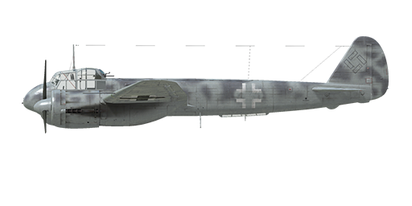

# Ju 88 C-6

## Description

Indicated stall speed in flight configuration: 185..203 km/h  
Indicated stall speed in takeoff/landing configuration: 155..183 km/h  
Dive speed limit: 670 km/h  
Maximum load factor: 8.0 G  
Stall angle of attack in flight configuration: 21.0 °  
Stall angle of attack in landing configuration: 16.6 °  
  
Maximum true air speed at sea level, engine mode - Climb: 427 km/h  
Maximum true air speed at 2000 m, engine mode - Climb: 468 km/h  
Maximum true air speed at 5300 m, engine mode - Climb: 498 km/h  
  
Service ceiling: 9300 m  
Climb rate at sea level: 9.2 m/s  
Climb rate at 3000 m: 7.3 m/s  
Climb rate at 6000 m: 5.7 m/s  
  
Maximum performance turn at sea level: 26.8 s, at 250 km/h IAS.  
Maximum performance turn at 3000 m: 39.4 s, at 250 km/h IAS.  
  
Flight endurance at 3000 m: 4.1 h, at 300 km/h IAS.  
  
Takeoff speed: 170..210 km/h  
Glideslope speed: 210..220 km/h  
Landing speed: 150..160 km/h  
Landing angle: 9 °  
  
Note 1: the data provided is for international standard atmosphere (ISA).  
Note 2: flight performance ranges are given for possible aircraft mass ranges.  
Note 3: maximum speeds, climb rates and turn times are given for standard aircraft mass.  
Note 4: climb rates are given for Climb power, turn times are given for Take-off power.  
  
Engine:  
Model: Jumo-211J  
Maximum power in Take-off mode at sea level: 1420 HP  
Maximum power in Climb mode at sea level: 1190 HP  
Maximum power in Climb mode at 1500 m: 1260 HP  
Maximum power in Climb mode at 4900 m: 1180 HP  
  
Engine modes:  
Nominal (unlimited time): 2250 RPM, 1.15 ata  
Climb power (up to 30 minutes): 2400 RPM, 1.25 ata  
Take-off power (up to 1 minute): 2600 RPM, 1.42 ata  
  
Water rated temperature in engine output: 80 °C  
Water maximum temperature in engine output: 110 °C  
Oil rated temperature in engine output: 100 °C  
Oil maximum temperature in engine output: 130 °C  
  
Supercharger gear shift altitude: automatic   
  
Empty weight: 8315 kg  
Minimum weight (no ammo, 10% fuel): 9139 kg  
Standard weight: 10500 kg  
Maximum takeoff weight: 13503 kg  
Fuel load: 1277 kg / 1680 l  
Useful load: 5188 kg  
  
Forward-firing armament:  
2 x 7.92mm machine gun "MG 17", 1000 rounds, 1200 rounds per minute, nose-mounted  
7.92mm machine gun "MG 17", 800 rounds, 1200 rounds per minute, nose-mounted  
3 x 20mm gun "MG FF", 120 rounds, 540 rounds per minute, nose-mounted  
20mm gun "MG 151/20", 350 rounds, 700 rounds per minute, nose-mounted (modification)  
  
Defensive armament:  
Top: 7.92mm machine gun "MG 81", 1000 rounds, 1600 rounds per minute  
Top: 13.0mm machine gun "MG 131", 500 rounds, 900 rounds per minute (modification)  
  
Bombs:  
Up to 10 x 55 kg general purpose bombs "SC 50"  
Up to 2 x 249 kg general purpose bombs "SC 250"  
Up to 2 x 500 kg general purpose bombs "SC 500"  
Up to 2 x 1090 kg general purpose bombs "SC 1000"  
  
Length: 14.3 m  
Wingspan: 20.02 m  
Wing surface: 52.7 m²  
  
Combat debut: November 1942  
  
Operation features:  
- Each engine has a two-stage mechanical supercharger with an automatic switch system that switches gears depending altitude and engine revolutions. It can also be manually switched to first gear.  
- Engine mixture control is automatic.  
- Engine RPM has an automatic governor and it is maintained at the required RPM corresponding to the governor control lever position. The governor automatically controls the propeller pitch to maintain the required RPM.  
- Propellers have a feathering system which should be activated in case of engine damage to reduce drag of the propeller in auto-rotation.  
- Water and oil radiators shutters are joint with engine cowl outlet shutters and manually operated. Ground personnel may install additional fixed shutters on the intake of the oil radiators in cold weather to prevent freezing of the oil.  
- The aircraft has a fuel gauge which shows remaining fuel in fuel tanks depending on switch position. In game the fuel indicator switch changes by pressing (RShift+I).  
- The aircraft has trimmers for all flight-controls: pitch, roll and yaw.  
- The aircraft has hydraulic-actuated landing flaps with three fixed positions: retracted, takeoff (25°) and landing (50°). Flap indicator lights are located on left panel.  
- The aircraft has an automatically controlled horizontal stabilizer. An automatic control system adjusts the stabilizer angle depending on the extended angle of the landing flaps. The stabilizer control lamps are located near the flaps indicator lights.  
- The aircraft is also equipped with differential ailerons which are lowered in synch with the flaps.  
- Lowering the landing gear takes a long time, for this reason it is necessary to extend the landing gear well before final landing approach.  
- The aircraft tailwheel rotates freely and does not have a lock. For this reason, it is necessary to confidently and accurately operate the rudder pedals during the takeoff and landing.  
- The aircraft has independent left and right hydraulic wheel brake controls. To apply either brake push the upper part of the rudder pedal.  
- The aircraft has dedicated fuel gauges for left and right fuel tank groups and there is a switch between the internal and external fuel tank group indicator. In game the fuel indicator switch changes by itself during horizontal flight every 10 seconds. Also, the airplane has low fuel warning lights (180 liters) for the internal tanks.  
- Aiming line of forward-firing armament is set at an elevation angle of -4.5 degrees.  
- The aircraft is equipped with an automatic bomb salvo controller, it allows you to switch between the bomb racks to be released (internal or external) and to switch between different salvo quantities. There is also a controller for a drop delay between each bomb in the salvo.  
  
Basic data and recommended positions of the aircraft controls:  
1. Starting the engine:  
	- recommended position of the mixture control lever: auto mixture control  
	- recommended position of the cowl flap control handle: close  
	- recommended position of the prop pitch control handle: heavy  
	- recommended position of the throttle lever: 10%  
  
2. Recommended mixture control lever positions for various flight modes: auto mixture control  
  
3. Recommended positions of the cowl flap control handle for various flight modes:  
	- takeoff: open 100%  
	- climb: open 100%  
	- cruise flight: open 20% (in winter conditions - close if necessary)  
	- combat: open 50% (in winter conditions - close if necessary)  
  
4. Approximate fuel consumption at 2000 m altitude:  
	- Cruise engine mode: 10.5 l/min  
	- Combat engine mode: 16.0 l/min

## Modifications

**13mm MG131 turret**  
Top backward-looking turret with 13mm machine gun MG 131 with 500 rounds  
Removed mass: 69 kg  
Estimated speed gain: 3 km/h

**Rear fuel tank**  
Instalation of rear fuel tank in fuselage  
Additional mass: 495 kg  
Estimated speed loss after drop: 47 km/h

**Underwing bombs**  
2 x 249 kg General Purpose Bombs SC 250  
Additional mass: 598 kg  
Ammunition mass: 498 kg  
Racks mass: 100 kg  
Estimated speed loss before drop: 17 km/h  
Estimated speed loss after drop: 2 km/h  
  
2 x 500 kg General Purpose Bombs SC 500  
Additional mass: 1100 kg  
Ammunition mass: 1000 kg  
Racks mass: 100 kg  
Estimated speed loss before drop: 23 km/h  
Estimated speed loss after drop: 2 km/h  
  
2 x 1090 kg General Purpose Bombs SC 1000  
Additional mass: 2280 kg  
Ammunition mass: 2180 kg  
Racks mass: 100 kg  
Estimated speed loss before drop: 38 km/h  
Estimated speed loss after drop: 2 km/h

**10 x SC 50 bombs**  
10 x 55 kg General Purpose Bombs SC 50  
Additional mass: 605 kg  
Ammunition mass: 555 kg  
Racks mass: 50 kg  
Estimated speed loss before drop: 3 km/h  
Estimated speed loss after drop: 0 km/h

**Forvard fuel tank**  
Instalation of forvard fuel tank in fuselage  
Additional mass: 891 kg  
Estimated speed loss after drop: 47 km/h

**20mm MG 151/20 gun**  
Installation of MG 151/20 20mm gun with 350 rounds in place of MG FF/M 20mm  
Additional mass: 33 kg  
Ammunition mass: 78 kg  
Gun mass: 46 kg  
Estimated speed loss: 1 km/h

**Exhaust flame suppressors**  
Installation of engine exhaust flame suppressors  
Additional mass: 4 kg  
Estimated speed loss: 0 km/h

**Additional armor**  
Installation of additional cockpit armor and armored glass  
Additional mass: 30 kg  
Estimated speed loss: 1 km/h

**Drop tank**  
External fuel tank  
Additional mass: 646 kg  
Estimated speed loss before drop: 84 km/h  
Estimated speed loss after drop: 47 km/h
