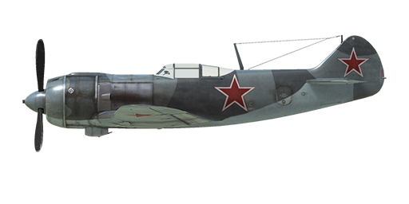

# La-5F ser.38

## Description

Indicated stall speed in flight configuration: 165..183 km/h  
Indicated stall speed in takeoff/landing configuration: 147..162 km/h  
Dive speed limit: 720 km/h  
Maximum load factor: 10 G  
Stall angle of attack in flight configuration: 22.7 °  
Stall angle of attack in landing configuration: 15.1 °  
  
Maximum true air speed at sea level, engine mode - Nominal: 552 km/h  
Maximum true air speed at 3000 m, engine mode - Nominal: 580 km/h  
Maximum true air speed at 6000 m, engine mode - Nominal: 597 km/h  
  
Service ceiling: 10000 m  
Climb rate at sea level: 19.5 m/s  
Climb rate at 3000 m: 14.4 m/s  
Climb rate at 6000 m: 9.5 m/s  
  
Maximum performance turn at sea level: 20.8 s, at 300 km/h IAS.  
Maximum performance turn at 3000 m: 29.0 s, at 320 km/h IAS.  
  
Flight endurance at 3000 m: 1.7 h, at 350 km/h IAS.  
  
Takeoff speed: 170..200 km/h  
Glideslope speed: 200..210 km/h  
Landing speed: 150..160 km/h  
Landing angle: 13 °  
  
Note 1: the data provided is for international standard atmosphere (ISA).  
Note 2: flight performance ranges are given for possible aircraft mass ranges.  
Note 3: maximum speeds, climb rates and turn times are given for standard aircraft mass.  
Note 4: climb rates and turn times are given for nominal power.  
  
Engine:  
Model: M-82F  
Maximum power in Nominal mode at sea level: 1700 HP  
Maximum power in Nominal mode at 2100 m: 1550 HP  
Maximum power in Nominal mode at 5400 m: 1335 HP  
  
Engine modes:  
Nominal (unlimited time): 2400 RPM, 1140 mm Hg  
  
Oil rated temperature in engine output: 55..90 °C  
Oil maximum temperature in engine output: 125 °C  
Cylinder head rated temperature: 140..210 °C  
Cylinder head maximum temperature: 250 °C  
  
Supercharger gear shift altitude: 3500 m  
  
Empty weight: 2584 kg  
Minimum weight (no ammo, 10%25 fuel): 2844 kg  
Standard weight: 3220 kg  
Maximum takeoff weight: 3460 kg  
Fuel load: 334 kg / 464 l  
Useful load: 876 kg  
  
Forward-firing armament:  
2 x 20mm gun "ShVAK", 170 rounds, 800 rounds per minute, synchronized  
  
Bombs:  
2 x 50 kg general purpose bombs "FAB-50sv"  
2 x 104 kg general purpose bombs "FAB-100M"  
  
Length: 8.672 m  
Wingspan: 9.8 m  
Wing surface: 17.51 m²  
  
Combat debut: Summer 1943  
  
Operation features:  
- The boost regulator on an airplane works only as a boost limiter. The regulator limits the nominal boost to 1140 mmHg at the first stage of the supercharger operation and 950 mmHg at the second stage of the supercharger operation.  
- The engine has a two-stage mechanical supercharger which must be manually switched at 3500m altitude.  
- Engine mixture control is automatic when the mixture lever is set to maximum. It is possible to manually lean the mixture by moving the mixture control to less than maximum. This also reduces fuel consumption during flight.  
- Engine RPM has an automatic governor and it is maintained at the required RPM corresponding to the governor control lever position. The governor automatically controls the propeller pitch to maintain the required RPM.  
- Oil radiator, air cooling intake and outlet shutters are manually controlled.  
- Air cooling intake shutters should always be open. They should only be closed when there is a possibility of engine overcooling, for example in a dive with idle throttle.  
- The aircraft has trimmers for pitch and yaw controls.  
- The aircraft has automatic wing slats. They deploy when the high angle of attack increases which makes pre-stall softer.  
- Landing flaps have a hydraulic actuator and they can be extended to any angle up to 60°.  
- The aircraft tail wheel rotates freely and does not have a lock. For this reason, it is necessary to confidently and accurately operate the rudder pedals during the takeoff and landing.  
- The aircraft has differential pneumatic wheel brakes with shared control lever. This means that if the brake lever is held and the rudder pedal the opposite wheel brake is gradually released causing the plane to swing to one side or the other.  
- The aircraft has a fuel gauge which shows total remaining fuel.  
- The canopy has an emergency jettison for bailing out at a high speed.  
- The control system for the bomb rack only allows to drop the two bombs at the same time.

## Modifications

**2 x FAB-100M bombs**  
2 x 104 kg General Purpose Bombs FAB-100M  
Additional mass: 228 kg  
Ammunition mass: 208 kg  
Racks mass: 20 kg  
Estimated speed loss before drop: 27 km/h  
Estimated speed loss after drop: 12 km/h

**2 x FAB-50sv bombs**  
2 x 50 kg General Purpose Bombs FAB-50sv  
Additional mass: 120 kg  
Ammunition mass: 100 kg  
Racks mass: 20 kg  
Estimated speed loss before drop: 20 km/h  
Estimated speed loss after drop: 12 km/h

**RPK-10**  
Fixed loop radio compass for navigation with radio beacons  
Additional mass: 10 kg  
Estimated speed loss: 0 km/h

**Mirror**  
Rear view mirror  
Additional mass: 1 kg  
Estimated speed loss: 0 km/h

**Special Guns Ammo Load**  
Loadout variants: armour piercing (AP) or high-explosive (HE) rounds only

**Landing light**  
Landing light for night flights  
Additional mass: 2 kg  
Estimated speed loss: 0 km/h
