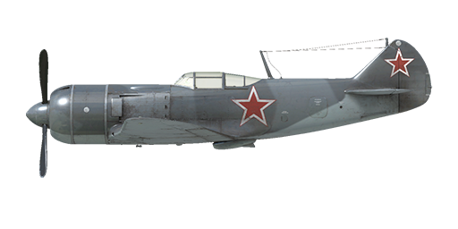

# La-7 ser.1

## Description

Indicated stall speed in flight configuration: 168..185 km/h  
Indicated stall speed in takeoff/landing configuration: 147..159 km/h  
Dive speed limit: 720 km/h  
Maximum load factor: 10 G  
Stall angle of attack in flight configuration: 22.2 °  
Stall angle of attack in landing configuration: 15.0 °  
  
Maximum true air speed at sea level, engine mode - Boosted: 603 km/h  
Maximum true air speed at 2500 m, engine mode - Nominal: 641 km/h  
Maximum true air speed at 6000 m, engine mode - Nominal: 665 km/h  
  
Service ceiling: 10500 m  
Climb rate at 1000 m: 24 m/s  
  
Maximum performance turn at sea level: 21.0 s, at 320 km/h IAS.  
Maximum performance turn at 3000 m: 28.0 s, at 340 km/h IAS.  
  
Flight endurance at 3000 m: 2.0 h, at 350 km/h IAS.  
  
Takeoff speed: 175..195 km/h  
Glideslope speed: 200..210 km/h  
Landing speed: 150..160 km/h  
Landing angle: 13 °  
  
Note 1: the data provided is for international standard atmosphere (ISA).  
Note 2: flight performance ranges are given for possible aircraft mass ranges.  
Note 3: maximum speeds, climb rates and turn times are given for standard aircraft mass.  
Note 4: climb rates and turn times are given for Boosted power.  
  
Engine:  
Model: M-82FN  
Maximum power in Boosted mode at sea level: 1850 HP  
Maximum power in Nominal mode at sea level: 1560 HP  
Maximum power in Nominal mode at 1550 m: 1630 HP  
Maximum power in Nominal mode at 4800 m: 1460 HP  
  
Engine modes:  
Nominal (unlimited time): 2400 RPM, 1000 mm Hg  
Boosted power (up to 10 minutes): 2500 RPM, 1180 mm Hg  
  
Oil rated temperature in engine intake: 65..75 °C  
Oil maximum temperature in engine intake: 85 °C  
Cylinder head rated temperature: 180..215 °C  
Cylinder head maximum temperature: 250 °C  
  
Supercharger gear shift altitude: 3500 m  
  
Empty weight: 2588 kg  
Minimum weight (no ammo, 10% fuel): 2771 kg  
Standard weight: 3233 kg  
Maximum takeoff weight: 3461 kg  
Fuel load: 342 kg / 466 l  
Useful load: 783 kg  
  
Forward-firing armament:  
2 x 20mm gun "ShVAK", 170 rounds, 800 rounds per minute, synchronized  
3 x 20mm gun "B-20", 130 rounds, 800 rounds per minute, synchronized (modification)  
  
Bombs:  
2 x 50 kg general purpose bombs "FAB-50sv"  
2 x 104 kg general purpose bombs "FAB-100M"  
  
Length: 8.640 m  
Wingspan: 9.8 m  
Wing surface: 17.51 m²  
  
Combat debut: May-June 1944  
  
Operation features:  
- The engine has a boost mode. To engage it, increase the manifold pressure to 1180 mm Hg. Boost only works on 1st supercharger gear.  
- The engine has a two-stage mechanical supercharger which must be manually switched at 3500m altitude.  
- Engine RPM has an automatic governor and it is maintained at the required RPM corresponding to the governor control lever position. The governor automatically controls the propeller pitch to maintain the required RPM.  
- Oil radiator, air cooling intake and outlet shutters are manually controlled.  
- Air cooling intake shutters should always be open. They should only be closed when there is a possibility of engine overcooling, for example in a dive with idle throttle.  
- The aircraft is equipped with elevator and rudder trimmers.  
- The aircraft has automatic wing slats. They deploy when the high angle of attack increases which makes pre-stall softer.  
- Landing flaps have a hydraulic actuator and they can be extended to any angle up to 60°.  
- The aircraft tailwheel rotates freely and does not have a lock. For this reason, it is necessary to confidently and accurately operate the rudder pedals during the takeoff and landing.  
- The aircraft has differential pneumatic wheel brakes with shared control lever. This means that if the brake lever is held and the rudder pedal the opposite wheel brake is gradually released causing the plane to swing to one side or the other.  
- The aircraft has a fuel gauge which shows total remaining fuel.  
- Also, it is impossible to open or close canopy at high speed due to strong airflow. The canopy has no emergency release, so bail out requires the speed drop before it.  
- The control system for the bomb rack only allows to drop the two bombs at the same time.  
  
Basic data and recommended positions of the aircraft controls:  
1. Starting the engine:  
	- recommended position of the mixture control lever: no mixture control  
	- recommended position of the cowl flap control handle: open  
	- recommended position of the radiator/cowl flap control handle: close  
	- recommended position of the prop pitch control handle: 100%  
	- recommended position of the throttle lever: 0%  
  
2. Recommended mixture control lever positions for various flight modes: no mixture control  
  
3.1 Recommended positions of cowl flaps for various flight modes:  
	- takeoff: open  
	- climb: open  
	- cruise flight: open (in winter conditions - close 50% if necessary)  
	- combat: open  
  
3.2 Recommended positions of cowl flaps for various flight modes:  
	- takeoff: open 100%  
	- climb: open 100%  
	- cruise flight: open 20% (in winter conditions - close if necessary)  
	- combat: open 60%  
  
3.3 Recommended positions of the oil radiator control handle for various flight modes:  
	- takeoff: open 50%  
	- climb: open 100%  
	- cruise flight: open 20% (in winter conditions - close if necessary)  
	- combat: open 50%  
4. Approximate fuel consumption at 2000 m altitude:  
	- Cruise engine mode: 3.6 l/min  
	- Combat engine mode: 12.3 l/min

## Modifications

**3x 20mm B-20**  
3 20mm cannon B-20 with 130 rounds per gun instead of default 2 20mm SHVAK.  
Additional mass: 5 kg  
Ammunition mass: 87 kg  
Guns mass: 76,5 kg

**2 x FAB-50sv bombs**  
2 x 50 kg General Purpose Bombs FAB-50sv  
Additional mass: 120 kg  
Ammunition mass: 100 kg  
Racks mass: 20 kg  
Estimated speed loss before drop: 20 km/h  
Estimated speed loss after drop: 12 km/h

**2 x FAB-100M bombs**  
2 x 104 kg General Purpose Bombs FAB-100M  
Additional mass: 228 kg  
Ammunition mass: 208 kg  
Racks mass: 20 kg  
Estimated speed loss before drop: 27 km/h  
Estimated speed loss after drop: 12 km/h

**PKI Reflector Gunsight**  
PKI reflector gunsight  
Additional mass: 0.5 kg  
Estimated speed loss: 0 km/h

**Landing light**  
Landing light for night flights  
Additional mass: 2 kg  
Estimated speed loss: 0 km/h

**RPK-10**  
Fixed loop radio compass for navigation with radio beacons  
Additional mass: 10 kg  
Estimated speed loss: 0 km/h

**Mirror**  
Rear view mirror  
Additional mass: 1 kg  
Estimated speed loss: 0 km/h
