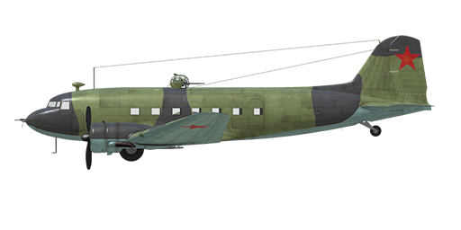

# Li-2

## Description

Indicated stall speed in flight configuration: 115...135 km/h  
Indicated stall speed in takeoff/landing configuration: 105...120 km/h  
Dive speed limit: 410 km/h  
Maximum load factor: 5.0 G  
Stall angle of attack in flight configuration: 13 °  
Stall angle of attack in landing configuration: 12.5 °  
  
Maximum true air speed at sea level, engine mode - take-off: 322 km/h  
Maximum true air speed at 900 m, engine mode - take-off: 333 km/h  
  
Maximum true air speed at sea level, engine mode - economical maximum: 303 km/h  
Maximum true air speed at 1700 m, engine mode - economical maximum: 320 km/h  
  
Service ceiling: 5500 m  
Climb rate at sea level: 4,0 m/s  
Climb rate at 3000 m: 2,5 m/s  
  
Maximum performance turn at sea level: 25.5 s, at 220 km/h IAS.  
  
Flight endurance at 4000 m: 9h, at 2000 rpm / 640 mm Hg MAP  
  
Takeoff speed: 120..130 km/h  
Glideslope speed: 150..165 km/h  
Landing speed: 105..115 km/h  
Landing angle: 11.5 °  
  
Note 1: the data provided is for international standard atmosphere (ISA).  
Note 2: flight performance ranges are given for possible aircraft mass ranges.  
Note 3: maximum speeds, climb rates and turn times are given for standard aircraft mass.  
Note 4: climb rates are given for maximum continuous power, turn times are given for nominal power.  
  
Engine:  
Model: M-62IR  
Maximum power in take-off mode at sea level: 1000 HP  
Maximum power in maximum continuous (nominal) mode at sea level: 820 HP  
  
Maximum power in maximum continuous (nominal) mode at 1700 m: 840 HP  
  
Engine modes:  
Take-off (up to 5 minutes): 2200 RPM, 1050 mm Hg  
Nominal: 2100 RPM, 900 mm Hg  
  
Oil rated temperature in engine output: 115 °C  
Oil maximum temperature in engine output: 125 °C  
Cylinder head rated temperature: 205 °C  
Cylinder head maximum temperature: 235 °C  
  
Empty weight: 7526 kg  
Maximum takeoff weight: 11600 kg  
Fuel load: 2240 kg / 3110 l  
Useful load: 4074 kg   
  
Forward-firing armament:  
7.62 mm "ShKAS" machine gun, 450 rounds, 1800 rounds per minute, nose-mounted  
  
Defensive armament:  
Top: 12.7 mm machine gun "UBT" in UTK-1 turret, 230 rounds, 1000 rounds per minute  
Left: 7.62 mm "ShKAS" machine gun, 500 rounds, 1800 rounds per minute  
Right: 7.62 mm "ShKAS" machine gun, 500 rounds, 1800 rounds per minute  
  
Bombs:  
Up to 4 x 254 kg general purpose bombs "FAB-250sv"  
Up to 2 x 512 kg general purpose bombs "FAB-500M"  
  
Length: 19.65 m  
Wingspan: 28,81 m   
Wing surface: 91,7 m²  
  
Combat debut: Autumn 1942  
  
Operation features:  
- IMPORTANT: take up to 50% fuel in cargo loadout to not exceed the maximum takeoff weight.  
- The engine has no manifold pressure automatic governor. For this reason, manifold pressure not only depends on throttle position, but also from RPM and altitude. This requires additional checking of manifold pressure to not cause engine damage.  
- Engine mixture control is automatic when the mixture lever is set to maximum. It is possible to manually lean the mixture by moving the mixture control to less than maximum. This also reduces fuel consumption during flight.  
- Engine RPM has an automatic governor and it is maintained at the required RPM corresponding to the governor control lever position. The governor automatically controls the propeller pitch to maintain the required RPM.  
- Oil radiators and engine cowl outlet shutters are manually operated.  
- The aircraft has trimmers for all flight-controls: pitch, roll and yaw.  
- Landing flaps have a hydraulic actuator and they can be extended to any angle up to 50°.  
- The aircraft has independent left and right hydraulic wheel brake controls. To apply either brake push the upper part of the rudder pedal.  
- The aircraft is equipped with a parking brake system.  
- The aircraft is equipped with landing and navigation lights.  
- The engine has a one-stage mechanical supercharger.  
- The aircraft has a fuel gauge which shows remaining fuel in fuel tanks depending on switch position. In the game the fuel indicator switch changes by pressing (RShift+I).  
- The aircraft has a manual control for the tailwheel lock. The unlocked tailwheel has no turn limit. The tailwheel should be locked when taxiing straight for a long distance and before takeoff and landing.  
- The aircraft is equipped with three-channel autopilot system (main switch RAlt + A). Pilot has the ability to trim course (RAlt + Left/Right), pitch (RAlt + Up/Down) and roll (RShift + Left/Right) stabilizing angles.  
- Cargo unload doors can be opened on the ground only.  
- The side door must be opened for dropping paratroopers or cargo containers stored inside. Open it using the bomb bay doors toggle command ("N" by default) and then use the bomb drop button ("B" by default) to drop them.  
  
Basic data and recommended positions of the aircraft controls:  
1. Starting the engine:  
	- recommended position of the mixture control lever: forward  
	- recommended position of the cowl flap control handle: close  
	- recommended position of the radiator control handle: open 50%  
	- recommended position of the prop pitch control handle: heavy  
	- recommended position of the throttle lever: 15%  
	- before taxiing, you must unlock the tailwheel  
	- before taxiing, the parking brake must be released  
  
2. Recommended mixture control lever positions for various flight modes:  
	- When running the engine at low throttle near the ground, the mixture control lever should be in the position of about 60%.  
	- When the engine is running at full throttle near the ground, the mixture control lever should be in the 40-50% position.  
	- As you gain altitude, the altitude corrector closes.  
  
3.1 Recommended positions of the radiator/cowl flap control handle for various flight modes: / no control of radiators/cowl flaps  
	- takeoff: open 100%  
	- climb: open 100%  
	- cruise flight: open 50% (in winter conditions - close if necessary)  
	- combat: open 50%  
  
3.2 Recommended positions of the radiator/cowl flap control handle for various flight modes: / no control of radiators/cowl flaps  
	- takeoff: open 50%  
	- climb: open 100%  
	- cruise flight: open 40% (in winter conditions - close if necessary)  
	- combat: open 50%  
  
4. Approximate fuel consumption at 2000 m altitude:  
	- Cruise engine mode: 7.7 l/min  
	- Combat engine mode: 9.8 l/min

## Modifications

**16 paratroopers**  
16 paratroopers with equipment  
Additional mass: 1600 kg  
Estimated speed loss before drop: 7 km/h  
Estimated speed loss after drop: 0 km/h

**Bomb Load**  
4 x 254 kg General Purpose Bombs FAB-250sv  
Additional mass: 1076 kg  
Ammunition mass: 1016 kg  
Racks mass: 60 kg  
Estimated speed loss before drop: 13 km/h  
Estimated speed loss after drop: 2 km/h  
or  
2 x 512 kg General Purpose Bombs FAB-500M  
Additional mass: 1084 kg  
Ammunition mass: 1024 kg  
Racks mass: 60 kg  
Estimated speed loss before drop: 17 km/h  
Estimated speed loss after drop: 2 km/h

**6 x PD-MM containers**  
6 x 125 kg drop transport container with parachute PD-MM  
Additional mass: 814 kg  
Containers mass: 754 kg  
Racks mass: 60 kg  
Estimated speed loss before drop: 20 km/h  
Estimated speed loss after drop: 2 km/h

**14 PD-MM containers (inside)**  
14 x 125 kg drop transport container with parachute PD-MM stored in the cargo compartment  
Additional mass: 1760 kg  
Estimated speed loss before drop: 5 km/h  
Estimated speed loss after drop: 0 km/h

**2200 kg of cargo**  
2200 kg of military cargo payload  
Additional mass: 2200 kg  
Estimated speed loss: 6 km/h
