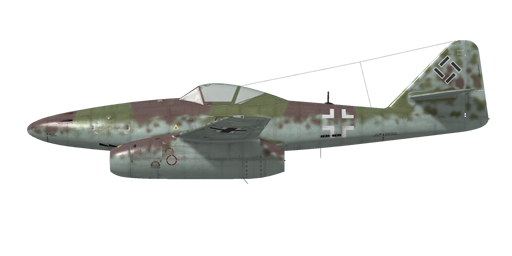

# Me 262 A

## Description

Indicated stall speed in flight configuration: 165..200 km/h  
Indicated stall speed in takeoff/landing configuration: 139..154 km/h  
Dive true air speed limit: 1000 km/h  
Maximum load factor: 12.5 G  
Stall angle of attack in flight configuration: 17°  
Stall angle of attack in flight configuration (with slats extended): 23°  
Stall angle of attack in landing configuration: 22°  
  
Maximum true air speed at sea level, engine mode - Nominal, 8400 RPM: 759 km/h  
Maximum true air speed at 6000 m, engine mode - Nominal, 8400 RPM: 780 km/h  
Maximum true air speed at 9000 m, engine mode - Nominal, 8400 RPM: 739 km/h  
  
Maximum true air speed at sea level, engine mode - Maximal, 8700 RPM: 837 km/h  
Maximum true air speed at 6000 m, engine mode - Maximal, 8700 RPM: 871 km/h  
Maximum true air speed at 9000 m, engine mode - Maximal, 8700 RPM: 838 km/h  
  
Service ceiling: 12000 m  
Climb rate at sea level: 19.3 m/s  
Climb rate at 6000 m: 9.7 m/s  
Climb rate at 9000 m: 5.4 m/s  
  
Maximum performance turn at sea level: 32..35 s, at 450 km/h IAS.  
Maximum performance turn at 6000 m: 43..48 s, at 380 km/h IAS.  
  
Flight endurance at 6000 m: 2 h 20 m, at 475 km/h IAS.  
  
Takeoff speed: 200..220 km/h  
Glideslope speed: 250 km/h  
Landing speed: 165..185 km/h  
Landing angle: 12.3°  
  
Note 1: the data provided is for international standard atmosphere (ISA).  
Note 2: flight performance ranges are given for possible aircraft mass ranges.  
Note 3: maximum speeds, climb rates and turn times are given for standard aircraft mass.  
Note 4: climb rates and turn times are given for Maximal (8700 RPM) power.  
  
Engine: 2 x turbo jet  
Model: Jumo-004 B1  
Maximum power in Maximal mode (8700 RPM) at sea level: 810 kg(f)  
Maximum power in Maximal mode (8700 RPM) at 6000 m: 530 kg(f)  
Maximum power in Maximal mode (8700 RPM) at 9000 m: 385 kg(f)  
  
Engine modes:  
Nominal (unlimited time): 8400 RPM  
Maximal (15 minutes): 8700 RPM  
  
Nominal exhaust temperature: 600 °C  
Maximum exhaust temperature: 650 °C  
  
Exhaust pressure: 0.2-0.38 kg/cm²  
  
Fuel injection pressure: 40-80 kg/cm²  
  
Oil rated pressure in engine output: 2 kg/cm²  
Oil maximum pressure in engine output: 5 kg/cm²  
  
Empty weight: 4146 kg  
Minimum weight (no ammo, 10% fuel): 4737 kg  
Standard weight: 6400 kg  
Weight with full tanks: 6900 kg  
Maximum takeoff weight: 7100 kg  
Fuel load: 2161 kg / 2570 l  
Useful load: 700 kg  
  
Forward-firing armament:  
2 x 30mm gun "MK 108", 100 rounds, 650 rounds per minute, nose-mounted inner (upper)  
2 x 30mm gun "MK 108", 80 rounds, 650 rounds per minute, nose-mounted outer (lower)  
  
Bombs:  
2 x 249 kg general purpose bombs "SC 250"  
500 kg general purpose bombs "SC 500"  
  
Length: 10.6 m  
Wingspan: 12.6 m  
Wing surface: 20.4 m²  
  
Combat debut: Summer 1944  
  
Operation features:  
- The aircraft is equipped with two turbojet engines Jumo-004 B1. They are controlled automatically by the throttle which sets the turbine rotor RPM.  
- The engine is equipped with automatic fuel regulator that engaged only at more than 6000 RPM. Therefore, the fuel regulation at lower RPM wasn\'t effective and a careless throttle increase could cause excessive fuel intake, resulting in overheating and possible engine fire.  
- At high altitudes it is possible to lean the mixture too much by a sharp throttle decrease, causing a flameout and engine stop. The turbine shouldn\'t be set below 6000-8000 RPM depending on the altitude.  
- It is impossible to restart the engine at high altitudes (more than 4000 m).  
- The aircraft is equipped with horizontal stabilizer and rudder trim to reduce the load on controls.  
- The aircraft is susceptible to Mach tuck when diving at 0.84 M or higher speed.   
- Landing flaps have a hydraulic actuator and they can be extended to any angle up to 55°. The hydraulic valve controlling the flaps can\'t be turned during the landing gear operation (lowering or retracting).  
- Landing gear brakes are hydraulic as well and are engaged by pushing a corresponding pedal. The nose gear orients by itself (up to 50° in either direction), has a rotation dampener and dedicated brake handle. The aircraft tends to rotate during a breakaway unless the nose wheel is set forward.  
- There are two main (900 l each) and two secondary fuel tanks (600 and 170 l). The fuel transfer from secondary to main tanks using the electric fuel pump is initiated by the pilot when the fuel level in main tanks drops lower than 600 l. The main tanks have fuel level indicators and emergency fuel lamps (they light up when there are less than 250 l left).  
  
Basic data and recommended positions of the aircraft controls:  
1. Starting the engine:  
	- recommended position of the mixture control lever: auto mixture control  
	- recommended position of the throttle lever: 0%  
  
2. Recommended mixture control lever positions for various flight modes: auto mixture control  
  
3. Recommended positions of the radiator/cowl flap control handle for various flight modes:  no radiators/cowl flaps  
  
4. Approximate fuel consumption at 2000 m altitude:  
	- Cruise engine mode: 18.8 l/min  
	- Combat engine mode: 28.3 l/min

## Modifications

**Removed Frontal Armor**  
Removed frontal cannons armor  
Removed mass: 124 kg  
Estimated speed gain: 2 km/h

**Armoured Head Rest**  
Additional pilot protection  
Additional mass: 33 kg  
Estimated speed loss: 0 km/h

**Back Armor**  
Additional pilot protection  
Additional mass: 59 kg  
Estimated speed loss: 0 km/h

**Removed Inner Cannons**  
Removed inner (upper) MK-108 cannons  
Removed mass: 244 kg  
Removed ammunition mass: 119 kg  
Removed guns mass: 125 kg  
Estimated speed gain: 9 km/h

**Gyro Gunsight**  
EZ42 Gyro Gunsight  
Additional mass: 13 kg  
Estimated speed loss: 0 km/h

**Bomb load**  
249 kg General Purpose Bomb SC 250  
Additional mass: 279 kg  
Ammunition mass: 249 kg  
Racks mass: 30 kg  
Estimated speed loss before drop: 124 km/h  
Estimated speed loss after drop: 76 km/h  
  
2 x 249 kg General Purpose Bomb SC 250  
Additional mass: 558 kg  
Ammunition mass: 498 kg  
Racks mass: 60 kg  
Estimated speed loss before drop: 154 km/h  
Estimated speed loss after drop: 100 km/h  
  
500 kg General Purpose Bomb SC 500  
Additional mass: 530 kg  
Ammunition mass: 500 kg  
Racks mass: 30 kg  
Estimated speed loss before drop: 136 km/h  
Estimated speed loss after drop: 76 km/h

**24 x R4M rockets**  
24 x 55 mm High Explosive unguided rockets R4M  
Additional mass: 90 kg  
Ammunition mass: 73 kg  
Racks mass: 17 kg  
Estimated speed loss before launch: 70 km/h  
Estimated speed loss after launch: 36 km/h

**Fuel regulating valve**  
This automatic valve in the fuel line limits an excessive fuel pressure caused by a rapid throttle increase, preventing the overheating and the resulting destruction of the engine. It almost completely removed the danger of engine fire from careless throttle inputs.  
It was installed on Jumo-004 B1 engines during routine maintenance since the end of 1944.
