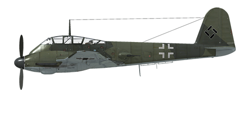

# Me 410 A-1

## Description

Indicated stall speed in flight configuration: 191...224 km/h  
Indicated stall speed in landing configuration: 163...194 km/h  
  
Dive speed limit: 750 km/h  
Maximum load factor: 9.0 G  
Stall angle of attack in flight configuration: 16.6 °  
Stall angle of attack in landing configuration: 13.9 °  
  
DB-603A engine:  
  
Maximum true air speed at sea level, engine mode - Combat: 498 km/h  
Maximum true air speed at 3000 m, engine mode - Combat: 549 km/h  
Maximum true air speed at 6300 m, engine mode - Combat: 591 km/h  
  
Service ceiling: 10100 m  
Climb rate at sea level: 11.6 m/s  
Climb rate at 3000 m: 10.4 m/s  
Climb rate at 6000 m: 7.5 m/s  
  
Maximum performance turn at sea level: 27.3 s, at 310 km/h IAS.  
Maximum performance turn at 3000 m: 34.0 s, at 310 km/h IAS.  
  
DB-603Aa engine:  
  
Maximum true air speed at sea level, engine mode - Combat: 495 km/h  
Maximum true air speed at 3000 m, engine mode - Combat: 545 km/h  
Maximum true air speed at 7800 m, engine mode - Combat: 587 km/h  
  
Service ceiling: 10400 m  
Climb rate at sea level: 11.3 m/s  
Climb rate at 3000 m: 10.0 m/s  
Climb rate at 6000 m: 6.9 m/s  
  
Maximum performance turn at sea level: 27.6 s, at 310 km/h IAS.  
Maximum performance turn at 3000 m: 34.7 s, at 310 km/h IAS.  
  
Flight endurance at 3000 m: 6.6 h, at 290 km/h IAS.  
  
Takeoff speed: 180...200 km/h  
Glideslope speed: 210...240 km/h  
Landing speed: 160..190 km/h  
Landing angle: 14.0 °  
  
Note 1: the data provided is for international standard atmosphere (ISA).  
Note 2: flight performance ranges are given for possible aircraft mass ranges.  
Note 3: maximum speeds, climb rates and turn times are given for standard aircraft mass.  
Note 4: climb rates are given for Combat power, turn times are given for Emergency power.  
  
Engine:  
Model: DB-603A  
Maximum power in Emergency mode at sea level: 1750 HP  
Maximum power in Emergency mode at 5700 m: 1620 HP  
Maximum power in Combat mode at sea level: 1580 HP  
Maximum power in Combat mode at 5700 m: 1510 HP  
  
Model: DB-603Aa  
Maximum power in Emergency mode at sea level: 1670 HP  
Maximum power in Emergency mode at 7300 m: 1450 HP  
Maximum power in Combat mode at sea level: 1510 HP  
Maximum power in Combat mode at 7200 m: 1370 HP  
  
Engine modes:  
Nominal (unlimited time): 2300 RPM, 1.2 ata  
Combat power (up to 30 minutes): 2500 RPM, 1.3 ata  
Emergency power (up to 1 minute): 2700 RPM, 1.4 ata  
  
Water rated temperature in engine output: 100..102 °C  
Water maximum temperature in engine output: 115 °C  
Oil rated temperature in engine intake: 70..80 °C  
Oil maximum temperature in engine intake: 85 °C  
  
Supercharger gear shift altitude: fluid coupling   
  
Empty weight: 7861 kg  
Minimum weight (no ammo, 10%25 fuel): 8412 kg  
Standard weight: 10244 kg  
Maximum takeoff weight: 11412 kg  
Fuel load: 1776 kg / 2400 l  
Maximum useful load: 3551 kg  
  
Forward-firing armament:  
2 x 7.92mm machine gun "MG 17", 1000 rounds, 1200 rounds per minute, nose-mounted  
2 x 13mm machine gun "MG 131", 550 rounds, 900 rounds per minute, nose-mounted (modification)  
2 x 20mm gun "MG 151/20", 350 rounds, 700 rounds per minute, nose-mounted  
2 x 20mm gun "MG 151/20", 250 rounds, 700 rounds per minute, nose-mounted (modification)  
4 x 20mm gun "MG 151/20", 150 rounds, 700 rounds per minute, nose-mounted (modification)  
2 x 30mm gun "MK 103", 110/115 rounds, 400 rounds per minute, nose-mounted (modification)  
50мм gun "BK5", 22 rounds, 50 rounds per minute, nose-mounted (modification)  
  
Defensive armament:  
2 x 13mm machine gun "MG 131", 500 rounds, 900 rounds per minute  
  
Bombs:  
8 x 66 kg fragmentation bombs "SD 70"  
2 x 249 kg general purpose bomb "SC 250"  
500 kg general purpose bomb "SC 500"  
1000 kg general purpose bomb "SB1000/410"  
  
Rockets:  
Four WGr.21 rockets in jettisonable launchers (modification)  
  
Length: 12.48 m  
Wingspan: 16.35 m  
Wing surface: 36.2 m²  
  
Combat debut: Spring 1943  
  
Operation features:  
- The aircraft has a wide automatization of the engine systems, in fact, to control speed it is only necessary to use the throttle lever. There is no need to manually set engine revolutions and mixture or supercharger gear in normal flight.  
- Water temperature are controlled manually by adjusting the radiator shutters.  
- The aircraft has trimmers for all flight-controls: pitch, roll and yaw.  
- The aircraft has fence-type airbrakes which are located above and under the wing and are used to slow the descent during steep dive bombing.  
- The aircraft has hydraulically-actuated landing flaps with three fixed positions: retracted, takeoff (20°) and landing (50°). Flaps control buttons and indicator lights are located on left panel near the throttle. The speed with the extended flaps is limited to 300 km/h.  
- The aircraft has automatic wing slats. They deploy when the high angle of attack increases which makes pre-stall softer.  
- The aircraft has a manual tail wheel lock. Wheel should be locked when taxiing straight for a long distance and before takeoff and landing.  
- The aircraft has independent left and right hydraulic wheel brake controls. To apply either brake push the upper part of the rudder pedal.  
- The design of the cockpit canopy does not allow it to be opened during flight. The canopy should be closed before takeoff to prevent damage. The canopy has an emergency release system for bailouts  
- The aircraft is equipped with bottom formation lights which can be turned on simultaneously.  
- The aircraft has dive bombsight Stuvi 5B by default. Pilot should set target height above sea level (RShift + Period/Semicolon) and wind speed (RAlt + Period/Semicolon) before initiating the dive.  
- The gunsight has a sliding sun-filter.  
- The aircraft is equipped with a bomb salvo controller, it has two release modes: drop single or drop all bombs in salvo.  
- When rockets are installed there is a salvo controller, it has three launch modes: single fire, fire two in a salvo or fire four in a salvo.

## Modifications

**4x MG 151 + 2x MG 131 (B-2/U4)**  
Four MG 151/20 20mm cannons mounted in bombbay with 150 rounds per gun + 13mm machineguns MG 131 with 550 rounds per gun instead of default MG 17 nose-mounted machineguns (Me-410 B-2/U4 field mod).  
Also installs Revi 16B gunsight.  
Additional mass: 376 kg  
Ammunition mass: 239 kg  
Guns mass: 221 kg

**2x MG 131 (Me 410 B)**  
13mm machineguns MG 131 with 550 rounds per gun instead of default MG 17 nose-mounted machineguns (Me 410 B).  
Additional mass: 47 kg  
Ammunition mass: 92 kg  
Guns mass: 39 kg

**50mm BK5 (A-1/U4 - B-2/U4)**  
50mm BK5 cannon mounted in bombbay with 22 rounds (Me-410 A-1/U4 - B-2/U4). Compatible with DB 603 Aa engine only with MG 131 machineguns.  
Also installs ZFR4 gunsight.  
Additional mass: 650 kg  
Ammunition mass: 53 kg  
Guns mass: 540 kg  
Estimated speed loss: 15 km/h

**WB 151 (Me 410 A-1/U2 - B-2/U2)**  
WB 151 gun pod with two 20mm MG 151 cannons and 250 rounds per gun (Me 410 A-1/U2 - B-2/U2).  
Also installs Revi C12D gunsight.  
Additional mass: 290 kg  
Ammunition mass: 123 kg  
Guns mass: 84 kg

**WB 151 + MG 131 + DB 603 Aa (U2)**  
WB 151 gun pod with two 20mm MG 151 cannons and 250 rounds per gun + 13mm machineguns MG 131 with 550 rounds per gun instead of default MG 17 nose-mounted machineguns + DB 603 Aa engine (Me-410 B-2/U2).  
Also installs Revi 16B gunsight.  
Additional mass: 337 kg  
Ammunition mass: 215 kg  
Guns mass: 123 kg

**2x MK 103 + 2x MG 131 (B-2/U1)**  
Two 30mm MK 103 cannons mounted in bombbay with 110 rounds (left gun) and 115 rounds (right gun) + 13mm machineguns MG 131 with 550 rounds per gun instead of default MG 17 nose-mounted machineguns (Me-410 B-2/U1).  
Also installs ZFR4 gunsight.  
Additional mass: 631 kg  
Ammunition mass: 299 kg  
Guns mass: 329 kg  
Estimated speed loss: 1 km/h

**DB 603 Aa Engines (Me 410 B)**  
DB 603 Aa engine with higher critical altitude (Me 410 B). Compatible with 50mm BK5 cannon only with MG 131 machineguns.

**Additional Armour Plates**  
Additional protection: front armour plates. Can be fitted only with additional cannons.  
Additional mass: 59 kg
