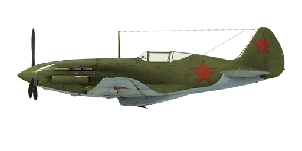

# MiG-3 ser.24

## Description

Indicated stall speed in flight configuration: 159..175 km/h  
Indicated stall speed in takeoff/landing configuration: 134..147 km/h  
Dive speed limit: 750 km/h  
Maximum load factor: 12.8 G  
Stall angle of attack in flight configuration: 17.3 °  
Stall angle of attack in landing configuration: 15.1 °  
  
Maximum true air speed at sea level, engine mode - Boosted: 525 km/h  
Maximum true air speed at sea level, engine mode - Nominal: 493 km/h  
Maximum true air speed at 7600 m, engine mode - Nominal: 626 km/h  
  
Service ceiling: 11800 m  
Climb rate at sea level: 15.9 m/s  
Climb rate at 3000 m: 14.0 m/s  
Climb rate at 6000 m: 10.2 m/s  
  
Maximum performance turn at sea level: 22.4 s, at 270 km/h IAS.  
Maximum performance turn at 3000 m: 28.7 s, at 270 km/h IAS.  
  
Flight endurance at 3000 m: 2.5 h, at 350 km/h IAS.  
  
Takeoff speed: 180..200 km/h  
Glideslope speed: 195..205 km/h  
Landing speed: 135..145 km/h  
Landing angle: 15 °  
  
Note 1: the data provided is for international standard atmosphere (ISA).  
Note 2: flight performance ranges are given for possible aircraft mass ranges.  
Note 3: maximum speeds, climb rates and turn times are given for standard aircraft mass.  
Note 4: climb rates and turn times are given for Boosted power.  
  
Engine:  
Model: AM-35a  
Maximum power in Boosted mode at sea level: 1350 HP  
Maximum power in Nominal mode at sea level: 1120 HP  
Maximum power in Nominal mode at 6000 m: 1200 HP  
  
Engine modes:  
Nominal (unlimited time): 2050 RPM, 1040 mm Hg  
Boosted power (up to 10 minutes): 2050 RPM, 1240 mm Hg  
  
Water rated temperature in engine output: 80..110 °C  
Water maximum temperature in engine output: 120 °C  
Oil rated temperature in engine intake: 40..80 °C  
Oil maximum temperature in engine intake: 85 °C  
Oil rated temperature in engine output: 115 °C  
Oil maximum temperature in engine output: 120 °C  
  
Supercharger gear shift altitude: single gear  
  
Empty weight: 2650 kg  
Minimum weight (no ammo, 10% fuel): 2831 kg  
Standard weight: 3244 kg  
Maximum takeoff weight: 3476 kg  
Fuel load: 352 kg / 480 l  
Useful load: 826 kg  
  
Forward-firing armament:  
2 x 7.62mm machine gun "ShKAS", 750 rounds, 1800 rounds per minute, synchronized  
12.7mm machine gun "UB", 300 rounds, 1000 rounds per minute, synchronized  
2 x 12.7mm machine gun "UB", 145 rounds, 1000 rounds per minute, wing-mounted (modification)  
2 x 12.7mm machine gun "UB", 350 rounds, 1000 rounds per minute, synchronized (modification)  
2 x 20mm gun "SsVAK", 150 rounds, 800 rounds per minute, synchronized (modification)  
  
Bombs:  
2 x 50 kg general purpose bombs "FAB-50sv"  
2 x 104 kg general purpose bombs "FAB-100M"  
  
Rockets:  
6 x 7 kg rockets "ROS-82", HE payload mass 2.52 kg  
  
Length: 8.255 m  
Wingspan: 10.2 m  
Wing surface: 17.44 m²  
  
Combat debut: July 1941  
  
Operation features:  
- The engine has a boost mode which is engaged by setting mixture control lever to maximum position.  
- The engine has a single stage mechanical supercharger which does not require manual control.  
- Engine mixture control is automatic when the mixture lever is set to the intermediate (50%) position. It is possible to manually lean the mixture by moving the control lever to less than 50%. This will lower fuel consumption during flight.  
- Engine RPM has an automatic governor and it is maintained at the required RPM corresponding to the governor control lever position. The governor automatically controls the propeller pitch to maintain the required RPM.  
- Water and oil radiator shutters are controlled manually.  
- The aircraft has only pitch and yaw flight-control trimmers.  
- The aircraft has automatic wing slats. They deploy when the high angle of attack increases which makes pre-stall softer.  
- Landing flaps have a limiter for the maximum angle. The flaps have an extended range from 0° to 50°. The landing flaps have pneumatic actuator. Flaps can only be instantly extended to the angle which is set by limiter, gradual extending is impossible. Due to weak force of the actuator the extended landing flaps may retract upward by the airflow when the airspeed is more than 220 km/h. For this reason, it is necessary to remember that flaps will not extend fully in case of high speed. In case of a high-speed landing approach the flaps may extend a few steps right before landing.  
- The aircraft has a tailwheel control system which is unlocked and made controllable by the rudder if the rudder pedal is pressed more than for 40% of its range. The tailwheel remans locked if pedals are deflected less than 40%. Because of this, it is necessary to avoid large rudder pedal inputs when moving at high speed, or be ready to control the airplane with an unlocked tailwheel should large rudder inputs be made.  
- The aircraft has differential pneumatic wheel brakes with shared control lever. This means that if the brake lever is held and the rudder pedal the opposite wheel brake is gradually released causing the plane to swing to one side or the other.  
- The aircraft has a fuel gauge which shows total remaining fuel.  
- It is impossible to open or close the canopy at high speed due to strong airflow. The canopy has no emergency release, so bail out requires the speed drop before it.  
- When bombs are installed there is a salvo controller, it has two release modes: single drop or drop two in a salvo.  
- When rockets are installed there is a salvo controller, it has three launch modes: single fire, fire two in a salvo or fire four in a salvo.  
  
Basic data and recommended positions of the aircraft controls:  
1. Starting the engine:  
	- recommended position of the mixture control lever: auto mixture control  
	- recommended position of the radiator/cowl flap control handle: close  
	- recommended position of the prop pitch control handle:auto prop pitch control  
	- recommended position of the throttle lever: 10%  
  
2. Recommended mixture control lever positions for various flight modes: auto mixture control  
  
3.1 Recommended positions of the oil radiator control handle for various flight modes:  
	- takeoff: open 100%  
	- climb: open 100% (winter: 50%)  
	- cruise flight: open 50% (winter: 20%)  
	- combat: close  
  
3.2 Recommended positions of the water radiator control handle for various flight modes:  
	- takeoff: open 100% (winter: 25%)  
	- climb: open 100% (winter: 25%)  
	- cruise flight: open 40% (winter: 20%)  
	- combat: open 100%  
  
4. Approximate fuel consumption at 2000 m altitude:  
	- Cruise engine mode: 6.0 l/min  
	- Combat engine mode: 7.2 l/min

## Modifications

**2 x 12.7 mm BK machinegun pods**  
BK 12.7mm machineguns in wing-mounted gun pods with 145 rounds per each  
Additional mass: 155 kg  
Ammunition mass: 54 kg  
Guns mass: 101 kg  
Estimated speed loss: 13 km/h

**2 x BS 12.7 mm (700 rounds)**  
BS 12.7mm nose-mounted machineguns with 350 rounds per each instead of default ShKAS and BS nose-mounted machineguns  
Additional mass: 34 kg  
Ammunition mass: 131 kg  
Guns mass: 62 kg  
Estimated speed loss: 0 km/h

**2 x 20mm ShVAK (300 rounds)**  
ShVAK 20mm nose-mounted guns with 150 rounds per each instead of default ShKAS and BS nose-mounted machineguns  
Additional mass: 4 kg  
Ammunition mass: 69 kg  
Guns mass: 94 kg  
Estimated speed loss: 0 km/h

**6 x ROS-82 rockets**  
6 x 82mm High Explosive unguided rockets ROS-82  
Additional mass: 60 kg  
Ammunition mass: 42 kg  
Racks mass: 18 kg  
Estimated speed loss before launch: 23 km/h  
Estimated speed loss after launch: 17 km/h

**2 x FAB-50sv / FAB-100M bombs**  
2 x 50 kg General Purpose Bombs FAB-50sv / 2 x 104 kg General Purpose Bombs FAB-100M  
  
FAB-50sv:  
Additional mass: 120 kg  
Ammunition mass: 104 kg  
Racks mass: 20 kg  
Estimated speed loss before drop: 20 km/h  
Estimated speed loss after drop: 12 km/h  
  
FAB-100M:  
Additional mass: 228 kg  
Ammunition mass: 208 kg  
Racks mass: 20 kg  
Estimated speed loss before drop: 27 km/h  
Estimated speed loss after drop: 12 km/h
