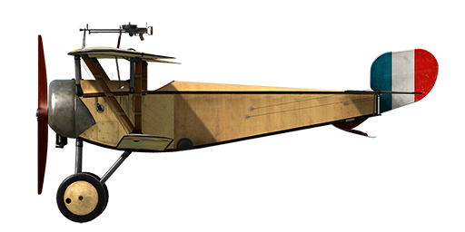

# Nieuport 11.C1

## Description

The Nieuport 11 "Bebe" ("Baby") was a further development of the concepts proposed by Gustav Delage, who was the designer of the Nieuport 10. In general, the Bebe was designed as a single-seat sesquiplane fighter. Its lower wing consisted of one spar and had a much narrower chord than the upper wing, and it was fastened to the upper wing with Vee-shaped interplane struts. A drawback of this design was the weakly built construction of the lower wing, thus making it prone to twisting and bending when under high G loads. Similar problems were common to other sesquiplanes, including the whole family of Nieuports from the "10" to the "23," the Albatros D.III and D.V, etc.  
The first Nieuport 11s arrived at the French front in January 1916. The Bebe quickly became a formidable adversary for the monoplane Fokker Eindecker, surpassing it in almost every way. In addition to ailerons, elevators were now attached to a conventional tailplane with a vertical stabiliser and a deflecting rudder. These upgrades greatly improved manoeuvrability and precise control of the aircraft, compared with older types equipped with wing warping and balanced \'Morane\' type elevators. The emergence of the Nieuport 11 at the front finally put an end to the devastating superiority of the Fokker monoplanes, which for a time had become known as the "Fokker Scourge." During the Battle of Verdun in February 1916, Nieuport 11s inflicted heavy damage on the enemy\'s air forces, which forced the German High Command to review the tactics of combat aircraft. Many famous aces of WWI (including Georges Guynemer) had their first major successes flying the Bebe.  
  
Some Nieuport 11s were equipped with special rails mounted on the wing struts in order to fire Le Prieur missiles at enemy airships and observation balloons. The Bebe remained in active military service until the summer of 1917, by which time aircraft that were more modern had replaced the Nieuport 11. Some planes were transferred to flying schools for operation as training aircraft. Famous in its time, the performance characteristics of this aircraft led to its wide popularity. The Nieuport 11 was in service with many countries, including Belgium, Russia, and Great Britain. Several hundred aircraft of this type were also built under license in Italy and Russia.  
  
Engine  
9 cyl. rotary Le Rhone 9C 80 hp  
  
Dimensions  
Height: 2400 mm  
Length: 5640 mm  
Wing span: 7520 mm  
Wing surface: 13.3 sq.m  
  
Weight  
Empty weight: 320 kg  
Takeoff weight: 480 kg  
Fuel capacity: 91 l  
Oil capacity: 15 l  
  
Climb rate  
1000 m:  3 min. 47 sec.  
2000 m:  8 min. 19 sec.  
3000 m: 14 min. 51 sec.  
4000 m: 28 min. 02 sec.  
  
Maximum airspeed (IAS)  
sea level — 167 km/h  
1000 m — 158 km/h  
2000 m — 146 km/h  
3000 m — 133 km/h  
4000 m — 117 km/h  
  
Service ceiling 5050 m  
  
Endurance at 1000 m  
nominal power (combat) — 2 h.  
minimal consumption (cruise) — 3 h.  
  
Armament  
Forward firing: 1 х Lewis Mk.I 7,69mm, 388 rounds.  
  
References  
1) Nieuport Fighters in action. Aircraft Number 167.  
2) Nieuport Fighters. JM Bruce Windsock Datafile, vol.1 and vol.2.  
3) Nieuport Aces of World War 1. Osprey Aircraft of the Aces Number 33.

## Modifications

**Anemometer**  
E.Badin Anemometer (70..200 km/h at 2000 m and 80..220 km/h at 4000 m)  
Additional mass: 1 kg

**Clock**  
Mechanical Clock  
Additional mass: 1 kg

**Cockpit light**  
Cockpit illumination lamp for night sorties  
Additional mass: 1 kg

**Aldis**  
Aldis Refractor-type Collimator Sight (imported from Britain)  
Additional mass: 2 kg

**Altimeter**  
Peltret and Lafage Altimeter (0..5000m)  
Additional mass: 1 kg

**Le-Chretien**  
Le-Chretien Refractor-type Collimator Sight  
Additional mass: 1 kg

**Twin Lewis Overwing**  
Two overwing mounted additional fixed Lewis machineguns.  
Ammo: 582 of 7.69mm rounds (6 drums with 97 rounds in each)  
Projectile weight: 11 g  
Muzzle velocity: 745 m/s  
Rate of fire: 550 rpm  
Guns weight: 16 kg (w/o ammo drums)  
Mounts weight: 6 kg  
Ammo weight: 24 kg  
Total weight: 46 kg  
Estimated speed loss: 7-18 km/h

**LePrieur rockets**  
8 x strut-mounted "Le Prieur" anti-balloon rockets of incendary action, with pointed triangular blade attached to nose cone to asssit penetration of balloon envelope or with high explosive grenade.  
Additional mass: 36 kg  
Ammunition mass: 16 kg  
Racks mass: 20 kg  
Estimated speed loss before launch: 8 km/h  
Estimated speed loss after launch: 6 km/h

**Compass**  
L.Maxant Compass  
Additional mass: 1 kg
