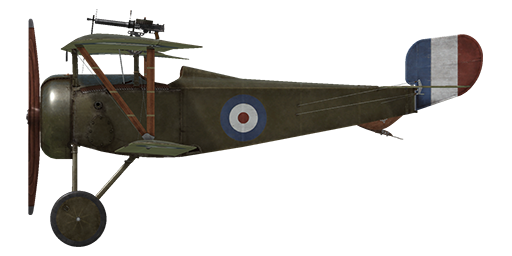

# Nieuport 17.C1 GBR

## Description

The Nieuport 17 was intended to be a further development of the Nieuport 11 fighter. When the Nieuport 17 arrived on the battlefield in March 1916, it swiftly replaced the Nieuport 11. By the end of 1916, every squadron in the French Aviation Militaire had Nieuport 17s. Compared to its predecessor, it had a larger wingspan and surface area, a more powerful engine, a Vickers machine gun, and metal aileron control wires. The plane was initially built in several French factories, but licenses were soon purchased by other countries: Great Britain, Russia, Italy, Finland and Japan.  
  
Pilots noted its good climb rate and visibility, as well as its excellent maneuverability. The plane's powerful engine and high dive speed exposed the main drawback of the "one and a half wing" design - a weak lower wing due to only one spar. There are two known occasions when pilots made successful landings after losing their lower wings. The introduction of the Vickers machine gun was met with ambiguity: some pilots removed and replaced it with a Lewis machine gun mounted on the upper wing. Others, however, used both machine guns simultaneously, although this somewhat decreased manoeuvrability.  
  
Its superiority over any British plane led to its adoption by the Royal Flying Corps and Royal Naval Air Service. The Nieuport 17 GBR was customized for British service with Imperial system instruments instead of metric.  
  
Engine  
9 cyl. rotary Le Rhone 9J 110 hp  
  
Dimensions  
Height: 2400 mm  
Length: 5800 mm  
Wing span: 8160 mm  
Wing surface: 14.75 sq.m  
  
Weight  
Empty weight: 369 kg  
Takeoff weight: 558 kg  
Fuel capacity: 78 l  
Oil capacity: 20 l  
  
Climb rate  
1000 m:  3 min. 06 sec.  
2000 m:  6 min. 43 sec.  
3000 m: 11 min. 34 sec.  
4000 m: 19 min. 23 sec.  
5000 m: 33 min. 08 sec.  
  
Maximum airspeed (IAS)  
sea level — 165 km/h  
1000 m — 155 km/h  
2000 m — 145 km/h  
3000 m — 132 km/h  
4000 m — 117 km/h  
5000 m —  95 km/h  
  
Service ceiling 5300 m  
  
Endurance at 1000 m  
nominal power (combat) — 1 h. 50 min.  
minimal consumption (cruise) — 2 h. 40 min.  
  
Armament  
Forward firing: 1 х Lewis Mk.I 7.69mm, 291 rounds per barrel.  
  
References  
1) Nieuport Fighters in action. Aircraft Number 167.  
2) Nieuport Fighters. JM Bruce Windsock Datafile, vol.1 and vol.2.  
3) Profile Publications. The Nieuport 17 Number 49.

## Modifications

**Sideslip Indicator**  
Sideslip indicator (bubble-type)  
Additional mass: 1 kg

**LePrieur rockets**  
8 x strut-mounted "Le Prieur" anti-balloon rockets of incendary action, with pointed triangular blade attached to nose cone to asssit penetration of balloon envelope or with high explosive grenade.  
Additional mass: 36 kg  
Ammunition mass: 16 kg  
Racks mass: 20 kg  
Estimated speed loss before launch: 8 km/h  
Estimated speed loss after launch: 6 km/h

**Compass**  
L.Maxant Compass  
Additional mass: 1 kg

**Twin Lewis Overwing**  
Two overwing mounted additional fixed Lewis machineguns.  
Ammo: 582 of 7.69mm rounds (6 drums with 97 rounds in each)  
Projectile weight: 11 g  
Muzzle velocity: 745 m/s  
Rate of fire: 550 rpm  
Guns weight: 16 kg (w/o ammo drums)  
Mounts weight: 6 kg  
Ammo weight: 24 kg  
Total weight: 46 kg  
Estimated speed loss: 5 km/h

**Clock**  
Mechanical Clock  
Additional mass: 1 kg

**Aldis**  
Aldis Refractor-type Collimator Sight (imported from Britain)  
Additional mass: 2 kg

**Cockpit light**  
Cockpit illumination lamp for night sorties  
Additional mass: 1 kg
