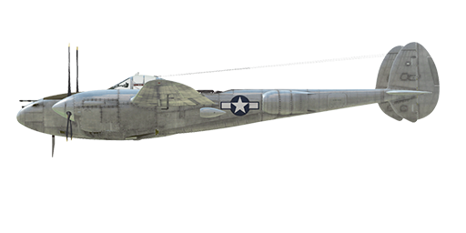

# P-38J-25

## Description

Indicated stall speed in flight configuration: 179..220 km/h (111..137 mph)  
Indicated stall speed in takeoff/landing configuration: 149..185 km/h (93..115 mph)  
  
Dive speed limit: 725 km/h (450 mph)  
Maximum load factor: 9.0 G  
Stall angle of attack in flight configuration: 14.1 °  
Stall angle of attack in landing configuration: 11.5 °  
  
Maximum true air speed at sea level, engine mode - WEP: 557 km/h (346 mph)  
Maximum true air speed at 7860 m (25800 feet), engine mode - WEP: 674 km/h (419 mph)  
  
Maximum true air speed at sea level, engine mode - Combat: 540 km/h (336 mph)  
Maximum true air speed at 8500 m (27890 feet), engine mode - Combat: 670 km/h (416 mph)  
  
Service ceiling: 12350 m (40500 feet)  
  
Climb at engine mode - WEP  
Climb rate at sea level: 20.4 m/s (4020 feet/min)  
Climb rate at 3000 m (9843 feet): 19.1 m/s (3758 feet/min)  
Climb rate at 6000 m (19685 feet): 15.0 m/s (2953 feet/min)  
  
Climb at engine mode - Combat  
Climb rate at sea level: 12.8 m/s (2518 feet/min)  
Climb rate at 3000 m (9843 feet): 11.5 m/s (2258 feet/min)  
Climb rate at 6000 m (19685 feet): 9.4 m/s (1844 feet/min)  
  
Maximum performance turn at sea level: 20.0 s, at 310 km/h (195 mph) IAS.  
Maximum performance turn at 3000 m (9843 feet): 28.3 s, at 320 km/h (200 mph) IAS.  
  
Flight endurance at 3000 m (9843 feet): 5.8 h, at 350 km/h (217 mph) IAS.  
  
Takeoff speed: 160..175 km/h (100..110 mph)  
Glideslope speed: 185..210 km/h (115..130 mph)  
Landing speed: 150..175 km/h (95..110 mph)  
Landing angle: 7.0 °  
  
Note 1: the data provided is for international standard atmosphere (ISA).  
Note 2: flight performance ranges are given for possible aircraft mass ranges.  
Note 3: maximum speeds, climb rates and turn times are given for standard aircraft mass and 70%25 of fuel.  
Note 4: turn times are given for WEP power.  
  
Engine:  
Model: Allison V-1710-89 (left) and V-1710-91 (right)  
Maximum power in WEP mode at sea level: 1550 HP  
Maximum power in WEP mode at 7860 m (25800 feet): 1505 HP  
  
Engine modes:  
Cruise (unlimited time): 2600 RPM, 44 inch Hg  
Combat power (up to 15 minutes): 3000 RPM, 54 inch Hg  
WEP (up to 5 minutes): 3000 RPM, 60 inch Hg  
  
Maximum continuous turbocharger RPM: 24000  
Maximum turbocharger RPM for up to 15 minutes: 26400  
  
Water rated temperature in engine output: 85 °C  
Water maximum temperature in engine output: 105 °C  
Oil rated temperature in engine output: 105 °C  
Oil maximum temperature in engine output: 115 °C  
  
Supercharger gear shift altitude: single gear  
  
Empty weight: 6356 kg (14013 lb)  
Minimum weight (no ammo, 10%25 fuel): 6662 kg (14687 lb)  
Standard weight: 7890 kg (17395 lb)  
Maximum takeoff weight: 10113 kg (22295 lb)  
Fuel load: 1132 kg (2496 lb) / 1575 l (416 gal)  
Useful load: 3757 kg (8282 lb)  
  
Forward-firing armament:  
20mm gun "M2", 150 rounds, 650 rounds per minute, nose-mounted  
4 x 12.7mm machine gun "M2.50", 300 rounds, 850 rounds per minute, nose-mounted  
It is possible to increase the ammo load to 500 rounds per gun.  
  
Bombs:  
Up to six 500 lb general purpose bomb "M64"  
Up to four 1000 lb general purpose bomb "M65"  
Up to two 2000 lb general purpose bomb "M66"  
  
Rockets:  
6 x unguided rockets "M8" in two "M10" launchers that can be jettisoned  
  
Length: 10.89 m (35.73 feet)  
Wingspan: 15.85 m (52 feet)  
Wing surface: 30.4 m² (327 feet²)  
  
Combat debut: 1944  
  
Operation features:  
- In addition to the automatic single-stage supercharger, each engine is equipped with the automatic turbo-supercharger.  
- The turbo-supercharger is powered by the engine exhaust backpressure and is regulated automatically by the pilot throttle control in the cockpit using the shutters on the exhaust pipes.  
- It should be noted that turbocharger RPM changes relatively slowly and not immediately after a control lever adjustment. For instance, during takeoff it's necessary to keep the brakes pressed for several seconds after moving the throttle to takeoff position and begin the run only when the turbocharger RPM increases sufficiently to reach 54 inches of pressure.  
- The automatic fuel mixture control maintains optimal mixture if mixture lever is set to Auto Rich (70%25) position. To use automatic mixture leaning to reduce the fuel consumption during flight set the mixture lever to Auto Lean (30%25) position. In a case of malfunction of the automatic mixture control, the mixture lever should be set to Full Rich (move the lever completely forward) position. To stop the engine, set it to the Idle Cut Off (0%25) position.  
- The automatic engine governor keeps the set engine RPM by adjusting the propeller pitch using an electric actuator (it is possible to turn it off and control the propeller pitch manually). The propellers can be feathered.  
- The aircraft has pitch and yaw flight-control trimmers.  
- Landing flaps have a hydraulic actuator and can be extended to any angle up to 40°. There is also a fixed "maneuver" flaps position that can be set by a short flaps button press ("F" by default).  
- The aircraft is equipped with hydraulic aileron actuators, making their operation and good roll performance at high speeds possible. The actuators are turned on using a special valve on the left side of the cockpit and require at least 1200 psi pressure in the hydraulic system, so they should be turned off if there is only one engine running. In the sim, they are turned on and off automatically.  
- The aircraft has independent left and right hydraulic wheel brake controls. To apply either brake push the upper part of the rudder pedal.  
- The aircraft is equipped with a parking brake system.  
- The landing gear indicator lamp lights up if the landing gear is neither extended nor retracted. The extension of the nose wheel can also be checked by its reflection in the mirrors on the inner sides of the engine nacelles and by the pressure drop in the hydraulic system during the landing gear operation.  
- There are signal lamps warning about the low fuel level in the outer wing tanks (the primary fuel source) and separate fuel indicators for the left and right fuel tank pairs.  
- The canopy has an emergency release system for bailouts.  
- The windows on the sides of the canopy can be lowered during flight, but this can cause the excessive shaking of the plane.  
- The electric bomb controller allows dropping the bombs one by one from the left and right racks or by pairs.  
- The unguided rockets are launched using the electric controller which allows single, pair, triple and salvo (all rockets at 0.1 seconds interval) launch. The rocket containers are jettisonable.

## Modifications

**Additional ANM2 .50 cal MG ammo**  
Additional ammo for machine guns: 500 for each gun.  
  
Additional mass: 99.3 kg (218.9 lbs)  
Estimated speed loss: 0 km/h

**General purpose bombs**  
General purpose bombs (underwing)  
  
2*500 lb General Purpose Bomb M64:  
  
Additional mass: 508 kg (1120 lbs)  
Estimated speed loss before drop: 9 km/h (5.5 mph)  
Estimated speed loss after drop: 2 km/h (1.2 mph)   
  
2*1000 lb General Purpose Bomb M65:  
  
Additional mass: 1024 kg (2324 lbs)  
Estimated speed loss before drop: 19 km/h (11.6 mph)  
Estimated speed loss after drop: 2 km/h (1.2 mph)   
  
2*2000 lb General Purpose Bomb M66:  
  
Additional mass: 1858 kg (4096 lbs)  
Estimated speed loss before drop: 23 km/h (14.2 mph)  
Estimated speed loss after drop: 2 km/h (1.2 mph) 

**Bendix MN-26**  
Fixed loop radio compass for navigation with radio beacons  
Additional mass: 17,5 kg (38.6 lbs)  
Estimated speed loss: 1 km/h

**M8 rockets**  
Six M8 rockets in jettisonable M10 launchers  
  
Additional mass: 171.9 kg (379 lbs)  
Ammunition mass: 115.9 kg (256 lbs)  
Racks mass: 56 kg (123 lbs)  
Estimated speed loss before launch: 18 km/h (11.4 mph)  
Estimated speed loss after launch: 13 km/h (8.2 mph)  
Estimated speed loss after drop: 4 km/h (2.5 mph)

**Additional bomb racks**  
Underwing bomb holders  
  
6*500 lb General Purpose Bomb M64:  
  
Additional mass: 1568 kg (3457 lbs)  
Ammunition mass: 1524 kg (3360 lbs)  
Rack mass: 44 kg (97 lbs)  
Estimated speed loss before drop: 52 km/h (32.3 mph)  
Estimated speed loss after drop: 19 km/h (12.0 mph)   
  
4*1000 lb General Purpose Bomb M65:  
  
Additional mass: 2092 kg (4612 lbs)  
Ammunition mass: 2048 kg (4515 lbs)  
Rack mass: 44 kg (97 lbs)  
Estimated speed loss before drop: 60 km/h (37.0 mph)  
Estimated speed loss after drop: 19 km/h (12.0 mph) 
