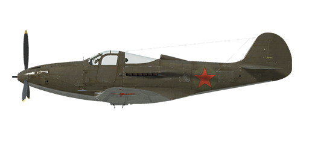

# P-39L-1

## Description

Indicated stall speed in flight configuration: 160..172 km/h  
Indicated stall speed in takeoff/landing configuration: 140..151 km/h  
  
Dive speed limit: 841 km/h  
Maximum load factor: 13.0 G  
Stall angle of attack in flight configuration: 18.3 °  
Stall angle of attack in landing configuration: 16.3 °  
  
Maximum true air speed at sea level, engine mode - Take-off: 539 km/h  
Maximum true air speed at 2850 m, engine mode - Take-off: 600 km/h  
Maximum true air speed at 4600 m, engine mode - Military: 596 km/h  
  
Service ceiling: 9300 m  
Climb rate at sea level: 16.7 m/s  
Climb rate at 3000 m: 13.5 m/s  
Climb rate at 6000 m: 7.2 m/s  
  
Maximum performance turn at sea level: 21.5 s, at 270 km/h IAS.  
Maximum performance turn at 3000 m: 30.3 s, at 270 km/h IAS.  
  
Flight endurance at 3000 m: 1.6 h, at 350 km/h IAS.  
  
Takeoff speed: 150..180 km/h  
Glideslope speed: 180..210 km/h  
Landing speed: 155..160 km/h  
Landing angle: 17.0 °  
  
Note 1: the data provided is for international standard atmosphere (ISA).  
Note 2: flight performance ranges are given for possible aircraft mass ranges.  
Note 3: maximum speeds, climb rates and turn times are given for standard aircraft mass.  
Note 4: climb rates and turn times are given for Take-off power.  
  
Engine:  
Model: V-1710-63  
Maximum power in War Emergency power mode at sea level: 1550 HP  
Maximum power in Take-off mode at sea level: 1325 HP  
Maximum power in Military mode at 12000 feet: 1150 HP  
Maximum power in Nominal mode at 10800 feet: 1000 HP  
  
Engine modes:  
Nominal (unlimited time): 2600 RPM, 37.2 inch Hg  
Military power (up to 15 minutes): 3000 RPM, 42 inch Hg  
Take-off power (up to 5 minutes): 3000 RPM, 51 inch Hg  
Maximum Possible power (up to 2 minutes): 3000 RPM, 60 inch Hg  
  
Water rated temperature in engine output: 105..115 °C  
Water maximum temperature in engine output: 125 °C  
Oil rated temperature in engine intake: 60..80 °C  
Oil maximum temperature in engine intake: 95 °C  
  
Supercharger gear shift altitude: single gear  
  
Empty weight: 2929 kg  
Minimum weight (no ammo, 10%25 fuel): 3331 kg  
Standart weight: 3508 kg  
Maximum takeoff weight: 3868 kg  
Fuel load: 326,9 kg / 454 l  
Useful load: 939 kg  
  
Forward-firing armament:  
37 мм cannon "М4", 30 rounds, 150 rounds per minute, nose-mounted  
2 x 12,7мм machine gun "M2.50", 200 rounds, 850 rounds per minute, synchronized  
4 x 7,62мм machine gun "M2.30", 300 or 1000 rounds, 1350 rounds per minute, wing-mounted  
  
Bombs:  
104 kg general purpose bomb "FAB-100M"  
254 kg general purpose bomb "FAB-250sv"  
  
Length: 9.2 m  
Wingspan: 10.4 m  
Wing surface: 19.82 m²  
  
Combat debut: late 1942  
  
Operation features:  
- There is War Emergency power mode. To engage it, move the throttle to max forward position and set the mxiture control to Full Rich (move it 90%25 forward to engage the Take-Off mode).  
- The engine has a single stage mechanical supercharger which does not require manual control.  
- The engine is equipped with an automatic fuel mixture control which maintains optimal mixture if mixture lever is set to Auto Rich (66%25) position. To use automatic mixture leaning to reduce fuel consumption during flight it is necessary to set mixture lever to Auto Lean (33%25) position. To stop the engine mixture lever should be set to the Cut Off (0%25) position. Full Rich positon is used during take-off, in case of emergency or automatic mixture system malfunction.  
- Engine RPM has an automatic governor and it is maintained at the required RPM corresponding to the governor control lever position. The governor automatically controls the propeller pitch to maintain the required RPM. Also it is possible to turn off the governor and control propeller pitch manually.  
- Water and oil temperatures are controlled manually by adjusting the outlet engine radiator shutters.  
- The aircraft has trimmers for all flight-controls: pitch, roll and yaw.  
- The aircraft has electrically-actuated landing flaps and they can be extended to any angle up to 43°.  
- The nose gear orients by itself, doesn't have brakes and can't be controlled. Its maximum turn angle is 60° left or right.  
- The aircraft has independent left and right hydraulic wheel brake controls. To apply either brake push the upper part of the rudder pedal.  
- The aircraft is equipped with a parking brake system.  
- The aircraft has two fuel gauges which shows the level in each group of fuel tank.  
- Although there are two cockpit doors equipped with window lifters, usually only the right one is used. They can't be opened during flight, but can be jettisoned to bail out.  
- The aircraft is equipped with mechanical releasing system for a single bomb.  
- The gunsight has a sliding sun-filter. There is also a back-up mechanical sight which can be used if main sight is damaged.

## Modifications

**Bendix MN-26**  
Fixed loop radio compass for navigation with radio beacons  
Additional mass: 20 kg  
Estimated speed loss: 2 km/h

**Additional ANM2 .30 cal MG ammo**  
1000 rounds per ammo load for wing-mounted .30 machine guns.  
Additional mass: 83 kg  
Estimated speed loss: 0 km/h

**FAB-250tsk bomb**  
254 kg General Purpose Bomb FAB-250tsk  
Additional mass: 264 kg  
Ammunition mass: 254 kg  
Rack mass: 10 kg  
Estimated speed loss before drop: 19 km/h  
Estimated speed loss after drop: 7 km/h

**FAB-100M bomb**  
104 kg General Purpose Bomb FAB-100M  
Additional mass: 114 kg  
Ammunition mass: 104 kg  
Rack mass: 10 kg  
Estimated speed loss before drop: 18 km/h  
Estimated speed loss after drop: 3 km/h

**Special 37mm Gun Ammo Load**  
Additional loadout variant for M4 37mm gun: armour piercing (AP) (Lend-Leasing of this type of rounds was limited)

**Removal of ANM2 .30**  
Removal of 4 wing-mounted .30 cal machine guns and rear armour plate to reduce total weight  
Removed mass: 192 kg  
Removed ammunition mass: 158 kg  
Removed guns mass: 20 kg  
Estimated speed gain: 3 km/h
