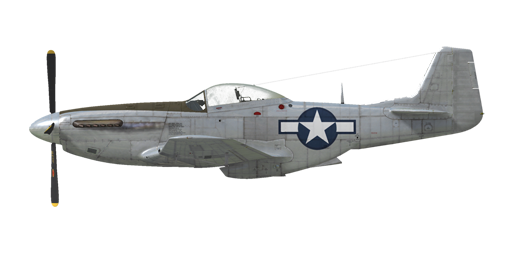

# P-51D-15

## Description

Indicated stall speed in flight configuration: 159..196 km/h (99..122 mph)  
Indicated stall speed in takeoff/landing configuration: 147..181 km/h (91..112 mph)  
  
Dive speed limit: 812 km/h (505 mph)  
Maximum load factor: 10.0 G  
Stall angle of attack in flight configuration: 19.1 °  
Stall angle of attack in landing configuration: 16.3 °  
  
Maximum true air speed at sea level, engine mode - WEP: 592 km/h (368 mph)  
Maximum true air speed at 8000 m (26250 feet), engine mode - WEP: 717 km/h (446 mph)  
  
Maximum true air speed at sea level, engine mode - WEP, with 150 grade fuel: 607 km/h (377 mph)  
Maximum true air speed at 7000 m (22960 feet), engine mode - WEP, with 150 grade fuel: 718 km/h (446 mph)  
  
Maximum true air speed at sea level, engine mode - Combat: 578 km/h (359 mph)  
Maximum true air speed at 8500 m (28000 feet), engine mode - Combat: 711 km/h (442 mph)  
  
Maximum true air speed at sea level, engine mode - Cruise: 513 km/h (319 mph)  
Maximum true air speed at 8500 m (28000 feet), engine mode - Cruise: 646 km/h (401 mph)  
  
Service ceiling: 12680 m (41600 feet)  
  
Climb at engine mode - WEP  
Climb rate at sea level: 18.1 m/s (3567 feet/min)  
Climb rate at 3000 m (9843 feet): 15.7 m/s (3083 feet/min)  
Climb rate at 6000 m (19685 feet): 12.4 m/s (2433 feet/min)  
  
Maximum performance turn at sea level: 20.0 s, at 290 km/h (180 mph) IAS.  
Maximum performance turn at 3000 m (9843 feet): 29.5 s, at 295 km/h (183 mph) IAS.  
  
Flight endurance at 3000 m (9843 feet): 4.3 h, at 350 km/h (217 mph) IAS.  
  
Takeoff speed: 185..200 km/h (115..125 mph)  
Glideslope speed: 185..210 km/h (115..130 mph)  
Landing speed: 175..195 km/h (110..120 mph)  
Landing angle: 12.9 °  
  
Note 1: the data provided is for international standard atmosphere (ISA).  
Note 2: flight performance ranges are given for possible aircraft mass ranges.  
Note 3: maximum speeds, climb rates and turn times are given for standard aircraft mass and 68%25 of fuel.  
Note 4: turn times are given for WEP power.  
  
Engine:  
Model: Packard V-1650-7  
Maximum power in WEP mode at sea level: 1650 HP  
Maximum power in Combat mode at sea level: 1490 HP  
  
Maximum power in WEP mode at 5800 m (19030 feet): 1525 HP  
Maximum power in Combat mode at 6500 m (21325 feet): 1390 HP  
  
Engine modes:  
Cruise (unlimited time): 2700 RPM, 46 inch Hg  
Combat power (up to 15 minutes): 3000 RPM, 61 inch Hg  
WEP (up to 5 minutes): 3000 RPM, 67 inch Hg  
WEP with 150 grade fuel (up to 5 minutes): 3000 RPM, 75 inch Hg  
  
Water rated temperature in engine output: 100..110 °C  
Water maximum temperature in engine output: 121 °C  
Oil rated temperature in engine intake: 80 °C  
Oil maximum temperature in engine intake: 90 °C  
  
Supercharger gear shift altitude: automatic with possibility of manual switch to low gear  
  
Empty weight: 3433 kg (7568 lb)  
Minimum weight (no ammo, 10%25 fuel, 2 MG removed): 3629.5 kg (8002 lb)  
Standard weight: 4578.6 kg (10093 lb)  
Maximum takeoff weight: 5667 kg (12493 lb)  
Fuel load: 732 kg (1614 lb) / 1020 l (269 gal)  
Useful load: 2234 kg (4925 lb)  
  
Forward-firing armament:  
6 x 12.7mm machine gun "M2 .50", 400 rounds for inboard and 270 rounds for central and outboard, 850 rounds per minute, wing-mounted  
It is possible to remove 2 central machine guns, and increase the ammo load of outboard to 500 rounds per gun  
It is possible to increase the ammo load of inboard to 490 rounds per gun  
  
Bombs:  
Up to two 500 lb general purpose bomb "M64"  
Up to two 1000 lb general purpose bomb "M65"  
  
Rockets:  
6 x unguided rockets "M8" in two "M10" launchers that can be jettisoned  
  
Length: 9.84 m (32 3-5/16 feet)  
Wingspan: 11.29 m (37 5/16 feet)  
Wing surface: 22.30 m² (240 feet²)  
  
Combat debut: 1944  
  
Operation features:  
- COMBAT, AEROBATIC MANEUVERS AND INSTRUMENT FLYING ARE FORBIDDEN AT FULL FUEL RESERVE! The aircraft is unstable with full rear fuel tank. This limit is lifted when there is no more than 20 gallons (around 75%25 fuel left) in the rear tank. This tank is completely empty at 68%25 total fuel level.  
- It is possible to reach dangerously high Mach numbers in a dive: the aircraft starts to shake and the loss of control is possible. Reduce the throttle and gently return to a horizontal flight.  
- The engine is equipped with the automatic governor of the manifold pressure that works when the throttle is set to 1/3 position or above.  
- The engine has a two stage mechanical supercharger which does not require manual control. It can be switched to the low gear manually.  
- The engine is equipped with an automatic fuel mixture control which maintains optimal mixture if the mixture lever is set to RUN (70%25) position. In the case of malfunction of the automatic mixture control the mixture lever should be set to Full Rich (100%25) position. To stop the engine mixture lever should be set to the Cut Off (0%25) position.  
- Engine RPM has an automatic governor that controls the propeller pitch to maintain the required RPM.  
- The water and oil radiators shutters are operated automatically, but there is a manual mode.  
- The aircraft has trimmers for all flight-controls: pitch, roll and yaw.  
- Landing flaps have a hydraulic actuator and can be extended to 10°, 20°, 30°, 40° or 50°.  
- Each tank has a dedicated fuel level indicator: wing tank inidicators are located on the cockpit floor and the rear tank indicator is behind the pilot seat on the left.  
- The tail wheel rotates freely, but moving the control stick back locks it so it rotates by the pedals input.  
- The aircraft has independent left and right hydraulic wheel brake controls. To apply either brake push the upper part of the rudder pedal.  
- The aircraft is equipped with a parking brake system.  
- The signal lamp lights up when the landing gear is up and the throttle is in the backward position or when the landing gear is down, but the throttle is in the forward position.  
- The aircraft is equipped with a siren that warns a pilot if the throttle is set to low position with landing gear retracted.  
- It is impossible to open the canopy at high speeds because of the ram air, but there is an emergency jettison handle for bailing out.  
- The aircraft is equipped with formation lights.  
- The unguided rockets are launched using the electric controller which allows single, pair, triple and salvo (all rockets at 0.1 seconds interval) launch.  
- The gyroscopic gunsight automatically calculates required angular deflection while firing at a target. It has 3 modes: fixed reticle, fixed and gyro reticle, gyro reticle. The angular deflection will be calculated correctly only if the target range is set properly. To set the range, adjust the target base first using separate controls and then set the range by adjusting the size of the range-finding reticle to be the same as the target size.

## Modifications

**2 x M65 bomb racks**  
2 x 1000 lb M65 General Purpose Bombs  
Additional mass: 1046 kg (2306 lb)  
Ammunition mass: 1024 kg (2258 lb)  
Racks mass: 22 kg (49 lb)  
Estimated speed loss before drop: 51 km/h (31.7 mph)  
Estimated speed loss after drop: 9 km/h (5.6 mph)

**Mirror**  
Rear view mirror  
Additional mass: 1 kg (2.2 lbs)  
Estimated speed loss: 2 km/h (1.2 mph)

**2 x M64 bomb racks**  
2 x 500 lb M64 General Purpose Bombs  
Additional mass: 530 kg (1169 lb)  
Ammunition mass: 508 kg (1120 lb)  
Racks mass: 22 kg (49 lb)  
Estimated speed loss before drop: 25 km/h (15.5 mph)  
Estimated speed loss after drop: 9 km/h (5.6 mph)

**Bendix MN-26**  
Fixed loop radio compass for navigation with radio beacons  
Additional mass: 17,5 kg (38.6 lbs)  
Estimated speed loss: 2 km/h (1.2 mph)

**Additional ANM2 .50 cal MG ammo**  
Additional ammo for inboard machine guns: 490 for each gun.  
  
Additional mass: 22.4 kg (49.4 lbs)  
Estimated speed loss: 0 km/h

**Gyro Gunsight**  
K-14A Gyro Gunsight  
Additional mass: 5.2 kg (11.5 lbs)  
Estimated speed loss: 0 km/h

**M8 rockets**  
Six M8 rockets in jettisonable M10 launchers  
  
Additional mass: 171.9 kg (379 lbs)  
Ammunition mass: 115.9 kg (256 lbs)  
Racks mass: 56 kg (123 lbs)  
Estimated speed loss before launch: 38 km/h (23.6 mph)  
Estimated speed loss after launch: 28 km/h (17.4 mph)  
Estimated speed loss after drop: 6 km/h (3.7 mph)

**150 grade fuel**  
150 grade fuel, which allows increase manifold pressure up to 75 inch.

**4 x ANM2 .50 cal machine guns**  
Removal of 2 central wing-mounted machine guns and additional ammo for outboard machine guns: 500 for each gun.  
Removed mass: 70.9 kg (156 lbs)  
Removed ammunition mass: 9.9 kg (22 lbs)  
Removed guns mass: 61 kg (134 lbs)  
Estimated speed gain: 1 km/h (0.6 mph)
