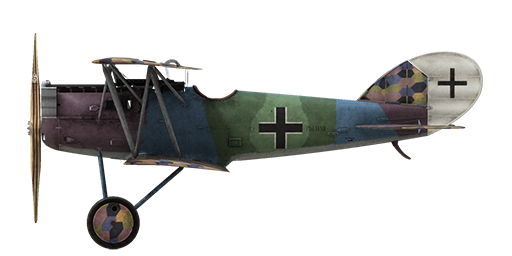

# Pfalz D.XII

## Description

In designing the next modification of the Pfalz fighter aircraft, the company\'s engineers decided to use a thin-sectioned wing similar to that found on the SPAD VII. Such a wing satisfied the needs of combat tactics used by German pilots: diving, firing at the enemy, then climbing back to altitude. The design also featured equal surface areas of both the upper and the lower wings. In addition, aircraft was fitted with a nose radiator similar to the Fokker D.VII and was the first fighter fitted with a tube radiator (which subsequently was redesigned due to cooling issues). In all, 800 planes of the type were built.  
  
The aircraft\'s first flight was made near the end of February 1918 at Adlershof. During the second fighter competition in June 1918 at Adlershof, the plane (fitted with a BMW IIIa engine) came in second in the climb speed challenge - 5 km in 17.6 minutes! After that, it was sent to the front for combat testing. One pilot noted good cockpit visibility, especially vertically down, and in a dive, it was faster than the Fokker D.VII. However, it was less manoeuvrable and its controls were heavier than the Fokker D.VII. On June 30 1918, the plane entered service with combat squadrons. It was often used in combination with the Fokker D.VII, usually operating at a lower altitude than the better-climbing Fokker D.VII. It was mostly assigned to rookie pilots and supporting squadrons.  
  
Among its flaws was a tendency to stall during an Immelman manoeuvre. In such a case, it would come out of the stall after losing 1500m altitude. In a horizontal turn, the altitude loss was 150m. After reaching 3km altitude, its climb rate decreased. It is assumed that these characteristics belonged to planes fitted with the Mercedes D.IIIa engine, as the Fokker Company had the priority for BMW IIIa engines. Due to its high landing speed and weak landing gear, which was new to most pilots, the landing gear often broke on landing (later models had strengthened and shorter landing gear to compensate for this). The plane took part in battles over the Western Front.  
  
  
Engine  
BMW IIIa inline 6 cyl. 232 HP  
  
Dimensions  
Height: 2700 mm  
Length: 6350 mm  
Wing span: 9000 mm  
Wing surface: 21.7 sq.m.  
  
Weight  
Empty: 753 kg  
Takeoff: 921 kg  
Fuel capacity: 84 l  
Oil capacity: 18.5 l  
  
Climb rate  
1000 m — 3 min 45 sec.  
2000 m — 7 min 26 sec.  
3000 m — 11 min. 16 sec.  
4000 m — 15 min. 24 sec.  
5000 m — 20 min. 02 sec.  
  
Maximum airspeed (IAS)  
sea level —  197 km/h  
1000 m — 198 km/h  
2000 m — 195 km/h  
3000 m — 185 km/h  
4000 m — 174 km/h  
5000 m — 163 km/h  
  
Service ceiling 8850 m  
  
Endurance at 1000m  
nominal power (combat) - 1 h. 32 min.  
minimal consumption (cruise) - 4 h.  
  
Armament  
Forward firing: 2 х LMG 08/15 Spandau 7,92mm, 500 rounds per barrel.  
  
References  
1) Pfalz D.XII by P M Grosz. Windsock Datafile 41.  
2) The Pfalz D.XII, Profile Publications Number 199.  
3) WW I Aero №124, May 1989.

## Modifications

**Anemometer and High Altimeter**  
Wilhelm Morell Anemometer (45-250 km/h) and D.R.P Altimeter (0-8000 m)  
Additional mass: 1.5 kg

**Bullet counters**  
Wilhelm Morell digital bullet counters for 2 machine guns  
Additional mass: 1 kg

**Cockpit light**  
Cockpit illumination lamp for night sorties  
Additional mass: 1 kg

**Compass**  
L.Maxant Compass  
Additional mass: 1 kg

**Clock**  
Mechanical Clock  
Additional mass: 1 kg

**Inclinometer**  
D.R.G.M liquid Inclinometer (indicates bank while on ground and sideslip while in flight)  
Additional mass: 1 kg

**Collimator Night**  
Oigee Reflector-type Collimator sight (daytime dimmer removed)  
Additional mass: 2 kg

**Thermometer**  
A.Schlegelmilch engine coolant temperature indicator (0-100 °C)  
Additional mass: 1 kg

**Collimator Day**  
Oigee Reflector-type Collimator sight (daytime dimmer installed)  
Additional mass: 2 kg
