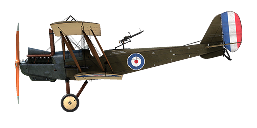

# R.E.8

## Description

The R.E.8 was designed as a replacement for the obsolete B.E.2. Armament consisted of one synchronized machine gun facing forward and a rear gunner position aft of the pilot. This was a departure from the B.E.2 design which had the gunner in front of the pilot. This caused some awkward and dangerous firing positions, especially to the rear.  
The R.E.8 was equipped with V-shaped 12-cylinder air- cooled engine the RAF4a. The aircraft was designed to carry a radio and photographic equipment for recon and artillery spotting duty. It could also carry a small bombload on underwing racks.  
A very versatile aircraft for its time. The first versions of this aircraft began to arrive at the front in late 1916, but it did not arouse much enthusiasm among its pilots. The aircraft was difficult to fly and it was not very forgiving. Piloting mistakes could lead to a deadly tailspin. The first front-line squadrons to receive the R.E.8 reverted back to the old, but combat proven B.E.2. Eventually the R.E.8 did see combat and its debut was not very encouraging.  
One famous combat from April 13, 1917, saw six R.E.8’s, which were on a recon mission over the front line, attacked by six Albatrosses led by Manfred von Richthofen. In a fleeting, lopsided battle, all six R.E.8’s were shot down with no losses to the Germans.  
Nevertheless, the troops urgently needed a new plane and after modifications of the tail assembly and elimination of many small defects, the R.E.8 entered into mass production at several plants and became the most popular two-seat aircraft fielded by the British during the First World War. No fewer than 4,077 planes were built after introduction and it was one of the most common aircraft in the skies over the Western Front. It was used as an artillery spotter and reconnaissance platform, as well as a bomber.  
The military designation of “R.E.8” shared a familiar ring with the name of a famous entertainer of the day called Harry Tate, so the aircraft became known affectionately as the “Harry Tate” by its aircrew. The R.E.8, when under the direction of experienced flight crews, performed well in combat and remained in service until the end of the war. 16 squadrons of Royal Air Force flew the R.E.8 at the Western Front . Several other squadrons in other theaters of combat operations also used the R.E.8.  
  
Engine: 12-cyl. inline RAF 4a 150 hp  
  
Dimensions  
Height: 3470 mm  
Length: 8500 mm  
Wing span: 12980 mm  
Wing surface: 35.07 sq.m  
  
Weight  
Empty weight: 817 kg  
Takeoff weight: 1235 kg  
Fuel capacity: 218 l  
Oil capacity: 40 l  
  
Maximum airspeed (IAS, km/h):  
sea level - 170.4 km/h  
1000 m - 158.4 km/h  
2000 m - 145.6 km/h  
3000 m - 131.4 km/h  
  
Climb rate:  
1000 m -  6 min. 03 sec.  
2000 m - 14 min. 36 sec.  
3000 m - 27 min. 27 sec.  
  
Service ceiling: 4000 m  
  
Endurance: 4 h. 15 min.  
  
Armament  
Forward firing:  1 x Vickers Mk.I 7.69mm, 500 rounds per barrel.  
Tail upper position:  1 x Lewis 7.69mm, 9 drums with 97 rounds each.  
  
Bomb load variations:  
12 x 20lb (109kg)  
 8 x 20lb + 2 x 112lb (175g)  
 2 x 112lb (101.7kg)  
  
175kg in total  
  
References  
1) Windsock Datafile RAF RE8 by J.M. Bruce.  
2) WWI Aeroplanes by J.M. Bruce.  
3) Putnam. Paul R. Hare. The Royal Aircraft Factory.

## Modifications

**Radio**  
Radio transmitter  
Additional mass: 10 kg

**Camera**  
Camera for taking aerial photographs  
Additional mass: 10 kg

**Cockpit light**  
Cockpit illumination lamp for night sorties  
Additional mass: 1 kg

**Cooper / H.E.R.L. bombs**  
Up to 12 x 11 kg (24 lb) General Purpose Bombs  
Additional mass: 167 kg  
Ammunition mass: 131 kg  
Racks mass: 36 kg  
Estimated speed loss before drop: 7 km/h  
Estimated speed loss after drop: 3 km/h  
  
Up to 2 x 51 kg (112 lb) H.E.R.L. General Purpose Bombs  
Additional mass: 126 kg  
Ammunition mass: 102 kg  
Racks mass: 24 kg  
Estimated speed loss before drop: 8 km/h  
Estimated speed loss after drop: 4 km/h

**Lewis Overwing**  
Overwing mounted additional Lewis machinegun with changeable position.  
Ammo: 291 of 7.69mm rounds (3 drums with 97 rounds in each)  
Forward position: 25°  
Upward position: 45°  
Projectile weight: 11 g  
Muzzle velocity: 745 m/s  
Rate of fire: 550 rpm  
Guns weight: 7.5 kg (w/o ammo drum)  
Mounts weight: 0.8 kg  
Ammo weight: 12 kg  
Total weight: 20.3 kg  
Estimated speed loss: 5 km/h

**Twin Lewis MG turret**  
Scarff ring turret with twin Lewis MG  
Ammo: 776 of 7.69mm rounds (8 drums with 97 rounds in each)  
Projectile weight: 11 g  
Muzzle velocity: 745 m/s  
Rate of fire: 550 rpm  
Guns weight: 15 kg (w/o ammo drums)  
Mount weight: 12 kg  
Ammo weight: 32 kg  
Total weight: 59 kg  
Estimated speed loss: 2 km/h

**Aldis**  
Aldis Refractor-type Collimator Sight  
Additional mass: 2 kg
