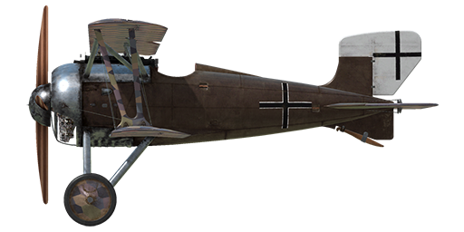

# SSW D.IV

## Description

SSW D.IV came very late to the Great War, too late to change Germany’s fortunes, but what machines did make it to front-line squadrons acquitted themselves well. This airplane was the end result of a robust line of Siemens-Schuckert aircraft that saw service in the war and it came with a unique feature. The 207-hp Siemens-Halske Sh.IIIa rotary engine had a crankshaft that rotated opposite of the engine and the propeller\'s rotation in an attempt to reduce the torque. The four-bladed propeller gave it a fast rate of climb and a high speed. The SSW D.IV was even faster than Germany’s mainstay front-line fighter, the very successful Fokker D.VII. It was also very maneuverable, but reportedly had sudden stall without warning when pushed too far. It was armed with two 7.92 mm machine guns.  
  
  
Engine  
Sh.IIIa contra-rotary 11 cyl., 207 h.p.  
  
Dimensions  
Height : 2630 mm  
Length : 5580 mm  
Wing span : 8350 mm  
Wing surface: 15,12 sq.m.  
  
Weight  
Empty weight : 552 kg  
Takeoff weight : 735 kg  
Fuel capacity : 80 l  
Oil capacity : 20 l  
  
Climb rate  
1000 m — 1 min. 54 sec.  
2000 m — 4 min. 10 sec.  
3000 m — 6 min. 44 sec.  
4000 m — 9 min. 43 sec.  
5000 m — 13 min. 15 sec.  
6000 m — 17 min. 35 sec.  
7000 m — 23 min. 16 sec.  
8000 m — 31 min. 47 sec.  
  
Maximum airspeed (IAS)  
sea level — 192 km/h  
1000 m — 183 km/h  
2000 m — 173 km/h  
3000 m — 164 km/h  
4000 m — 155 km/h  
5000 m — 145 km/h  
6000 m — 136 km/h  
7000 m — 126 km/h  
8000 m — 115 km/h  
  
Note 1: the data provided is for international standard atmosphere (ISA).  
Note 2: maximum speeds and climb rates are given for standard aircraft mass.  
Note 3: climb rates are given for maximum possible power, maximum airspeeds are given for 1800 RPM.  
  
Service ceiling ~8000 m  
  
Endurance at 1000m  
nominal power (combat) — 1 h. 12 min.  
minimal consumption (cruise) — 2 h.  
  
Armament:  
Forward firing: 2хLMG 08/15 Spandau 7,92mm, 500 rounds per barrel.  
  
References:  
1) Airplaines in horizontal curvilinear flight, Heinrich Kann, From Technische Berichte, Volume 3, №7.  
2) Flight and Aircraft Engineer, 13 March, 1919.  
3) Technische Berichte, Neuere Bestrebungen und Erfahrungen im Flugmotorenbau, Von Schwager.  
4) WW1 Aero №99, April 1984.  
5) Siemens-Schuckert Aircraft of WWI, Jack Herris.  
6) Windsock Datafile №29 SSW D.III-D.IV, P.M. Grosz.

## Modifications

**Bullet Counters**  
Wilhelm Morell needle scale Bullet Counters for 2 machine guns  
Additional mass: 1 kg

**Cockpit light**  
Cockpit illumination lamp for night sorties  
Additional mass: 1 kg

**Inclinometer**  
D.R.G.M liquid Inclinometer (indicates bank while on ground and sideslip while in flight)  
Additional mass: 1 kg

**Collimator Night**  
Oigee Reflector-type Collimator sight (daytime dimmer removed)  
Additional mass: 2 kg

**Collimator Day**  
Oigee Reflector-type Collimator sight (daytime dimmer installed)  
Additional mass: 2 kg

**Anemometer**  
Wilhelm Morell Anemometer (45-250 km/h)  
Additional mass: 1 kg
