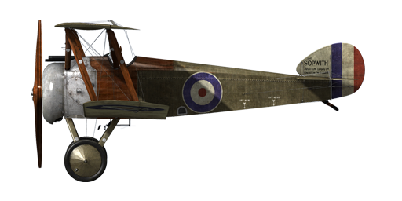

# Sopwith Camel

## Description

The Sopwith Camel\'s construction was based on that of its predecessor, the Sopwith Pup. Sopwith\'s chief designer Herbert Smith decided to somewhat alter the Pup’s design, since a newer, larger and heavier engine would have to be mounted. Some changes were made to the landing gear struts, the spacing of the wings and stabiliser were increased, and the fuselage acquired an extension to the cockpit\'s trailing edge, which looked rather like a camel’s hump. That \'hump\' is what gave the plane its name - the Sopwith Camel.  
  
A remarkable detail of the plane’s construction was its compactness: the pilot’s seat, fuel tanks, machine guns and engine were all installed very close together. In parallel with the work of the main Sopwith factory, the plane was also assembled by a number of other companies such as Ruston Proctor Co, Portholme Aerodrome Ltd, Boulton & Paul Ltd, British Caudron Co. Ltd, Clayton & Shuttleworth Ltd, Hooper & Co. Ltd and others. In total, about 5490 Camels were built. The Camel’s first flight trials were performed by the British No. 60 squadron in March of 1917, which were followed by a series of minor improvements to the plane’s construction. Production aircraft were first delivered to fighter squadrons in May of 1917. It was primarily used for destroying enemy aircraft and balloons, while from time to time it was also engaged in ground attack operations. English journalists referred to this plane as a “small and agile beast.”  
  
Camel pilots mentioned the plane’s well-balanced flight controls, the good upward view, and the high cruising speed. Due to the aircraft\'s unique balance, the plane could almost instantly change its heading, which made the Camel a dangerous opponent. The typical combat scenario for the Camel pilot was a dogfight at low and medium altitudes, where the Camel had the advantage in steep turns. Veterans were known to say, “Once you become a Camel pilot, you will fly it forever.” In addition to equipping British units, this plane was also piloted by four American squadrons of the U.S. Air Service and by some Belgian pilots.  
  
  
Engine  
Clerget 9B rotary 9 cyl., 130 h.p.  
  
Dimensions  
Height : 2590 mm  
Length : 5490 mm  
Wing span : 8530 mm  
Wing surface: 21,46 sq.m.  
  
Weight  
Empty weight : 431 kg  
Takeoff weight : 700 kg  
Fuel capacity : 168 l  
Oil capacity : 20 l  
  
Climb rate  
1000 m — 2 min. 37 sec  
2000 m — 5 min. 46 sec.  
3000 m — 9 min. 40 sec.  
4000 m — 14 min. 45 sec.  
5000 m — 21 min. 41 sec.  
6000 m — 32 min. 17 sec.  
  
Maximum airspeed (IAS)  
sea level — 195 km/h  
1000 m — 183 km/h  
2000 m — 170 km/h  
3000 m — 158 km/h  
4000 m — 145 km/h  
5000 m — 132 km/h  
6000 m — 117 km/h  
  
Service ceiling 6700 m  
  
Endurance at 1000m  
nominal power (combat) — 2 h. 50 min.  
minimal consumption (cruise) — 5 h.  
  
Armament:  
Forward firing: 2хVickers Mk.I 7.69, 500 rounds per barrel.  
Bomboad: 36kg  
  
References:  
1) Sopwith Aircraft Blueprints, WWI Aero Magazine.  
2) The Sopwith Camel. Profile publications Number 31.  
3) Sopwith Camel. JM Bruce Windsock Datafile 26.  
4) Sopwith Camel Aces of Wold War I.  Norman Franks, Osprey №52.  
5) Flying the Camel in 1918. FLIGHT International, 2 May 1968.  
6) A History of No.10 Sq. RNAS in WWI. Mike Westrop, Schiffer Military History.  
7) Sopwith Camel Specification.

## Modifications

**Aldis**  
Aldis Refractor-type Collimator Sight  
Additional mass: 2 kg

**Cooper bombs**  
Up to 4 x 11 kg (24 lb) Cooper General Purpose Bombs  
Additional mass: 56 kg  
Ammunition mass: 44 kg  
Racks mass: 12 kg  
Estimated speed loss before drop: 2 km/h  
Estimated speed loss after drop: 1 km/h

**Enlarged window**  
Enlarged cutout in the upper wing for improved field of view.  
Estimated speed loss: 2 km/h

**Cockpit light**  
Cockpit illumination lamp for night sorties  
Additional mass: 1 kg
