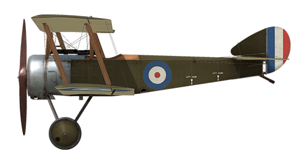

# Sopwith Pup

## Description

The Sopwith Pup was a single seat fighter designed by the talented engineer Herbert Smith of the Sopwith Aviation Company. The first prototype flew in February 1916, whereby its good flying characteristics and manoeuvrability quickly won it favour from its pilots. After a number of improvements, it was transferred to operational service in March 1916 with the Royal Naval Air Service (RNAS). The aircraft was officially called the \'Sopwith Scout\', but soon its nickname became the \'Pup\' due to its similarity to the 1½ Strutter (but with smaller proportions). The Pup nickname was never officially recognised, but it started the tradition of naming all later Sopwith aircraft after a bird or an animal.  
  
The first examples of the Sopwith Pup were transferred to the front in October 1916. Its good flight characteristics allowed it to compete successfully against enemy opposition. Over 20 victories were attributed to No. 8 (Naval) Squadron during the Battle of the Somme, who were equipped with the Pup. Manfred von Richthofen, after encountering the Pup in combat, noted, “We saw at once that the enemy aeroplane was superior to ours.” The excellent blend of the Pup’s light weight and its considerably large wing surface allowed British pilots to outperform the enemy in a dogfight. British ace James McCudden remarked, “the Sopwith [Pup] would turn twice to an Albatros’ once…it was a remarkably fine machine for general all-round flying. It was so extremely light and well surfaced that after a little practice one could almost land it on a tennis court.” It was due to this latter feature that the Pup became the first aircraft to land aboard a moving ship, HMS Furious, on August 2, 1917.  
  
The combat life of the Pup was short: Germany had received new aircraft superior to the Pup in many ways by the spring of 1917. One by one, the aircraft were transferred from the front to flying schools, where it was used in the training role for some time. Altogether, 1770 Pups were manufactured.  
  
  
Engine  
Le Rhône 9C rotary, 80 h.p.  
  
Dimensions  
Height: 2870 mm  
Length: 5890 mm  
Wing span: 8080 mm  
Wing surface: 23,6 sq.m.  
  
Weight  
Empty weight: 356 kg  
Takeoff weight: 556 kg  
Fuel capacity: 82 l  
Oil capacity: 21 l  
  
Maximum airspeed (IAS)  
sea level — 173 km/h  
1000 m — 164 km/h  
2000 m — 154 km/h  
3000 m — 143 km/h  
4000 m — 129 km/h  
  
Climb rate  
1000 m —  3 min. 24 sec.  
2000 m —  7 min. 53 sec.  
3000 m — 13 min. 50 sec.  
4000 m — 22 min. 30 sec.  
  
Service ceiling 5500 m  
  
Endurance at 1000m  
nominal power (combat) — 2 h. 30 min.  
minimal consumption (cruise) — 3 h. 30 min.  
  
Armament:  
Forward firing: 1 х Vickers Mk.I 7.69 mm, 500 rounds.  
  
References:  
1) Sopwith Pup. Windsock Datafile 2.  
2) Sopwith Pup. Windsock Datafile Special.  
3) Sopwith Pup Aces of World War I. Osprey Aircraft of the Aces 67.  
4) The Sopwith Pup. Profile publications Number 13.

## Modifications

**Aldis**  
Aldis Refractor-type Collimator Sight  
Additional mass: 2 kg

**LePrieur rockets**  
8 x strut-mounted "Le Prieur" anti-balloon rockets of incendary action, with pointed triangular blade attached to nose cone to asssit penetration of balloon envelope or with high explosive grenade.  
Additional mass: 36 kg  
Ammunition mass: 16 kg  
Racks mass: 20 kg  
Estimated speed loss before launch: 8 km/h  
Estimated speed loss after launch: 6 km/h

**Cockpit light**  
Cockpit illumination lamp for night sorties  
Additional mass: 9 kg
