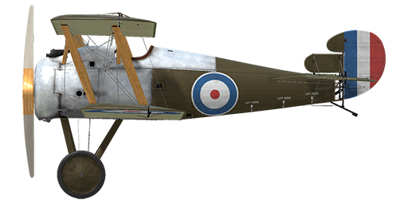

# Sopwith Snipe

## Description

The Sopwith Snipe was created as a replacement for the Camel in response to the appearance of new enemy fighters. At the design stage, the Camels engines (for instance, the Clerget 9B or Bentley B.R.1) were considered for use, as well as the newer and more powerful Bentley B.R.2. The decision was finally made after successful tests of the latter that confirmed its exceptional performance (234 HP). The early prototype’s fuselage and wings were similar to its predecessor, but later on its look became final. The rectangular fuselage got rounded edges, the biplane wings were reinforced by an additional pair of struts per side and the vertical stabilizer got the bigger surface rudder thanks to the compensator.  
  
Seven contracts for producing the first 1700 aircraft were assigned to Sopwith, Boulton & Paul, Coventry Ordnance Works, Napier, Nieuport & General, Portholme Aerodrome and Ruston Proctor companies. The first shipments began during the summer of 1918, but the production rate was lagging behind schedule. Only 77 airplanes were completed by the end of August instead of the planned 200. The total number of aircraft produced is not known, but at least 1567 Snipes were delivered. There were several improvements made to the design during the production run - for instance, the vertical stabilizer and upper wing ailerons surfaces have been increased even more. A more powerful (320 HP) radial engine, the "Dragonfly" was installed on some machines. The airplanes equipped with this engine became the ancestors of the new Sopwith Dragon after some additional changes in design.  
  
Compared to the much-loved Camel, the Snipe won a cautious welcome from the pilots. While the new arrival was fast and maneuverable, it lost the famous nearly instant response to the pilot input of its predecessor because it was significantly more massive. In spite of this, the Snipe was a very formidable weapon in the hands of an experienced user. On October 27th, 1918, only a few weeks after they became available, Major W.G. Barker alone engaged 15 enemy airplanes and shot down 4 of them, getting wounded in the hand and both legs. He was awarded the Victoria Cross for this feat and his Sopwith Snipe fuselage has been preserved and moved to Canada, where it is displayed in the Canadian War Museum in Ottawa.  
  
Only a handful of squadrons got the new aircraft in time to use it on the Western Front before the war ended: No.43 Squadron RAF, No.4 Squadron AFC and No.208 Squadron RAF. The Snipe saw its first action on September 26th, 1918.  
  
Engine  
Bentley B.R.2 rotary 9 cyl., 234 h.p.  
  
Dimensions  
Height: 2900 mm  
Length: 5870 mm  
Wing span: 9144 mm  
Wing surface: 24,455 sq.m.  
  
Weight  
Empty weight: 608 kg  
Takeoff weight: 905 kg  
Fuel capacity: 176 l  
Oil capacity: 33 l  
  
Climb rate  
1000 m — 2 min. 31 sec  
2000 m — 5 min. 24 sec.  
3000 m — 8 min. 49 sec.  
4000 m — 13 min. 00 sec.  
5000 m — 18 min. 31 sec.  
6000 m — 28 min. 23 sec.  
  
Maximum airspeed (IAS)  
sea level — 197 km/h  
1000 m — 188 km/h  
2000 m — 178 km/h  
3000 m — 167 km/h  
4000 m — 156 km/h  
5000 m — 143 km/h  
6000 m — 116 km/h  
  
Service ceiling 6100 m  
  
Endurance at 1000m  
nominal power (combat) — 2 h. 5 min.  
minimal consumption (cruise) — 4 h. 20 min.  
  
Armament:  
Forward firing: 2х Vickers Mk.I .303, 500 rounds per barrel.  
Bomb load: up to 51kg.  
  
References:  
1) Sopwith Aircraft 1912-1920, by H.F. King; Putnam, 1980.  
2) The Sopwith 7F.I Snipe. Profile publications Number 50.  
3) Sopwith Snipe. J.M. Bruce Windsock Datafile 46.  
4) Dolphin and Snipe Aces of Wold War I. Norman Franks, Osprey №48.

## Modifications

**Aldis**  
Aldis Refractor-type Collimator Sight  
Additional mass: 2 kg

**H.E.R.L. bomb**  
51 kg (112 lb) H.E.R.L. General Purpose Bomb  
Additional mass: 57 kg  
Ammunition mass: 51 kg  
Rack mass: 6 kg  
Estimated speed loss before drop: 2 km/h  
Estimated speed loss after drop: 1 km/h

**Cooper bombs**  
Up to 4 x 11 kg (24 lb) Cooper General Purpose Bombs  
Additional mass: 56 kg  
Ammunition mass: 44 kg  
Racks mass: 12 kg  
Estimated speed loss before drop: 2 km/h  
Estimated speed loss after drop: 1 km/h

**Enlarged cockpit cutouts**  
Enlarged cockpit cutouts for improved field of view ("Barker mod")

**Cockpit light**  
Cockpit illumination lamp for night sorties  
Additional mass: 9 kg
