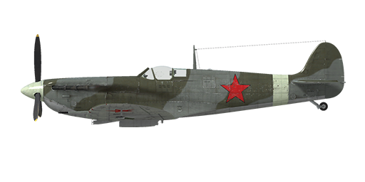

# Spitfire Mk.VB

## Description

Indicated stall speed in flight configuration: 137..144 km/h  
Indicated stall speed in takeoff/landing configuration: 129..135 km/h  
  
Dive speed limit: 725 km/h  
Maximum load factor: 12.5 G  
Stall angle of attack in flight configuration: 18.8 °  
Stall angle of attack in landing configuration: 16.0 °  
  
  
Merlin 46 engine:  
  
Maximum true air speed at sea level, 3000 RPM, boost +9: 457 km/h  
Maximum true air speed at sea level, 3000 RPM, boost +16: 515 km/h  
Maximum true air speed at 7400 m, 3000 RPM, boost +9: 597 km/h  
Maximum true air speed at 5000 m, 3000 RPM, boost +16: 604 km/h  
  
Service ceiling: 12000 m  
Climb rate at sea level: 12.9 m/s  
Climb rate at 3000 m: 13.1 m/s  
Climb rate at 6000 m: 12.0 m/s  
  
Maximum performance turn at sea level: 25 s, at 270 km/h IAS.  
Maximum performance turn at 3000 m: 30 s, at 260 km/h IAS.  
  
  
Merlin 45 engine:  
  
Maximum true air speed at sea level, 3000 RPM, boost +9: 480 km/h  
Maximum true air speed at sea level, 3000 RPM, boost +16: 535 km/h  
Maximum true air speed at 6000 m, 3000 RPM, boost +9: 590 km/h  
Maximum true air speed at 3500 m, 3000 RPM, boost +16: 596 km/h  
  
Service ceiling: 11200 m  
Climb rate at sea level: 14.5 m/s  
Climb rate at 3000 m: 14.7 m/s  
Climb rate at 6000 m: 11.4 m/s  
  
Maximum performance turn at sea level: 22 s, at 270 km/h IAS.  
Maximum performance turn at 3000 m: 28.2 s, at 260 km/h IAS.  
  
  
Flight endurance at 3000 m: 1 h 45 m, at 350 km/h IAS.  
  
Takeoff speed: 160..170 km/h  
Glideslope speed: 145..160 km/h  
Landing speed: 130..135 km/h  
Landing angle: 12.5 °  
  
Note 1: the data provided is for international standard atmosphere (ISA).  
Note 2: flight performance ranges are given for possible aircraft mass ranges.  
Note 3: maximum speeds, climb rates and turn times are given for standard aircraft mass.  
Note 4: climb rates are given for 2850 RPM and boost +9, turn times are given for 3000 RPM and boost +9.  
  
Engine:  
Model: Merlin 46  
Maximum power in Take-off mode (3000 RPM, boost +12) at sea level: 1100 HP  
Maximum power in Emergency Max All Out mode (3000 RPM, boost +16) at 14000 feet: 1400 HP  
Maximum power in International power mode (2850 RPM, boost +9) at 19000 feet: 1115 HP  
  
Model: Merlin 45  
Maximum power in Take-off mode (3000 RPM, boost +12) at sea level: 1185 HP  
Maximum power in Emergency Max All Out mode (3000 RPM, boost +16) at 9000 feet: 1455 HP  
Maximum power in International power mode (2850 RPM, boost +9) at 14200 feet: 1170 HP  
  
Engine modes:  
Max Cruising power (unlimited time): 2650 RPM, boost +7  
International power (up to 30 minutes): 2850 RPM, boost +9  
Emergency Max All Out power (up to 3 minutes): 3000 RPM, boost +16  
  
Water rated temperature in engine output: 105..115 °C  
Water maximum temperature in engine output: 125 °C  
Oil rated temperature in engine intake: 70..85 °C  
Oil maximum temperature in engine intake: 105 °C  
  
Supercharger gear shift altitude: single gear  
  
Empty weight: 2415 kg  
Minimum weight (no ammo, 10%25 fuel): 2732 kg  
Standard weight: 2979 kg  
Fuel load: 274 kg / 386 l / 85 gallons  
Useful load: 564 kg  
  
Forward-firing armament:  
2 x 20mm guns "Hispano Mk.II", 60 rounds per gun, 650 rounds per minute, wing-mounted  
4 x 7.7mm machine gun "Browning .303", 350 rounds per gun, 1150 rounds per minute, wing-mounted  
  
Length: 9.2 m  
Wingspan: 11.21 m  
Wing surface: 22.48 m²  
  
Combat debut: Winter 1941  
  
Operation features:  
- Engine is equipped with the automatic governor of the manifold pressure that works when the throttle is set to 1/3 position or above. It is neccessary to turn the automatic governor off to set the boost value to +16.  
- Engine has a single stage mechanical supercharger which does not require manual control.  
- Engine is equipped with an automatic fuel mixture control which maintains optimal mixture if mixture lever is set to the backward position. To use automatic mixture leaning to reduce fuel consumption during flight move the mixture lever to forward position.  
- Engine RPM has an automatic governor that controls the propeller pitch to maintain the required RPM.  
- The water radiator is operated manually, while the oil radiator is unadjustable.  
- Aircraft has a neutral static stability. The elevator effectiveness is high, so the aircraft should be controlled carefully, not giving too much flight stick input.  
- Aircraft becomes unstable with extended landing flaps.  
- Aircraft is equipped with elevator and rudder trimmers.  
- Landing flaps have a pneumatic actuator so they can be extended to maximum position only. Speed with extended landing flaps is limited to 150 mph.  
- Airplane tail wheel rotates freely and does not have a lock. Since the landing gear wheels are relatively close to each other, it is necessary to confidently and accurately operate the rudder pedals during the takeoff and landing.  
- Airplane has differential pneumatic wheel brakes with shared control lever. This means that if the brake lever is held and the rudder pedal the opposite wheel brake is gradually released causing the plane to swing to one side or the other.  
- Airplane is equipped with a siren that warns a pilot if the throttle is set to low position with landing gear retracted.  
- It is impossible to open or close the canopy at high speed due to strong airflow. The canopy has an emergency release system for bailouts.  
- Airplane is equipped with upper and bottom formation lights which can be turned on simultaneously or independently.  
- The gunsight is adjustable: both the target distance and target base can be set.  
- The gunsight has a sliding sun-filter.

## Modifications

**Merlin 45 engine**  
Merlin 45 engine.   
Additional mass: 0 kg  
Estimated speed loss: 0 km/h

**Mirror**  
Rear view mirror  
Additional mass: 1 kg  
Estimated speed loss: 0 km/h
