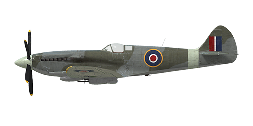

# Spitfire Mk.XIV

## Description

Indicated stall speed in flight configuration: 152..172 km/h  
Indicated stall speed in takeoff/landing configuration: 145..163 km/h  
  
Dive speed limit: 756 km/h  
Maximum load factor: 12.5 G  
Stall angle of attack in flight configuration: 19.0 °  
Stall angle of attack in landing configuration: 16.2 °  
  
Maximum true air speed at sea level, 2750 RPM, boost +18: 574 km/h  
Maximum true air speed at 4000 m, 2750 RPM, boost +18: 671 km/h  
Maximum true air speed at 8100 m, 2750 RPM, boost +18: 720 km/h  
  
Service ceiling: 13400 m  
Climb rate at sea level: 23.8 m/s  
Climb rate at 2650 m: 23.5 m/s  
Climb rate at 6750 m: 18.2 m/s  
  
Maximum performance turn at sea level: 18.1 s, at 270 km/h IAS.  
Maximum performance turn at 3000 m: 21.0 s, at 260 km/h IAS.  
  
Flight endurance at 3000 m: 1 h 45 m, at 350 km/h IAS.  
  
Takeoff speed: 170..195 km/h  
Glideslope speed: 180..210 km/h  
Landing speed: 140..160 km/h  
Landing angle: 12.5 °  
  
Note 1: the data provided is for international standard atmosphere (ISA).  
Note 2: flight performance ranges are given for possible aircraft mass ranges.  
Note 3: maximum speeds, climb rates and turn times are given for standard aircraft mass.  
Note 4: climb rates and turn times are given for 2750 RPM and boost +18.  
  
Engine:  
Model: Griffon 65  
Maximum power in Take-off mode (2750 RPM, boost +12, low gear) at sea level: 1565 HP  
Maximum power in International power mode (2600 RPM, boost +9, low gear) at 4270 m: 1520 HP  
Maximum power in International power mode (2600 RPM, boost +9, high gear) at 8070 m: 1375 HP  
Maximum power in Emergency Max All Out mode (2750 RPM, boost +18, low gear) at 2134 m: 2063 HP  
Maximum power in Emergency Max All Out mode (2750 RPM, boost +18, high gear) at 6400 m: 1845 HP  
  
Engine modes:  
Max Cruising power (unlimited time): 2400 RPM, boost +7  
International power (up to 1 hour): 2600 RPM, boost +9  
Emergency Max All Out power (up to 5 minutes): 2750 RPM, boost +18  
  
Water rated temperature in engine output: 105..115 °C  
Water maximum temperature in engine output: 135 °C  
Oil rated temperature in engine intake: 90 °C  
Oil maximum temperature in engine intake: 105 °C  
  
Supercharger gear shift altitude: automatic with possibility of manual switch to low gear  
  
Empty weight: 3295.0 kg  
Minimum weight (no ammo, 10%25 fuel): 3422.7 kg  
Standard weight: 3862.7 kg  
Fuel load: 363.3 kg / 504.6 l / 111 gallons  
Maximum useful load: 1027.8 kg  
  
Forward-firing armament ("c-type" wing):  
2 x 20mm gun "Hispano Mk.II", 150 rounds per gun, 650 rounds per minute, wing-mounted  
4 x 7.7mm machine gun "Browning .303", 350 rounds per gun, 1150 rounds per minute, wing-mounted  
  
Forward-firing armament ("e-type" wing):  
2 x 20mm gun "Hispano Mk.II", 150 rounds per gun, 650 rounds per minute, wing-mounted  
2 x 12.7mm machine gun "Browning .50", 250 rounds per gun, 850 rounds per minute, wing-mounted  
  
Bombs:  
2 x 250 lb general purpose bomb "250 lb. G.P."  
500 lb general purpose bomb "500 lb. G.P."  
  
Length: 9.9 m  
Wingspan: 11.21 m  
Wing surface: 22.48 m²  
  
Combat debut: January 1944  
  
Operation features:  
- Engine is equipped with the automatic governor of the manifold pressure that works when the throttle is set to 1/3 position or above.  
- Engine has a two stage mechanical supercharger which does not require manual control. It can be switched to the low gear manually.  
- Engine is equipped with an automatic fuel mixture control which maintains optimal mixture.  
- Engine RPM has an automatic governor that controls the propeller pitch to maintain the required RPM.  
- The water and oil radiators shutters are operated automatically, but there is a special manual mode that forces radiator shutters to open completely.  
- Aircraft has a neutral static stability. The elevator effectiveness is high, so the aircraft should be controlled carefully, not giving too much flight stick input.  
- Aircraft becomes unstable with extended landing flaps.  
- Aircraft is equipped with elevator and rudder trimmers.  
- Landing flaps have a pneumatic actuator so they can be extended to maximum position only. Speed with extended landing flaps is limited to 140 mph.  
- Airplane tail wheel rotates freely and does not have a lock. Since the landing gear wheels are relatively close to each other, it is necessary to confidently and accurately operate the rudder pedals during the takeoff and landing.  
- Airplane has differential pneumatic wheel brakes with shared control lever. This means that if the brake lever is held and the rudder pedal the opposite wheel brake is gradually released causing the plane to swing to one side or the other.  
- Airplane is equipped with a siren that warns a pilot if the throttle is set to low position with landing gear retracted.  
- It is impossible to open or close the canopy at high speed due to strong airflow. The canopy has an emergency release system for bailouts.  
- The aircraft is equipped with two underwing formation lights.  
- Standard gunsight is adjustable: both the target distance and target base can be set.  
- The gyroscopic gunsight automaticly calculates required angular deflection while firing at a target. It has 4 modes: fixed reticle, fixed and gyro reticle, gyro reticle, gyro reticle with the target range fixed at 150 yards (night mode). The angular deflection will be calculated correctly only if the target range is set properly. To set the range, adjust the target base first using separate controls and then set the range by adjusting the size of the rangefiding reticle to be the same as the target size.  
- Both gunsights have sliding sun-filters.

## Modifications

**Clipped Wing**  
Clipped Wing  
Removed mass: 4 kg  
Estimated speed loss: 0 km/h

**E-type Wing**  
2 x 12.7mm "Browning .50" machine guns instead of 4 x 7.7mm "Browning .303" machine guns  
Additional mass: 48 kg  
Ammunition mass: 70 kg  
Gun mass: 72 kg  
Estimated speed gain: 5 km/h

**150 grade fuel**  
Allows +21 lb boost  
Automatic supercharger gear shifting is disabled. Stages should be manually switched at 11000ft altitude.  
Estimated speed increase at sea level: 20 km/h

**2 x 250 lb G.P. bombs**  
2 x 250 lb General Purpose Bombs  
Additional mass: 247 kg  
Ammunition mass: 227 kg  
Racks mass: 20 kg  
Estimated speed loss before drop: 22 km/h  
Estimated speed loss after drop: 11 km/h

**Remove machine guns**  
Removal of wing-mounted machine guns to reduce total weight  
Removed mass: 95 kg  
Removed ammunition mass: 42 kg  
Removed guns mass: 53 kg  
Estimated speed gain: 8 km/h

**Mirror**  
Rear view mirror  
Additional mass: 1 kg  
Estimated speed loss: 1 km/h

**Gyro Gunsight**  
MkII Gyro Gunsight  
Additional mass: 5.2 kg  
Estimated speed loss: 0 km/h

**500 lb G.P. bomb**  
500 lb General Purpose Bomb  
Additional mass: 237 kg  
Ammunition mass: 227 kg  
Racks mass: 10 kg  
Estimated speed loss before drop: 12 km/h  
Estimated speed loss after drop: 6 km/h
