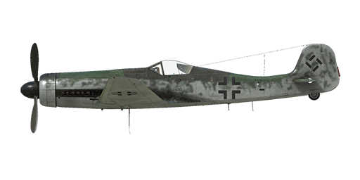

# Ta 152 H-1

## Description

Indicated stall speed in flight configuration: 170..192 km/h  
Indicated stall speed in takeoff/landing configuration: 156..178 km/h  
Dive speed limit: 750 km/h  
Maximum load factor: 8.5 G  
Stall angle of attack in flight configuration: 19.1°  
Stall angle of attack in landing configuration: 17.7°  
  
Maximum true air speed at sea level, engine mode - Emergency with MW-50: 579 km/h  
Maximum true air speed at 5000 m, engine mode - Emergency with MW-50: 663 km/h  
Maximum true air speed at 9500 m, engine mode - Emergency with MW-50: 740 km/h  
Maximum true air speed at 12000 m, engine mode - Emergency with GM-1: 756 km/h  
  
Maximum true air speed at sea level, engine mode - Combat: 541 km/h  
Maximum true air speed at 10700 m, engine mode - Combat: 707 km/h  
Maximum true air speed at 12000 m, engine mode - Combat: 678 km/h  
  
Service ceiling: 14000 m  
Climb rate at sea level: 17.5 m/s  
Climb rate at 3000 m: 15.8 m/s  
Climb rate at 6000 m: 13.4 m/s  
  
Maximum performance turn at sea level: 21.5 s, at 280 km/h IAS.  
Maximum performance turn at 3000 m: 26.9 s, at 280 km/h IAS.  
  
Flight endurance at 3000 m: 4.6 h, at 350 km/h IAS.  
  
Takeoff speed: 175..210 km/h  
Glideslope speed: 190..210 km/h  
Landing speed: 155..175 km/h  
Landing angle: 12.5°  
  
Note 1: the data provided is for international standard atmosphere (ISA).  
Note 2: flight performance ranges are given for possible aircraft mass ranges.  
Note 3: maximum speeds, climb rates and turn times are given for standard aircraft mass.  
Note 4: climb rates are given for Emergency power with MW-50, turn times are given for Combat power.  
  
Engine:  
Model: Jumo-213 E1  
Maximum power in Emergency mode at sea level: 2050 HP  
Maximum power in Emergency mode at 9500 m: 1450 HP  
Maximum power in Combat mode at sea level: 1750 HP  
Maximum power in Combat mode at 9800 m: 1330 HP  
Maximum power in Nominal mode at sea level: 1580 HP  
Maximum power in Nominal mode at 10700 m: 1260 HP  
  
Engine modes:  
Nominal (unlimited time): 3000 RPM, 1.42 ata  
Combat power (up to 30 minutes): 3250 RPM, 1.51 ata  
Emergency power (up to 3 minutes): 3250 RPM, 1.7 ata  
Emergency power with MW-50 (up to 10 minutes): 3250 RPM, 1.8 ata  
Emergency power with GM-1: 3250 RPM  
  
Water rated temperature in engine output: 55..110 °C  
Water maximum temperature in engine output: 120 °C  
Oil rated temperature in engine output: 40..120 °C  
Oil maximum temperature in engine output: 135 °C  
  
Supercharger gear shift altitude: automatic  
  
Empty weight: 3877 kg  
Minimum weight (no ammo, 10% fuel): 4184 kg  
Standard weight: 5217 kg  
Maximum takeoff weight: 5230 kg  
Fuel load: 736 kg / 995 l  
Useful load: 1353 kg  
  
Forward-firing armament:  
2 x 20mm gun "MG 151/20", 175 rounds, 700 rounds per minute, wing-mounted  
30mm gun "MK 108", 90 rounds, 650 rounds per minute, nose-mounted  
  
Length: 10.71 m  
Wingspan: 14.44 m  
Wing surface: 23.5 m²  
  
Combat debut: early March 1945  
  
Operation features:  
- The aircraft has a wide automatization of the engine systems, in fact, to control speed it is only necessary to use the throttle lever. There is no need to manually set engine revolutions and mixture or supercharger gear in normal flight. The engine supercharger has an automatic switch system which depends on altitude and engine revolutions.  
- The aircraft is equipped with MW-50 water-methanol mixture injection system that prevents the engine detonation in the emergency power mode. The system is activated by the pilot at altitudes up to 10000 m. The total operating duration of the MW-50 water-methanol mixture injection system is 28 minutes. Also, the airplane has a MW-50 warning light which shows no injection (over the engine RPM gauge).  
- The aircraft is equipped with GM-1 nitrous oxide injection system that provides the engine with additional oxygen. Nitrous oxide allows to fly above the rated altitude of the engine. The system is activated by the pilot at altitudes from 11000 m. The total operating duration of the GM-1 nitrous oxide injection system is 17 minutes. Consumption rate: 100 g/sec.  
- Radiator flaps are controlled automatically, keeping a set coolant temperature. This temperature can be set by a pilot using the thermostat regulator if needed (default 0% setting is adequate for all engine modes, while increasing it cools the engine more).  
- When the angle of attack increases to critical levels the wing may stall suddenly and unexpectedly. There is almost no pre-stall buffet before the stalling. To avoid this the pilot must pay additional attention when performing extreme maneuvering.  
- The aircraft has no flight-control trimmers. Airplane is equipped with bendable trim tabs that can be set pre-flight by ground personnel.  
- The aircraft has a manually controlled horizontal stabilizer which is electrically-actuated. It should be set to +1.5° before takeoff and landing. Also, it may be used to trim the flight stick during the flight. In a deep dive the stabilizer should be set so that the pilot must push the flight stick forward to maintain the dive angle.  
- Landing flaps have a hydraulic actuator and they can be extended to any angle up to 73°. The flap angle may be checked by indicators on the left and right wing outside the cockpit.  
- The aircraft has a tailwheel lock system which locks the tailwheel if the flight-stick is pulled backward. The tailwheel should be locked when taxiing straight for a long distance, before takeoff and after touchdown upon landing.  
- The aircraft has independent left and right hydraulic wheel brake controls. To apply either brake push the upper part of the rudder pedal.  
- The aircraft has a fuel gauge which shows remaining fuel in main fuselage fuel tanks depending on switch position. In game the fuel indicator switch changes by pressing (RShift+I). There are no fuel gauges for the wing tanks. Supplementary fuel flows into the rear fuselage tank. Also, the airplane has emergency fuel warning lights. The white warning light flashes when the rear tank supply has dropped to about 10 liters. The red warning light flashes when the supply in the front tank has dropped to about 80 liters.  
- The aircraft has a cockpit pressure gauge and cockpit ventilation switch. Compressed air is pumped into the cockpit at 8000 m altitude automatically. In the case of pressurized ventilation, a constant overpressure (0.1-0.2 atu) should normally be achieved in the cockpit. Also, the airplane has a cockpit depressurization warning light (at the top of the instrument panel).  
- It is impossible to open or close the canopy at high speed due to strong airflow. The canopy has an emergency release system for bailouts.  
- The gunsight has a sliding sun-filter.  
  
Basic data and recommended positions of the aircraft controls:  
1. Starting the engine:  
	- recommended position of the mixture control lever: auto mixture control  
	- recommended position of the radiator control handle: auto radiator control  
	- recommended position of the prop pitch control handle: auto prop pitch control  
	- recommended position of the throttle lever: 10%  
  
2. Recommended mixture control lever positions for various flight modes: auto mixture control  
  
3. Recommended positions of the cowl flap control handle (thermostat controls): open 0%  
  
4. Approximate fuel consumption at 2000 m altitude:  
	- Cruise engine mode: 9.5 l/min  
	- Combat engine mode: 10.7 l/min

## Modifications

**Gyro Gunsight**  
EZ42 Gyro Gunsight  
Additional mass: 13 kg  
Estimated speed loss: 0 km/h
