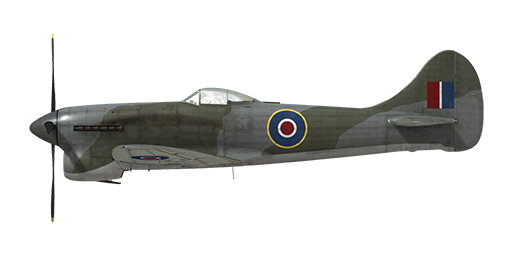

# Tempest Mk.V ser.2

## Description

Indicated stall speed in flight configuration: 150...174 km/h  
Indicated stall speed in takeoff/landing configuration: 128...149 km/h  
  
Dive speed limit: 870 km/h  
Maximum load factor: 12.0 G  
Stall angle of attack in flight configuration: 17.5 °  
Stall angle of attack in landing configuration: 13.7 °  
  
Maximum true air speed at sea level, 3700 RPM, boost +9: 600 km/h  
Maximum true air speed at 1950 m, 3700 RPM, boost +9: 664 km/h  
Maximum true air speed at 5640 m, 3700 RPM, boost +9: 703 km/h  
  
Service ceiling: 10800 m  
Climb rate at sea level: 21.0 m/s  
Climb rate at 3000 m: 15.1 m/s  
Climb rate at 6000 m: 12.1 m/s  
  
Maximum performance turn at sea level: 20.0 s, at 270 km/h IAS.  
Maximum performance turn at 3000 m: 27.8 s, at 270 km/h IAS.  
  
Flight endurance at 3000 m: 3 h 18 m, at 350 km/h IAS.  
  
Takeoff speed: 150...170 km/h  
Glideslope speed: 170...200 km/h  
Landing speed: 150..155 km/h  
Landing angle: 11.6 °  
  
Note 1: the data provided is for international standard atmosphere (ISA).  
Note 2: flight performance ranges are given for possible aircraft mass ranges.  
Note 3: maximum speeds, climb rates and turn times are given for standard aircraft mass.  
Note 4: climb rates and turn times are given for 3700 RPM and boost +9.  
  
Engine:  
Model: Napier Sabre IIA  
Maximum power in Combat mode (3700 RPM, boost +9, low gear) at sea level: 2180 HP  
Maximum power in Combat mode (3700 RPM, boost +9, high gear) at 11500 feet: 1830 HP  
  
Engine modes:  
Max Cruising power (unlimited time): 3150 RPM, boost +4.5  
Climb power (up to 1 hour): 3700 RPM, boost +7  
Combat power (up to 5 minutes): 3700 RPM, boost +9  
  
Water rated temperature in engine output: 65..125 °C  
Water maximum temperature in engine output: 130 °C  
Oil rated temperature in engine intake: 60..90 °C  
Oil maximum temperature in engine intake: 95 °C  
  
Supercharger gear shift altitude: 9500 feet  
  
Empty weight: 4354 kg  
Minimum weight (no ammo, 10% fuel): 4585 kg  
Standard weight: 5221 kg  
Maximum takeoff weight: 6190 kg  
Fuel load: 516 kg / 718 l / 158 gallons  
Maximum useful load: 1836 kg  
  
Forward-firing armament:  
4 x 20mm gun "Hispano Mk.V", 150 rounds per gun, 650 rounds per minute, wing-mounted  
  
Bombs:  
2 x 500 lb general purpose bomb "500 lb. M.C."  
2 x 1000 lb general purpose bomb "1000 lb. M.C."  
  
Length: 10.26 m  
Wingspan: 12.50 m  
Wing surface: 27.81 m²  
  
Combat debut: May 1944  
  
Operation features:  
- The engine is equipped with the two-stage mechanical supercharger which should be manually switched at 9500ft altitude.  
- The engine mixture control is automatic when the mixture lever is set to NORMAL (1/2) position. It should be set to START (forward, throttle lever movement will be limited by 1/10) position when starting the engine and to CUT-OUT position (back) to stop it.  
- The engine has an automatic RPM governor that controls the propeller pitch to maintain the required RPM.   
- Water and oil temperatures are controlled manually by adjusting the radiator shutters.  
- The aircraft has pitch and yaw flight-control trimmers.  
- Landing flaps have hydraulic actuators and can be extended to any angle up to 80°. The speed with the extended flaps is limited to 160 mph.  
- The airplane tailwheel rotates freely and does not have a lock.  
- The pneumatic brakes are differential: moving the pedals with brakes pressed results in releasing the brake opposite to the pressed pedal.  
- The landing gear indicator lamp lights up if the throttle is set to low (less than 1/3) position with the landing gear retracted.  
- It is impossible to open the canopy at high speeds because of the ram air, but there is an emergency jettison handle for bailing out.  
- The aircraft is equipped with bottom formation lights.  
- The range-finding gunsight reticle can be adjusted for a given target base and range.  
  
Basic data and recommended positions of the aircraft controls:  
1. Starting the engine:  
	- recommended position of the mixture control lever: Start  
	- recommended position of the radiator control handle: close  
	- recommended position of the prop pitch control handle: 100%  
	- recommended position of the throttle lever: 10%  
  
2. Recommended mixture control lever positions for various flight modes: Normal (auto mixture control)  
  
3. Recommended positions of the radiator control handle for various flight modes:  
	- takeoff: open  
	- climb: open  
	- cruise flight: close  
	- combat: open  
  
4. Approximate fuel consumption at 2000 m altitude:  
	- Cruise engine mode: 8.9 l/min  
	- Combat engine mode: 14.2 l/min

## Modifications

**Sabre IIA engine with +11 lb boost**  
Sabre IIA engine with +11 lb boost  
Estimated speed increase at sea level: 23 km/h

**2 x 500 lb M.C. bombs**  
2 x 500 lb Medium Capacity Bombs  
Additional mass: 484 kg  
Ammunition mass: 464 kg  
Racks mass: 20 kg  
Estimated speed loss before drop: 45 km/h  
Estimated speed loss after drop: 12 km/h

**2 x 1000 lb M.C. bomb**  
2 x 1000 lb Medium Capacity Bombs  
Additional mass: 969 kg  
Ammunition mass: 949 kg  
Racks mass: 20 kg  
Estimated speed loss before drop: 57 km/h  
Estimated speed loss after drop: 12 km/h
