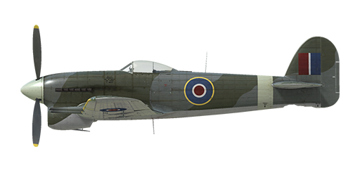

# Typhoon Mk.Ib

## Description

Indicated stall speed in flight configuration: 144...171 km/h  
Indicated stall speed in takeoff/landing configuration: 122...145 km/h  
  
Dive speed limit: 840 km/h  
Maximum load factor: 12.0 G  
Stall angle of attack in flight configuration: 20.0 °  
Stall angle of attack in landing configuration: 15.1 °  
  
Maximum true air speed at sea level, 3700 RPM, boost +9: 581 km/h  
Maximum true air speed at 2000 m, 3700 RPM, boost +9: 634 km/h  
Maximum true air speed at 5500 m, 3700 RPM, boost +9: 670 km/h  
  
Service ceiling: 10650 m  
Climb rate at sea level: 19.3 m/s  
Climb rate at 3000 m: 14.4 m/s  
Climb rate at 6000 m: 11.7 m/s  
  
Maximum performance turn at sea level: 23.4 s, at 270 km/h IAS.  
Maximum performance turn at 3000 m: 28.8 s, at 270 km/h IAS.  
  
Flight endurance at 3000 m: 2 h 15 m, at 350 km/h IAS.  
  
Takeoff speed: 152...185 km/h  
Glideslope speed: 170...210 km/h  
Landing speed: 124...148 km/h  
Landing angle: 11.5 °  
  
Note 1: the data provided is for international standard atmosphere (ISA).  
Note 2: flight performance ranges are given for possible aircraft mass ranges.  
Note 3: maximum speeds, climb rates and turn times are given for standard aircraft mass.  
Note 4: climb rates and turn times are given for 3700 RPM and boost +9.  
  
Engine:  
Model: Napier Sabre IIA  
Maximum power in Combat mode (3700 RPM, boost +9, low gear) at sea level: 2180 HP  
Maximum power in Combat mode (3700 RPM, boost +9, high gear) at 11500 feet: 1830 HP  
  
Engine modes:  
Max Cruising power (unlimited time): 3150 RPM, boost +4.5  
Climb power (up to 1 hour): 3700 RPM, boost +7  
Combat power (up to 5 minutes): 3700 RPM, boost +9  
  
Water rated temperature in engine output: 65..125 °C  
Water maximum temperature in engine output: 130 °C  
Oil rated temperature in engine intake: 60..90 °C  
Oil maximum temperature in engine intake: 95 °C  
  
Supercharger gear shift altitude: 9500 feet  
  
Empty weight: 4256 kg  
Minimum weight (no ammo, 10%25 fuel): 4304 kg  
Standard weight: 4915 kg  
Maximum takeoff weight: 6094 kg  
Fuel load: 496 kg / 691 l / 152 gallons  
Maximum useful load: 1838 kg  
  
Forward-firing armament:  
4 x 20mm gun "Hispano Mk.II", 143/145 rounds per gun, 650 rounds per minute, wing-mounted  
  
Bombs:  
2 x 500 lb general purpose bomb "500 lb. M.C."  
2 x 1000 lb general purpose bomb "1000 lb. M.C."  
  
Rockets:  
8 x 25 lb armour-piercing rocket "RP-3 A.P. 25 lb. mk.II"  
12 x 60 lb semi-armour-piercing rocket "RP-3 S.A.P. 60 lb. mk.II"  
  
Length: 9.77 m  
Wingspan: 12.66 m  
Wing surface: 25.92 m²  
  
Combat debut: May 1942  
  
Operation features:  
- The engine is equipped with the two-stage mechanical supercharger which should be manually switched at 2900m (9500ft) altitude.  
- The engine mixture control is automatic when the mixture lever is set to NORMAL (1/2) position. It should be set to START (forward, throttle lever movement will be limited by 1/10) position when starting the engine and to CUT-OUT position (back) to stop it.  
- The engine has an automatic RPM governor that controls the propeller pitch to maintain the required RPM.   
- Water and oil temperatures are controlled manually by adjusting the radiator shutters.  
- The aircraft has pitch and yaw flight-control trimmers.  
- Landing flaps have hydraulic actuators and can be extended to any angle up to 80°. The speed with the extended flaps is limited to 160 mph.  
- The airplane tail wheel rotates freely and does not have a lock.  
- The pneumatic brakes are differential: moving the pedals with brakes pressed results in releasing the brake opposite to the pressed pedal.  
- The landing gear indicator lamp lights up if the throttle is set to low (less than 1/3) position with the landing gear retracted.  
- It is impossible to open the canopy at high speeds because of the ram air, but there is an emergency jettison handle for bailing out.  
- The aircraft is equipped with bottom formation lights.  
- The range-finding gunsight reticle can be adjusted for a given target base and range.To make it easier to aim missiles it is possible to shift the target line up to 5 degrees downward (key combinations Right Shift + Semicolon / Right Shift + Period by default).

## Modifications

**Double RP-3 HE rockets on Mk.I rails**  
 3-in Semi-Armour Piercing/High Explosive unguided rockets RP-3 on Mk.I rails  
  
4 x double RP-3 SAP/HE and 4 x RP-3 SAP/HE:  
Additional mass: 544 kg  
Ammunition mass: 460 kg  
Racks mass: 84 kg  
Estimated speed loss before launch: 66 km/h  
Estimated speed loss after launch: 30 km/h

**M.C. Bombs**  
2 Medium Capacity Bombs  
  
2 x 500 lb Medium Capacity Bombs  
Additional mass: 484 kg  
Ammunition mass: 464 kg  
Racks mass: 20 kg  
Estimated speed loss before drop: 33 km/h  
Estimated speed loss after drop: 9 km/h  
  
2 x 1000 lb Medium Capacity Bombs  
Additional mass: 969 kg  
Ammunition mass: 949 kg  
Racks mass: 20 kg  
Estimated speed loss before drop: 42 km/h  
Estimated speed loss after drop: 9 km/h

**4-blades airscrew**  
Installation of 4-blade airscrew  
Estimated maximum speed increase: 12 km/h  
Estimated maximum climb rate increase: 2.3 m/s

**RP-3 HE / AP rockets on Mk.III rails**  
3-in Semi-Armour Piercing/High Explosive or Armour Piercing unguided rockets RP-3 on Mk.III rails  
  
8 x RP-3 SAP/HE:  
Additional mass: 360 kg  
Ammunition mass: 304 kg  
Racks mass: 56 kg  
Estimated speed loss before launch: 48 km/h  
Estimated speed loss after launch: 21 km/h  
  
8 x RP-3 AP:  
Additional mass: 226 kg  
Ammunition mass: 170 kg  
Racks mass: 56 kg  
Estimated speed loss before launch: 42 km/h  
Estimated speed loss after launch: 21 km/h

**Sabre IIA engine with +11 lb boost**  
Sabre IIA engine with +11 lb boost  
Estimated speed increase at sea level: 23 km/h

**Dome dust deflector**  
Installation of dust deflector on the engine air intake.  
Additional mass: 1 kg  
Estimated maximum speed loss: 8 km/h

**Gunsight without reflector**  
Installation of Type I Mk.III Gunsight  
Additional mass: 0 kg  
Estimated speed loss: 0 km/h

**RP-3 HE / AP rockets on Mk.I rails**  
 3-in Semi-Armour Piercing/High Explosive or Armour Piercing unguided rockets RP-3 on Mk.I rails  
  
8 x RP-3 SAP/HE:  
Additional mass: 388 kg  
Ammunition mass: 304 kg  
Racks mass: 84 kg  
Estimated speed loss before launch: 55 km/h  
Estimated speed loss after launch: 30 km/h  
  
8 x RP-3 AP:  
Additional mass: 254 kg  
Ammunition mass: 170 kg  
Racks mass: 84 kg  
Estimated speed loss before launch: 50 km/h  
Estimated speed loss after launch: 30 km/h

**Additional armor**  
Installation of additional engine and cockpit armor  
Additional mass: 157 kg  
Estimated speed loss: 2 km/h
