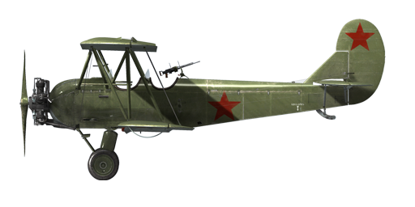

# U-2VS

## Description

Indicated stall speed in flight configuration: 63..70 km/h  
Dive speed limit: 240 km/h  
Maximum load factor: 6.5 G  
Stall angle of attack in flight configuration: 19°  
  
Maximum true air speed at sea level, engine mode - Takeoff, 1750 RPM: 151.7 km/h  
Maximum true air speed at 500 m, engine mode - Takeoff, 1740 RPM: 150.3 km/h  
Maximum true air speed at 1000 m, engine mode - Takeoff, 1730 RPM: 148.9 km/h  
  
Service ceiling: 3700 m  
Climb rate:  
500 m —  3 min. 5 sec.  
1000 m — 6 min. 35 sec.  
1500 m — 10 min. 40 sec.  
2000 m — 15 min. 24 sec.  
2500 m — 21 min. 15 sec.  
3000 m — 28 min. 35 sec.  
3500 m — 38 min. 20 sec.  
  
Maximum performance turn: 22..23 s, at 105..115 km/h IAS.  
  
Flight endurance at 500 m: 5 h, at 90 km/h IAS, 1300 RPM.  
  
Takeoff speed: 75..85 km/h  
Glideslope speed: 100 km/h  
Landing speed: 60..70 km/h  
Landing angle: 12°  
  
Note 1: the data provided is for international standard atmosphere (ISA).  
Note 2: flight performance ranges are given for possible aircraft mass ranges.  
Note 3: maximum speeds, climb rates and turn times are given for standard aircraft mass.  
Note 4: climb rates are given for full-throttle mode and 95 km/h IAS.  
Note 5: turn rate is given for 1400..1500 RPM with roll 43°..45°.  
  
Engine:  
Model: M-11D  
  
Maximum power in Takeoff mode (1750 RPM) at sea level: no less than 125 HP  
  
Maximum power in Nominal mode (1700 RPM) at sea level: 118 HP  
Maximum power in Nominal mode (1700 RPM) at 500 m: 110 HP  
Maximum power in Nominal mode (1700 RPM) at 1000 m: 105 HP  
  
Maximum power in Continuous mode (1640 RPM) at sea level: 107 HP  
Maximum power in Continuous mode (1640 RPM) at 500 m: 100 HP  
Maximum power in Continuous mode (1640 RPM) at 1000 m: 95 HP  
  
Engine modes:  
Takeoff/Emergency (5 min) : 1750/1840 RPM  
Continuous/Nominal (unlimited): 1640/1700 RPM  
  
Oil rated temperature in engine output: 70..80 °C  
Oil maximum temperature in engine output: 115 °C  
  
Airscrew:  
Type 257, D 2.4 m, pitch 1.524 m  
  
Empty weight: 748 kg  
Minimum weight (no ammo, 10% fuel): 927 kg  
Standard weight: 1007 kg  
Maximum takeoff weight: 1350 kg  
Fuel load: 90 kg / 126 l  
Useful load: 350 kg  
  
Forward-firing armament:  
1 x 7.62mm machine gun "ShKAS", 500 rounds, 1800 rounds per minute, wing-mounted (modification)  
  
Defensive armament:  
Rear-facing: 7.62mm machine gun "ShKAS", 400 rounds, 1800 rounds per minute (modification)  
  
Bombs:  
2 x 50 kg general purpose bombs "FAB-50sv"  
4 x 50 kg general purpose bombs "FAB-50sv"  
6 x 50 kg general purpose bombs "FAB-50sv"  
2 x 104 kg general purpose bombs "FAB-100M"  
2 x 50 kg general purpose bombs "FAB-50sv" and 2 x 104 kg general purpose bombs "FAB-100M"  
  
Height: 2.9 m  
Length: 8.17 m  
Wingspan of upper wing: 11.4 m  
Wingspan of lower wing: 10.65 m  
Wing surface: 33.15 m²  
  
The U-2 aircraft was developed under N.N. Polikarpov supervision in 1923-1928. It was designed as a simple, sturdy, and easy to handle two-seater aircraft for flight schools. It went airborne for the first time on June 24, 1927, but many improvements to its design were made afterwards to improve its climb rate. The upgraded plane went into production in 1929 after the first flight on January 7, 1928.  
  
Flight instructors and pilot candidates liked the plane - it forgave the typical mistakes of the trainees, was hard to stall and easy to recover, predictable at high angles of attack and had a low landing speed. Many future aces learned to fly in this \'flying school-desk\'. It was the first aircraft for the majority of VVS pilots.  
  
Several modifications of this aircraft were developed: ambulance S-1 and S-2, passenger U-2SP and U-2L, agriculture U-2AP and military U-2VS. The military modification could carry up to 300 kg of bombs and was equipped with a defensive MG turret. During WWII, it was mainly used as a low-altitude bomber and recon plane. It was a very hard target for enemy fighters at low altitudes because of its low speed, resulting in its relatively high survivability rate. It was used by the famous "night witches", female pilots and navigators of 46th Guards night bomber regiment. The model was renamed to Po-2 to honor N.N. Polikarpov after his passing in 1944.  
  
Operational features:  
- There is no engine supercharger.  
- The fuel mixture control is manual: the mixture should be leaned as the altitude increases for optimal engine functioning and to reduce the fuel consumption while flying level.  
- The fixed pitch propeller requires controlling the engine RPM manually.  
- The tail skid is linked to the rudder (8° maximum tilt).  
- There are no wheel brakes.  
- There is no electric generator in the default aircraft configuration, so electric lights and Pitot tube warmer (which consumes up to 226W) are fed from 24V battery (10 Ah capacity at 1 A current in standard conditions). To power the RSI-4 radio station, GS-10-350 electric generator is installed along with it.  
- Please note that with all possible modifications and full fuel the total aircraft weight is 1390 kg, more than its maximum takeoff weight.

## Modifications

**Female Crew**  
"Night Witches" (German: die Nachthexen; Russian: Ночные ведьмы, Nochnyye Vedmy) was a World War II German nickname for the all female military aviators of the 588th Night Bomber Regiment, known later as the 46th "Taman" Guards Night Bomber Aviation Regiment, of the Soviet Air Forces.

**Landing light**  
Landing light for night flights  
Additional mass: 2 kg  
Estimated speed loss: 1 km/h

**Navigation lights**  
Navigation lights  
Additional mass: 4 kg

**Rockets**  
82mm Explosive unguided rockets ROS-82 or 82mm Armour Piercing unguided rockets RBS-82 or 132mm Explosive unguided rockets ROS-132  
  
ROS-82x4:  
Additional mass: 40 kg  
Ammunition mass: 28 kg  
Racks mass: 12 kg  
Estimated speed loss before launch: 2 km/h  
Estimated speed loss after launch: 1 km/h  
  
ROS-82x8:  
Additional mass: 80 kg  
Ammunition mass: 56 kg  
Racks mass: 24 kg  
Estimated speed loss before launch: 4 km/h  
Estimated speed loss after launch: 2 km/h  
  
RBS-82x4:  
Additional mass: 72 kg  
Ammunition mass: 60 kg  
Racks mass: 12 kg  
Estimated speed loss before launch: 3 km/h  
Estimated speed loss after launch: 1 km/h  
  
RBS-82x8:  
Additional mass: 144 kg  
Ammunition mass: 120 kg  
Racks mass: 24 kg  
Estimated speed loss before launch: 4 km/h  
Estimated speed loss after launch: 2 km/h  
  
ROS-132x8:  
Additional mass: 224 kg  
Ammunition mass: 184 kg  
Racks mass: 40 kg  
Estimated speed loss before launch: 8 km/h  
Estimated speed loss after launch: 4 km/h

**Bow MG**  
Wing-mounted 7.62mm ShKAS machinegun with 500 rounds  
Additional mass: 27 kg  
Estimated speed loss: 3 km/h

**Rear turret**  
Rear turret with ShKAS 7.62mm machinegun with 400 rounds  
Additional mass: 34 kg  
Estimated speed loss: 2 km/h

**Radio transmitter**  
Radio transmitter RSI-4  
Additional mass: 12.6 kg  
Estimated speed loss: 0 km/h

**Horizon indicator**  
Horizon indicator AGP-2  
Additional mass: 2 kg  
Estimated speed loss: 0 km/h

**Bomb load**  
Underwing and underbelly racks with bombs  
  
2 x FAB-50sv bombs  
2 x 50 kg General Purpose Bombs FAB-50sv  
Additional mass: 104 kg  
Ammunition mass: 100 kg  
Racks mass: 4 kg  
Estimated speed loss before drop: 5 km/h  
Estimated speed loss after drop: 1 km/h  
  
4 x FAB-50sv bombs  
4 x 50 kg General Purpose Bombs FAB-50sv  
Additional mass: 208 kg  
Ammunition mass: 200 kg  
Racks mass: 8 kg  
Estimated speed loss before drop: 10 km/h  
Estimated speed loss after drop: 2 km/h  
  
6 x FAB-50sv bombs  
6 x 50 kg General Purpose Bombs FAB-50sv  
Additional mass: 312 kg  
Ammunition mass: 300 kg  
Racks mass: 12 kg  
Estimated speed loss before drop: 16 km/h  
Estimated speed loss after drop: 3 km/h  
  
2 x FAB-100M bombs  
2 x 104 kg General Purpose Bombs FAB-100M  
Additional mass: 212 kg  
Ammunition mass: 208 kg  
Racks mass: 4 kg  
Estimated speed loss before drop: 7 km/h  
Estimated speed loss after drop: 1 km/h  
  
2 x FAB-100M bombs and 2 x FAB-50sv bombs  
2 x 104 kg General Purpose Bombs FAB-100M and 2 x 50 kg General Purpose Bombs FAB-50sv  
Additional mass: 316 kg  
Ammunition mass: 308 kg  
Racks mass: 8 kg  
Estimated speed loss before drop: 13 km/h  
Estimated speed loss after drop: 2 km/h
