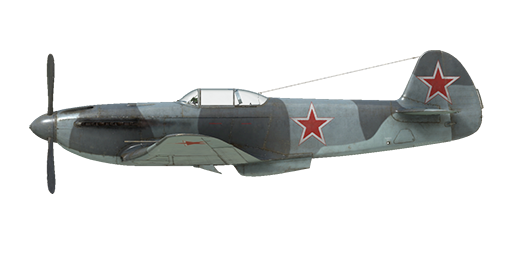

# Yak-3 ser.9

## Description

Indicated stall speed in flight configuration: 152..160 km/h  
Indicated stall speed in takeoff/landing configuration: 136..141 km/h  
Dive speed limit: 750 km/h  
Maximum load factor: 10.5 G  
Stall angle of attack in flight configuration: 18°  
Stall angle of attack in landing configuration: 16°  
  
Maximum true air speed at sea level, engine mode - Nominal, 2700 RPM: 555 km/h  
Maximum true air speed at 2000 m, engine mode - Nominal, 2700 RPM: 605 km/h  
Maximum true air speed at 4000 m, engine mode - Nominal, 2700 RPM: 629 km/h  
  
Service ceiling: 10500 m  
Climb rate at sea level: 21.5 m/s  
Climb rate at 3000 m: 16.4 m/s  
Climb rate at 6000 m: 11.7 m/s  
  
Maximum performance turn at sea level: 18.0 s, at 280 km/h IAS.  
Maximum performance turn at 3000 m: 26.0 s, at 305 km/h IAS.  
  
Flight endurance at 3500 m: 1.13 h, at 457 km/h IAS.  
  
Takeoff speed: 160..190 km/h  
Glideslope speed: 195..205 km/h  
Landing speed: 135..145 km/h  
Landing angle: 12 °  
  
Note 1: the data provided is for international standard atmosphere (ISA).  
Note 2: flight performance ranges are given for possible aircraft mass ranges.  
Note 3: maximum speeds, climb rates and turn times are given for standard aircraft mass.  
Note 4: climb rates and turn times are given for Nominal (2700 RPM) power.  
  
Engine:  
Model: VK-105PF2  
Maximum power in Nominal mode (2700 RPM) at sea level: 1290 HP  
Maximum power in Nominal mode (2700 RPM) at 700 m: 1320 HP  
Maximum power in Nominal mode (2700 RPM) at 2500 m: 1250 HP  
  
Engine modes:  
Nominal (unlimited time): 2700 RPM, 1050 mm Hg  
  
Water rated temperature in engine output: 90..100 °C, minimum allowable temperature: 60 °C.  
Water maximum temperature in engine output: 110 °C  
Oil rated temperature in engine output: 90..100 °C  
Oil maximum temperature in engine output: 110 °C  
  
Supercharger gear shift altitude: 1400 m  
  
Empty weight: 2039 kg  
Minimum weight (no ammo, 10% fuel): 2313 kg  
Standard weight: 2595 kg  
Maximum takeoff weight: 2655 kg  
Fuel load: 250 kg / 340 l  
Useful load: 616 kg  
  
Forward-firing armament:  
20mm gun "ShVAK", 125 rounds, 800 rounds per minute, nose-mounted  
12.7mm machine gun "UBS", 175 rounds, 1000 rounds per minute, synchronized  
  
Length: 8.5 m  
Wingspan: 9.2 m  
Wing surface: 15.85 m²  
  
Combat debut: May 1944  
  
Operation features:  
- The engine has a two-stage mechanical supercharger which must be manually switched at 1200...1600m altitude.  
- Engine mixture control is manual; it is necessary to lean the mixture if altitude is more than 3-4 km for optimal engine operation. Also, leaning the mixture allows a reduction in fuel consumption during flight.  
- Engine RPM has an automatic governor and it is maintained at the required RPM corresponding to the governor control lever position. The governor automatically controls the propeller pitch to maintain the required RPM.  
- Oil radiator shutters are controlled manually.  
- Water radiator shutters can be controlled automatically and manually.  
- The airplane can only be trimmed in the pitch axis.  
- Landing flaps have a pneumatic actuator. Flaps can only be fully extended; gradual extending is impossible. Due to the weak force of the actuator the extended landing flaps may be pressed upwards by the airflow if the airspeed is more than 220 km/h. Remember that the flaps will not extend fully in case of high speed. In case of a high-speed landing approach the flaps may extend a few steps further right before landing.  
- The aircraft has differential pneumatic wheel brakes with shared control lever. This means that if the brake lever is held and the rudder pedal the opposite wheel brake is gradually released causing the plane to swing to one side or the other.  
- Fuel gauges are installed on left and right wing fuel tanks, outside of the cockpit. The central feeder tank (20 litres) capacity is not measured.  
- It is impossible to open the canopy at high speeds because of the ram air, but there is an emergency jettison handle for bailing out.  
- The tailwheel rotates freely, but moving the control stick back locks it in the central (“flight-oriented”) position.  
  
Basic data and recommended positions of the aircraft controls:  
1. Starting the engine:  
	- recommended position of the mixture control lever: 100%  
	- recommended position of the radiators control handles: close  
	- recommended position of the prop pitch control handle: 100%  
	- recommended position of the throttle lever: 5%  
  
2. Recommended mixture control lever positions for various flight modes:  
	- When running the engine at low throttle near the ground, the mixture control lever should be in the position of about 50%.  
	- When the engine is running at full throttle near the ground, the mixture control lever should be in the 75-80% position.  
	- As you gain altitude, the altitude corrector closes. At 8-9 km altitude, the altitude corrector closes to 0%.  
  
3.1 Recommended positions of the oil radiator control handle for various flight modes:  
	- takeoff: open 100%  
	- climb: open 100%  
	- cruise flight: open 30%  
	- combat: open 100%  
  
3.2 Recommended positions of the water radiator control handle for various flight modes:  
	- takeoff: open 100%  
	- climb: open 100%  
	- cruise flight: open 40%  
	- combat: open 80%  
  
4. Approximate fuel consumption at 2000 m altitude:  
	- Cruise engine mode: 7.5 l/min

## Modifications

**12.7mm UBS MG**  
12.7mm UBS machinegun (right) with 175 rounds  
Additional mass: 57 kg  
Ammunition mass: 33 kg  
Gun mass: 24 kg  
Estimated speed loss: 0 km/h

**Mirror**  
Rear view mirror  
Additional mass: 1 kg  
Estimated speed loss: 0 km/h

**RPK-10**  
Fixed loop radio compass for navigation with radio beacons  
Additional mass: 10 kg  
Estimated speed loss: 0 km/h

**PKI Reflector Gunsight**  
PKI reflector gunsight  
Additional mass: 0.5 kg  
Estimated speed loss: 0 km/h
