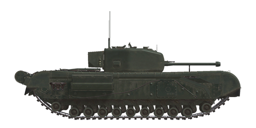

# Churchill IV

## Description

The Churchill tank belonged to the class of infantry tanks developed by the British Army. According to this classification, the Churchill had low mobility and hardly the most powerful weaponry, but it was protected with powerful armor, and thus belonged to the class of heavy tanks. The tank was produced in England throughout the war years and was one of the most numerous armored vehicles in His Majesty’s armed forces. The model featured in the game was produced by the Leyland factory.  
  
The first batch of early modification Churchill tanks under the Lend-Lease program was delivered to the USSR by the infamous Arctic convoy PQ-17. In total, 301 Churchill tanks were sent to the USSR during the war years, of which a little less than 50 vehicles were lost during transportation and 253 tanks were delivered to the Red Army during 1942 and 1943. The Churchill was the only heavy tank model supplied to the USSR by the Allies.  
  
Churchills took part in the battles on the southern face of the Kursk Bulge in the summer of 1943. There, as part of the 2nd Guards Tatsinsky Tank Corps, they fought against the German Totenkopf and Das Reich Panzer Divisions. Alongside, on the same section of the frontline, Churchills served with the 5th Guards Stalingrad Tank Corps and the 18th and 2nd Tank Corps. Each of these Corps included 21 Churchill tanks, a total of 84 tanks - a third of the total number of tanks of this type supplied under Lend-Lease during the War.  
  
The assessments of the tank in the Red Army were contradictory. Along with good armor, the cannon’s penetrating efficiency, a reliable radio station, and convenient observation devices, there were many problems with reliability, insufficient mobility, and the absence of high-explosive fragmentation shells in the ammunition load.  
  
The main armament of the tank was the Ordnance Quick-Firing (QF) 6-pounder 7 cwt cannon. Two versions of this gun were installed on the tank: Mk.III with a 43-caliber long barrel and Mk.V with a 50-caliber long barrel (the game features the Mk.V variant). The only type of cannon shell featured a fairly high armor penetration. However, it was solid, i.e. did not feature a bursting charge, and this significantly reduced its after-penetration effect. Also, the lack of high-explosive fragmentation shells in the ammunition load was limiting its versatility.  
  
From a technical point of view, the Churchill’s track assembly was quite peculiar and somewhat reminiscent of the famous British diamond-shaped pioneer tanks of the First World War, with the tracks covering the hull from above. This made it possible to include additional hatches along the sides that made it easier to abandon the vehicle in an emergency. Each of the 11 road wheels on either side of the tank had an individual spring suspension. However, only 6 middle ones of 11 were under load in the normal position. The hull armor was complex, comprising many rolled-steel armor parts assembled on the frame with rivets and bolts. The key feature of the Churchill IV, which distinguishes it from the previous modifications, was the turret made of a single cast part with a thin-walled spare parts box attached to its rear. The gun mantlet featured an original “internal” design with no parts protruding from the turret.  
  
The tank was also equipped with a 2-inch mortar fixed on the roof of the turret, on the loader’s side. Normally, it was intended for remote smoke screen deployment with 2-inch smoke grenades fired at a distance of about 400 meters in the direction same as that of the tank gun. In the reality of the Eastern Front, the Red Army often used Soviet-produced 50-mm high-explosive fragmentation rounds as ammunition for 2-inch English mortars. Besides the mortar, the tank was equipped with two pyrotechnic smoke dischargers mounted on the rear. They allow the tank to deploy a smoke screen for a minute and a half.  
  
<b><u>Unladen weight:</u></b> 40500 kg.  
Length: 7.6 m.  
Width: 3.3 m.  
Height: 2.5 m.  
Clearance: 484 mm.  
  
Engine: Twin 12-cylinder Bedford "Twin-Six", petrol.  
Maximum power: 350 HP at 2200 RPM.  
Maximum RPM: 2550 RPM.  
4 speed gearbox.  
  
<b><u>Maximum road speed:</u></b>  
1-st: 2.0 mph (3.3 kph).  
2-nd: 5.7 mph (9.1 kph).  
3-rd: 10.9 mph (17.5 kph).  
4-th: 18.2 mph (29.3 kph).  
Reverse: 1.1 mph (1.7 kph).  
  
<b><u>Maximum offroad speed:</u></b> 11 mph (18 kph).  
  
<b><u>Fluids:</u></b>  
Internal fuel tanks capacity: 682 l.  
Engine oil system capacity: 25 l.  
Summer engine coolant: 100 l. of water  
Winter engine coolant: 100 l. of 43%25 alcohol 15%25 glycerol  
Endurance range: 210 km.  
Maximum oil consumption: 1.3 l/h.  
  
<b><u>Hull armor:</u></b>  
Upper front: 92 mm rolled armor.  
Lower front: 83 mm rolled armor.  
Sides: 70 mm rolled armor.  
Rear: 51 mm rolled armor.  
Frontal roof: 19 mm rolled armor.  
Rear roof: 16 mm rolled armor.  
Frontal bottom: 19 mm rolled armor.  
Rear bottom: 16 mm rolled armor.  
  
<b><u>Turret armor:</u></b>  
Front bulges: 89 mm cast armor.  
Front center: 114 mm cast armor.  
Sides: 76 mm cast armor.  
Rear: 76 mm cast armor.  
Roof: 35 mm cast armor.  
Cupola: 19 mm cast armor.  
Gun mantlet: 89 mm cast armor.  
  
<b><u>Main gun:</u></b> rifled, 57 mm 6-pounder 7 cwt MkV.  
Barrel length: 50.  
Elevation: +20°..-11°.  
Ammo: up to 81 rounds.  
Usable rate of fire: 12 rounds per minute.  
Turret drive: electric, 26 seconds per rotation.  
  
<b><u>Ammunition:</u></b>  
6pdr APT armor piercing solid (AP): 2.8 kg, 890 m/s, 104 mm at 500 m.  
  
<b><u>Coaxial and bow MGs:</u></b> 7.92 mm BESA.  
Bullet mass: 11.5 g.  
Muzzle velocity: 823 m/s.  
Armour pentration at 100 m: 10 mm.  
Rate of fire: 850 rounds per minute.  
Coaxial: 20 belts, 225 rounds per belt (4500 rounds).  
Bow: +-17°/+16°..-8°, 15 belts, 225 rounds per belt (3375 rounds).  
  
<b><u>Gunsights:</u></b>  
No.39 Mk IV gunner telescopic sight, field of view 13°.  
No.39 Mk IIs machinegunner telescopic sight, field of view 21°.  
  
<b><u>Radio equipment:</u></b>  
Wireless Set No. 19. HF/VHF transceiver.  
5 intercom terminals.

## Modifications

**Armour Piercing Shells**  
6pdr APT  
  
Solid armour piercing shells without explosive filling. Good against spaced armour plates, but cause less damage inside a target than more advanced APHE.  
  
Mass: 2.8 kg.  
  
When fired from a 6-pounder Ordnance Quick-Firing (QF) 6-pounder 7 cwt Mk.V:  
Muzzle velocity 890 m/s, armour penetration at point blank range 136 mm.  
500 m: armour penetration 104 mm, velocity 738 m/s, drop -1.8 m.  
1000 m: armour penetration 78 mm, velocity 602 m/s, drop -8.4 m.  
2000 m: armour penetration 41 mm, velocity 387 m/s, drop -45.7 m.

**Removed Mid Fenders**  
Rare variant with mid sections of caterpillar fenders removed.

**HE Mortar Rounds**  
O-822Sh  
  
Replacement of 20 out of 30 smoke mortar rounds with 50 mm High-Explosive ones. On the Eastern Front, Churchill tank crews fired 50 mm Soviet-made mortar rounds from a 2-inch mortar installed in the turret to lay smoke screens.  
  
Mass 850 g, explosives mass 90 g.  
Direct hit armour penetration 7 mm, effective against infantry at less than 5 m.  
Range 400m. Muzzle velocity 74 m/s.

**Removed Bow Fenders**  
The track bow fenders of Churchill tanks on the Eastern front were often removed.

**Removed Fuel Tank**  
The external rear-mounted fuel tank was commonly removed on the Eastern front.
