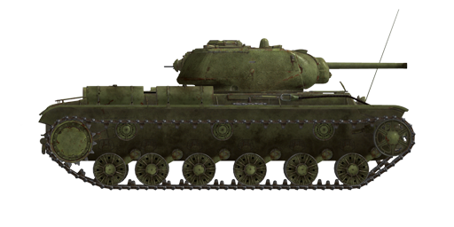

# KV-1s ChTZ (1943)

## Description

The tank was created by thedesign bureau of Chelyabinsk Tank Factory (ChTZ) during Summer 1942. It saw first combat action at the end of 1942 on Don and Voronezh front.  
  
The tank was based on its predecessor, KV-1 heavy tank. Because of its low mobility and reliability, KV-1s ('s' means 'skorostnoy' - speedy) was designed to be less armoured, but more mobile and reliable.  
  
Its main gun was its main shortcoming - the 76 mm ZiS-5 gun it inherited from KV-1. Together with reduced armour it made the tank almost equal to much more widespread T-34/76.  
  
Total 1083 KV-1s tanks were produced since July 1942 till August 1943.  
  
<b><u>Unladen weight:</u></b> 43350 kg.  
Length: 6.9 m.  
Width: 3.3 m.  
Height: 2.6 m.  
Clearance: 450 mm.  
  
Engine: В-2К, diesel.  
Maximum power: 600 HP at 2000 RPM.  
Maximum RPM: 2150 RPM.  
4 speed gearbox with 2 stage demultiplier.  
  
<b><u>Maximum road speed:</u></b>  
1-st low: 4.5 kph.  
2-st low: 6.6 kph.  
3-st low: 9.3 kph.  
4-st low: 12.9 kph.  
1-st high: 16.0 kph.  
2-st high: 23.1 kph.  
3-st high: 33.0 kph.  
4-st high: 45.4 kph.  
Reverse low: 5.0 kph.  
Reverse high: 17.9 kph.  
  
<b><u>Maximum offroad speed:</u></b> 24 kph.  
  
<b><u>Fluids:</u></b>  
Internal fuel tanks capacity: 600 l.  
Engine oil system capacity: 100 l.  
Summer engine coolant: 150 l. of water  
Winter engine coolant: 150 l. of 67%25 ethylene-glycol  
Endurance range: 200 km.  
Maximum oil consumption: 11 l/h.  
  
<b><u>Hull armour:</u></b>  
Upper front: 75 mm rolled armour.  
Middle front: 50 mm rolled armour.  
Lower front: 60 mm rolled armour.  
Sides: 60 mm rolled armour.  
Rear: 60 mm rolled armour.  
Frontal roof: 40 mm rolled armour.  
Rear roof: 30 mm rolled armour.  
Bottom: 30 mm rolled armour.  
  
<b><u>Turret armour:</u></b>  
Front: 82 mm cast armour.  
Sides: 82 mm cast armour.  
Rear: 82 mm cast armour.  
Roof: 30 mm rolled armour.  
Cupola: 60 mm cast armour.  
Gun mantlet: 70..82 mm cast armour.  
  
<b><u>Main gun:</u></b> rifled, 76.2 mm Zis-5.  
Barrel length: 41.6.  
Elevation: +12°..-5°.  
Ammo: up to 114 rounds.  
Usable rate of fire: 8 rounds per minute.  
Turret drive: electric, 30 seconds per rotation.  
  
<b><u>Ammunition:</u></b>  
BR-350B armour piercing high explosive (APHE): 6.5 kg, 660 m/s, 72 mm at 500 m.  
BR-350BSP armour piercing solid (AP): 6.6 kg, 660 m/s, 73 mm at 500 m.  
BR-354P armour piercing composite rigid (APCR): 3.02 kg, 950 m/s, 129 mm point blank.  
OF-350 high explosive (HE): 6.2 kg, 680 m/s, 710 g explosives.  
  
<b><u>Machineguns:</u></b> 7.62 mm Degtyarev DT.  
Bullet mass: 9.8 g.  
Muzzle velocity: 840 m/s.  
Armour pentration at 100 m: 11 mm.  
Rate of fire: 600 rounds per minute.  
Coaxial: 22 mags, 63 rounds per mag (1386 rounds).  
Bow: +-15°/+15°..-5°, 21 mags, 63 rounds per mag (1323 rounds).  
Rear: +-15°/+-12°, 6 mags, 63 rounds per mag (378 rounds).  
  
<b><u>Gunsights:</u></b>  
TMFD-7 gunner scope-sight, field of view 15°.  
PT4-7 gunner panoramic periscopic sight, field of view 26°.  
  
<b><u>Radio equipment:</u></b>  
VHF 9-RM transceiver.  
4 intercom terminals.

## Modifications

**High-Explosive Shells**  
OF-350  
  
Good against soft, unarmoured or lightly armoured targets.  
  
Mass 6.2 kg, explosives mass 710 g.  
Direct hit armour penetration 20 mm, effective damage distance for light vehicles 3 m.  
  
When fired from a F-34 / ZiS-5 gun:  
Muzzle velocity: 680 m/s.  
500 m: velocity: 616 m/s, drop -3.0 m.  
1000 m: velocity: 558 m/s, drop -12.5 m.  
2000 m: velocity: 468 m/s, drop -56.7 m.

**Armour Piercing Shells**  
BR-350BSP  
  
Solid armour piercing shells without explosive filling.  
Good against spaced armour plates, but cause less damage inside a target than more advanced APHE.  
  
Mass: 6.6 kg.  
  
When fired from a F-34 / ZiS-5 gun:  
Muzzle velocity 660 m/s, armour penetration at point blank range 87 mm.  
500 m: armour penetration 73 mm, velocity 585 m/s, drop -3.2 m.  
1000 m: armour penetration 62 mm, velocity 524 m/s, drop -13.6 m.  
2000 m: armour penetration 47 mm, velocity 429 m/s, drop -63.5 m.

**Armour Piercing High Explosive Shells**  
BR-350B  
  
Shells armed with bursting charge warhead.  
Good against armoured targets. In case of penetration do more damage inside the target than solid AP shells, but HE filling can detonate prematurely (for instance, when used against spaced armour plates).  
  
Mass 6.5 kg, explosives mass 119 g.  
  
When fired from a F-34 / ZiS-5 gun:  
Muzzle velocity 660 m/s, armour penetration at point blank range 86 mm.  
500 m: armour penetration 72 mm, velocity 584 m/s, drop -3.2 m.  
1000 m: armour penetration 61 mm, velocity 522 m/s, drop -13.6 m.  
2000 m: armour penetration 46 mm, velocity 427 m/s, drop -64.0 m.

**Sub-Caliber Armour Piercing Shells**  
BR-354P  
  
Shells armed with sub-caliber armour-piercing projectile.  
  
Good against heavily armoured targets at short ranges: being much lighter than ordinary rounds, they have much higher muzzle velocity and armour penetration at close distances. However, because of the lower mass their velocity quickly diminishes with distance and they are worse than ordinary rounds at higher distances.  
  
The penetrator is held in the barrel by a spool looking sabot. While reducing the round mass for increased muzzle velocity, this makes it lose velocity even more quickly because of the air drag.  
  
Mass: 3.02 kg, penetrator calibre 28 mm.  
  
When fired from a F-34 / ZiS-5 gun:  
Muzzle velocity 950 m/s, armour penetration at point blank range 129 mm.  
500 m: armour penetration 90 mm, velocity 741 m/s, drop -1.7 m.  
1000 m: armour penetration 60 mm, velocity: 558 m/s, drop -8.0 m.  
2000 m: armour penetration 24 mm, velocity: 295 m/s, drop -53.3 m.
