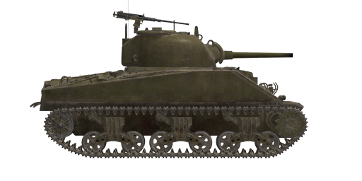

# M4A2

## Description

M4 was the mainstay American medium tank of WWII. It has been widely used by the US and Allies (including the lend-lease program) on all major theatres of war.  
  
These tanks were lend-leased to USSR starting from November 1942 and appeared on the Eastern front at the beginning of 1943. They were used in many Soviet operations of the second half of the war.  
  
In general, M4 tank was similar to T-34-76 in terms of combat effectiveness with a bonus (75 mm M3 gun rounds had better quality, while the .50 cal machinegun on the roof provided more firepower and protection). Soviet tank crews especially liked more comfortable and spacious tank interior (this, however, meant the tank was bigger and higher, making it easier to spot and hit in combat).  
  
Good internal equipment, quality visors, hydraulic gun stabilizer, more stable radio (compared to Soviet ones), overall maintainability and reliability made M4 a good tank.  
  
M4A2 modification was powered by twin 6-cylinder diesel engines GM 6046. Total 1990 M4A2 tanks equipped with 75 mm M3 gun were lend-leased to the USSR.  
  
<b><u>Unladen weight:</u></b> 30900 kg.  
Length: 6.1 m.  
Width: 2.7 m.  
Height: 2.9 m.  
Clearance: 470 mm.  
  
Engine: Twin 6-cylinder diesel engines GM 6046-71.  
Maximum power: 2 x 375 HP at 2100 RPM.  
Maximum RPM: 2150 RPM.  
5 speed gearbox.  
  
<b><u>Maximum road speed:</u></b>  
1-st: 2.4 mph (3.8 kph).  
2-nd: 7.2 mph (11.5 kph).  
3-rd: 11.9 mph (19.2 kph).  
4-th: 19.1 mph (30.7 kph).  
5-th: 29.9 mph (48.0 kph).  
Reverse: 3.6 mph (5.8 kph).  
  
<b><u>Maximum offroad speed:</u></b> 16 mph (26 kph).  
  
<b><u>Fluids:</u></b>  
Internal fuel tanks capacity: 590 l.  
Engine oil system capacity: 80 l.  
Summer engine coolant: 95 l. of water  
Winter engine coolant: 95 l. of 43%25 alcohol 15%25 glycerol  
Endurance range: 315 km.  
Maximum oil consumption: 3.7 l/h.  
  
<b><u>Hull armor:</u></b>  
Upper front: 51 mm rolled armor.  
Lower front: 51 mm rolled armor.  
Sides: 38 mm rolled armor.  
Rear: 38 mm rolled armor.  
Frontal roof: 19 mm rolled armor.  
Rear roof: 13 mm rolled armor.  
Frontal bottom: 25 mm rolled armor.  
Rear bottom: 13 mm rolled armor.  
  
<b><u>Turret armor:</u></b>  
Front bulges: 76 mm cast armor.  
Front center: 51 mm cast armor.  
Sides: 51 mm cast armor.  
Rear: 51 mm cast armor.  
Roof: 25 mm cast armor.  
Cupola: 25 mm cast armor.  
Gun mantlet: 38 mm cast armor.  
  
<b><u>Main gun:</u></b> rifled, 75 mm M-3.  
Barrel length: 40.  
Elevation: +25°..-10°.  
Ammo: up to 97 rounds.  
Usable rate of fire: 8 rounds per minute.  
Turret drive: electrohydraulic, 16 seconds per rotation.  
  
<b><u>Ammunition:</u></b>  
M61 armor piercing high explosive (APHE): 6.79 kg, 618 m/s, 83 mm at 500 m.  
M72 armor piercing solid (AP): 6.33 kg, 618 m/s, 91 mm at 500 m.  
M48 high explosive (HE): 6.67 kg, 604 m/s, 667 g explosives.  
  
<b><u>Coaxial and bow MGs:</u></b> 7.62 mm M1919.  
Bullet mass: 11 g.  
Muzzle velocity: 845 m/s.  
Armour pentration at 100 m: 12 mm.  
Rate of fire: 600 rounds per minute.  
Coaxial: 8 belts, 250 rounds per belt (2000 rounds).  
Bow: +-21°/+21°..-10°, 19 belts, 250 rounds per belt (4750 rounds).  
  
<b><u>AA MG:</u></b> 12.7 mm M2 .50.  
Bullet mass: 41.9 g.  
Muzzle velocity: 895 m/s.  
Armour pentration at 100 m: 22 mm.  
Rate of fire: 550 rounds per minute.  
Ammo: 6 belts, 50 rounds per belt (300 rounds).  
  
<b><u>Gunsights:</u></b>  
M38 gunner scope-sight combined with М4А1 periscope, field of view 9°.  
  
<b><u>Radio equipment:</u></b>  
Wireless Set No. 19. HF/VHF transceiver.  
5 intercom terminals.

## Modifications

**High-Explosive Shells**  
M48  
  
Good against soft, unarmoured or lightly armoured targets.  
  
Mass 6.67 kg, explosives mass 667 g.  
Direct hit armour penetration 20 mm, effective damage distance for light vehicles 3 m.  
  
When fired from a M3 gun:  
Muzzle velocity: 680 m/s.  
500 m: velocity: 558 m/s, drop -3.8 m.  
1000 m: velocity: 515 m/s, drop -15.3 m.  
2000 m: velocity: 441 m/s, drop -67.7 m.

**Armour Piercing Shells**  
M72  
  
Solid armour piercing shells without explosive filling. Good against spaced armour plates, but cause less damage inside a target than more advanced APHE.  
  
M72 round can penetrate slightly thicker armor at close to medium distances compared to M61 APHE, but this advantage disappears at ~1000 m or more.  
  
Mass: 6.33 kg.  
  
When fired from a M3 gun:  
Muzzle velocity 618 m/s, armour penetration at point blank range 109 mm.  
500 m: armour penetration 91 mm, velocity 545 m/s, drop -3.7 m.  
1000 m: armour penetration 76 mm, velocity 482 m/s, drop -15.8 m.  
2000 m: armour penetration 54 mm, velocity 379 m/s, drop -74.4 m.

**Armour Piercing High Explosive Shells**  
M61  
  
Shells armed with bursting charge warhead.  
Good against armoured targets. In case of penetration do more damage inside the target than solid AP shells, but HE filling can detonate prematurely (for instance, when used against spaced armour plates).  
  
Mass 6.79 kg, explosives mass 65 g.  
  
When fired from a M3 gun:  
Muzzle velocity 618 m/s, armour penetration at point blank range 92 mm.  
500 m: armour penetration 83 mm, velocity 575 m/s, drop -3.5 m.  
1000 m: armour penetration 75 mm, velocity 533 m/s, drop -14.6 m.  
2000 m: armour penetration 59 mm, velocity 454 m/s, drop -64.4 m.
