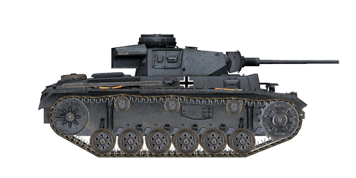

# Pz.Kpfw.III Ausf.L

## Description

Pz.Kpfw. III Ausf.L was equipped with 50 mm main gun that has a good armour penetration ability and additional 20 mm thick armour plates on the gun mantlet and front hull. These improvements were introduced when Germans encountered Soviet T-34 and KV tanks.  
  
This tank modification has been in production since April till August 1942, with around 700 units produced.  
  
<b><u>Unladen weight:</u></b> 22700 kg.  
Length: 6.3 m.  
Width: 3.0 m.  
Height: 2.5 m.  
Clearance: 385 mm.  
  
Engine: Maybach HL 120TRM, petrol.  
Maximum power: 300 HP at 3000 RPM.  
Maximum RPM: 3000 RPM.  
6 speed gearbox.  
  
<b><u>Maximum road speed:</u></b>  
1-st: 4.8 kph.  
2-nd: 9.2 kph.  
3-rd: 15.5 kph.  
4-th: 23.5 kph.  
5-th: 33.2 kph.  
6-th: 42.8 kph.  
Reverse: 5.9 kph.  
  
<b><u>Maximum offroad speed:</u></b> 18 kph.  
  
<b><u>Fluids:</u></b>  
Internal fuel tanks capacity: 320 l.  
Engine oil system capacity: 25 l.  
Summer engine coolant: 100 l. of 40% glysantin  
Winter engine coolant: 100 l. of 60% glysantin  
Endurance range: 155 km.  
Maximum oil consumption: 2 l/h.  
  
<b><u>Hull armour:</u></b>  
Upper front: 50 mm + 20 mm rolled armour.  
Middle front: 25 mm rolled armour.  
Lower front: 50 mm rolled armour.  
Bottom front: 30 mm rolled armour.  
Sides: 30 mm rolled armour.  
Upper rear: 50 mm rolled armour.  
Middle rear: 50 mm rolled armour.  
Lower rear: 30 mm rolled armour.  
Roof front: 10 mm rolled armour.  
Roof back: 15 mm cast armour.  
Bottom: 26 mm rolled armour.  
Bottom above tracks: 26 mm rolled armour.  
  
<b><u>Turret armour:</u></b>  
Front: 30 mm rolled armour.  
Sides: 30 mm rolled armour.  
Rear: 30 mm rolled armour.  
Roof: 10 mm rolled armour.  
Cupola: 50 mm cast armour.  
Gun mantlet: 50 mm cast armour.  
  
<b><u>Main gun:</u></b> rifled, 5 cm KwK 39 L/60.  
Barrel length: 56.5.  
Elevation: +20°..-10°.  
Ammo: up to 92 rounds.  
Usable rate of fire: 15 rounds per minute.  
Turret drive: mechanical, 33 seconds per rotation.  
  
<b><u>Gun ammunition:</u></b>  
5 cm Pzgr. 39 armour piercing high explosive (APHE): 2.06 kg, 835 m/s, 68 mm at 500 m.  
5 cm Pzgr. 40 armour piercing composite rigid (APCR): 0.925 kg, 1180 m/s, 175 mm point blank.  
5 cm Sprgr. 38 high explosive (HE): 1.81 kg, 550 m/s, 175 g. explosives.  
  
<b><u>Machineguns:</u></b> 7.92 mm Maschinengewehr 34.  
Bullet mass: 11.5 g.  
Muzzle velocity: 855 m/s.  
Armour pentration at 100 m: 11 mm.  
Rate of fire: 900 rounds per minute.  
Coaxial: 33 belts, 150 rounds per belt (4950 rounds).  
Bow: not implemented.  
  
<b><u>Gunsights:</u></b>  
Tzf 5f2 gunner scope-sight, field of view 25°.  
  
<b><u>Radio equipment:</u></b> VHF Fu 5 transceiver, 4 intercom terminals.  
  
  
<b><u>ATTENTION:</u></b>  
This tank is free to any IL-2 Great Battles user. 'Tank Crew' expansion tanks have siginficantly more detailed exterior and interior of the crew stations.

## Modifications

**High-Explosive Shells**  
5 cm Sprgr. 38  
  
Good against soft, unarmored or lightly armored targets.  
  
Mass 1.81 kg, explosives mass 175 g.  
  
Direct hit armour penetration 11 mm, effective damage distance for light vehicles 1.5 m.  
  
When fired from a 5 cm KwK 39 L/60 gun:  
Muzzle velocity 550 m/s.  
500 m: velocity 444 m/s, drop -4.9 m.  
1000 m: velocity 368 m/s, drop -22.6 m.  
2000 m: velocity 285 m/s, drop -118.5 m.

**Armour Piercing High Explosive Shells**  
5 cm Pzgr. 39  
  
Shells armed with bursting charge warhead.  
  
Good against armoured targets. In case of penetration do more damage inside the target than solid AP shells, but HE filling can detonate prematurely (for instance, when used against spaced armour plates).  
  
Mass 2.06 kg, explosives mass 17 g.  
  
When fired from a 5 cm KwK 39 L/60 gun:  
Muzzle velocity 835 m/s, armour penetration at point blank range 87 mm.  
500 m: armour penetration 68 mm, velocity 702 m/s, drop -1.5 m.  
1000 m: armour penetration 53 mm, velocity 587 m/s, drop -8.4 m.  
2000 m: armour penetration 30 mm, velocity 394 m/s, drop -76.7 m.

**Sub-Caliber Armour Piercing Shells**  
5 cm Pzgr. 40  
  
Shells armed with sub-caliber armour-piercing projectile.  
  
Good against heavily armoured targets at short ranges: being much lighter than ordinary rounds, they have much higher muzzle velocity and armour penetration at close distances. However, because of the lower mass their velocity quickly diminishes with distance and they are worse than ordinary rounds at higher distances.  
  
The penetrator is held in the barrel by a spool looking sabot. While reducing the round mass for increased muzzle velocity, this makes it lose velocity even more quickly because of the air drag.  
  
Mass: 0.925 kg, penetrator calibre 21 mm.  
  
When fired from a 5 cm KwK 39 L/60 gun:  
Muzzle velocity 1180 m/s, armour penetration at point blank range 175 mm.  
500 m: armour penetration 82 mm, velocity 696 m/s, drop -2.1 m.  
1000 m: armour penetration 43 mm, velocity: 443 m/s, drop -9.2 m.  
2000 m: armour penetration 16 mm, velocity: 223 m/s, drop -49.0 m.
